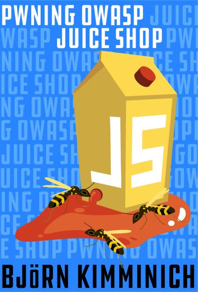
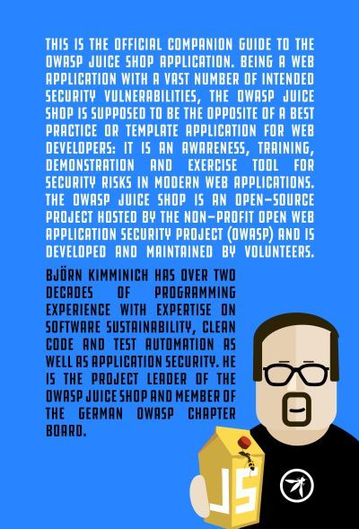

# Pwning OWASP Juice Shop

[Pwning OWASP Juice Shop](https://leanpub.com/juice-shop) is the
official companion guide for this project. It will give you a complete
overview of the vulnerabilities found in the application including hints
how to spot and exploit them. In the appendix you will even find
complete step-by-step solutions to every challenge.

 

The ebook is published under
[CC BY-NC-ND 4.0](https://creativecommons.org/licenses/by-nc-nd/4.0/)
and is online-readable **for free** at
<https://pwning.owasp-juice.shop>. The latest officially released
edition is also available **for free** at
<https://leanpub.com/juice-shop> in PDF and ePub format.

---

* Download a .pdf or .epub file from: https://leanpub.com/juice-shop (official release)
* Read the book online at: https://pwning.owasp-juice.shop
* Contribute content, suggestions, and fixes on GitHub: https://github.com/juice-shop/pwning-juice-shop
* Official OWASP Juice Shop project homepage: https://owasp-juice.shop

---

Open Worldwide Application Security Project and OWASP are registered trademarks of the OWASP Foundation, Inc.
This work is Copyright © by Bjoern Kimminich and licensed under a [Creative Commons Attribution-NonCommercial-NoDerivatives 4.0 International License](https://creativecommons.org/licenses/by-nc-nd/4.0/).
