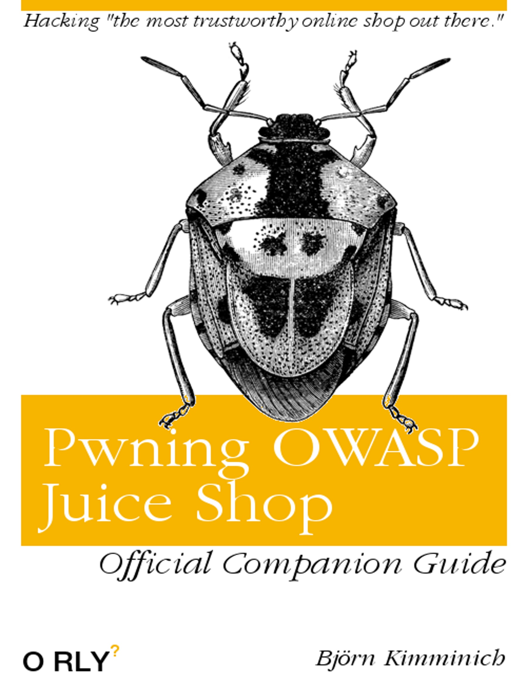

# Pwning OWASP Juice Shop

Written by [Björn Kimminich](https://twitter.com/bkimminich)

This is the official companion guide to the __OWASP Juice Shop__
application. Being a web application with a vast number of intended
security vulnerabilities, the OWASP Juice Shop is supposed to be the
opposite of a _best practice_ or _template application_ for web
developers: It is an awareness, training, demonstration and exercise
tool for security risks in modern web applications. The OWASP Juice Shop
is an open-source project hosted by the non-profit
[Open Web Application Security Project (OWASP)](https://owasp.org) and
is developed and maintained by volunteers. The content of this book was
written for {{book.juiceShopVersion}} of OWASP Juice Shop.

The book is divided into three parts:

### Part I - Hacking preparations

Part one helps you to get the application running and to set up optional
hacking tools.

### Part II - Challenge hunting

Part two gives an overview of the vulnerabilities found in the OWASP
Juice Shop including hints how to find and exploit them in the
application.

### Part III - Getting involved

Part three shows up various ways to contribute to the OWASP Juice Shop
open source project.

----

_Please be aware that this book is not supposed to be a comprehensive
introduction to Web Application Security in general. For every category
of vulnerabilities present in the OWASP Juice Shop you will find a brief
explanation - typically by quoting and referencing to existing content
on the given topic._

----

__Download a .pdf, .epub, or .mobi file from:__

* https://leanpub.com/juice-shop (official release)
* https://www.gitbook.com/book/bkimminich/pwning-owasp-juice-shop

__Read the book online at:__

* https://bkimminich.gitbooks.io/pwning-owasp-juice-shop/content

__Contribute content, suggestions, and fixes on GitHub:__

* https://github.com/bkimminich/pwning-juice-shop

__Official OWASP Juice Shop project homepage:__

* http://owasp-juice.shop

----

This work is licensed under a
[Creative Commons Attribution-NonCommercial-NoDerivatives 4.0 International License](https://creativecommons.org/licenses/by-nc-nd/4.0/).
