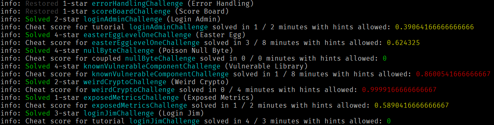

# Cheat detection

Whenever a challenge is solved, a `cheatScore` between 0 and 1 is
internally assigned to the solution. This indicates how likely the
challenge solution has been achieved with cheating.



## Cheat score calculation

The calculation curently relies only on the time difference between
current and previous solve in relation to the difficulty of the current
challenge. The cheat score also factors in if hints and/or tutorials are
enabled or disabled on the Score Board.

| Challenge Difficulty | Minimum solve time | w/o hints | w/ tutorial |
|:---------------------|:-------------------|:----------|:------------|
| ⭐                    | 2 minutes          | +1 min    | ÷2          |
| ⭐⭐                  | 4 minutes          | +2 min    | ÷2          |
| ⭐⭐⭐                 | 6 minutes          | +3 min    | ÷2          |
| ⭐⭐⭐⭐               | 8 minutes          | +4 min    | n/a         |
| ⭐⭐⭐⭐⭐              | 10 minutes         | +5 min    | n/a         |
| ⭐⭐⭐⭐⭐⭐            | 12 minutes         | +6 min    | n/a         |

The underlying formula assumes that a non-cheating user requires a
certain _absolute minimum amount of time_ to solve hacking challenges.
It is important to note, that this does not imply that you are _expected
to only need_ this minimum minutes for a challenge of certain
difficulty.

### Coupled challenges

The cheat scoring takes into account that some challenges will be solved
in the same HTTP request, for example:

* logging in the admin user _with his weak password_ solves logging in
  the admin _by any means_ (e.g. SQL Injection), too
* both XXE challenge automatically solve using a deprecated B2B
  interface
* the generic null byte challenge is typically solved along with the
  first actual exploit to access some sensitive file from `/ftp`

To avoid false positive cheat scoring, the second of two coupled
challenge solves will never count as cheating when they happen in
sequence.

### Trivial challenges

Some challenges are so frequently solved by accident or coincident, that
it would be unfair to take them into account for cheat scoring at all.
This includes:

* triggering any kind of error that is improperly handled by the
  application, which if often solved as a by-product of solving other
  challenges
* reading the privacy policy of the shop, which is merely a challenge
  making fun of the fact that almost nobody reads those in real life

## Coding challenges

For coding challenges the cheat score is also calculated based on expected solving time
since the previous solved hacking or coding challenge. As the difficulty of a hacking
challenge does not necessarily correlate with its associated coding challenge, the
cheat score formulas are based on different criteria.

### "Find It" cheat score calculation

The cheat score to find the vulnerable line(s) of code in the given code snippet
is based on the length of that code snippet and the number of lines that need to
be selected as the correct answer.

| Snippet length | Minimum solve time | # vulnerable lines |
|:---------------------|:-------------------|:----------|
| up to 1000 characters                    | 1 minutes          | ×#    | 
| up to 2000 characters                  | 2 minutes          | ×#    | 
| up to 3000 characters                 | 3 minutes          | ×#    | 
| up to 4000 characters               | 4 minutes          | ×#    | 
| etc.              |          |    | 

### "Fix It" cheat score calculation

The cheat score to detect the right fix for an identified vulnerability depends
only on the number of provided fix choices.

| Provided choices | Minimum solve time | 
|:---------------------|:-------------------|
| 3                  | 1 minute  | 
| 4                 | 2 minutes  | 
| 5               | 2 minutes  | 
| 6               | 3 minutes  |

Please note that Juice Shop does not allow coding challenges with less than 3 fix options
to choose from.

## Total cheat score

The server also keeps track of the average `cheatScore` across all
solved challenges in the `totalCheatScore` which is available via the
[`juiceshop_cheat_score` metric](monitoring.md#prometheus-metrics) but
also sent in each
[Challenge solution webhook](integration.md#challenge-solution-webhook)
call. The `totalCheatScore` value is not persisted across server
restarts, but its calculation is also not irritated by
[automatic](../part1/challenges.md#automatic-saving-and-restoring-hacking-progress)
or
[manual restoring of hacking progress](../part1/challenges.md#manual-progress-and-settings-backup).

An example of the `totalCheatScore` metric can be seen below:

```yaml
# HELP juiceshop_cheat_score Overall probability that any hacking or coding challenges were solved by cheating.
# TYPE juiceshop_cheat_score gauge
juiceshop_cheat_score{app="juiceshop"} 0.1201909090909091
```

The following values for `totalCheatScore` were measured during
activities that are
[definitely considered cheating](../part1/rules.md#-things-considered-cheating) while
solving the available hacking challenges:

* \>89% after executing all
  [Integration tests](../part3/contribution.md#integration-tests) in <1
  minute on the author's Windows 10 laptop
* \>88% after executing all
  [End-to-end tests](../part3/codebase.md#end-to-end-tests) in <20
  minutes on the author's Windows 10 laptop

## Limitations

The cheat scoring assumes that
[a single user is hacking the Juice Shop](../part1/running.md#single-user-restriction)
instance. If the application is used by a team, the values need to be
considered less reliable, as extra solve speed might come from
parallelization of challenges across team members. Similarly,
experienced Juice Shop users will also solve challenges faster than a
new user, so their speed is likely to trigger cheat detection as well.

If the Juice Shop instance is under the control of the user, any cheat
score it reports via Prometheus or Webhook cannot be trusted at all.

All in all, the cheat score should never blindly be used as a tool to
caution or sanction somebody. Vice versa a low score should also never
blindly be used to determine monetary rewards etc.
