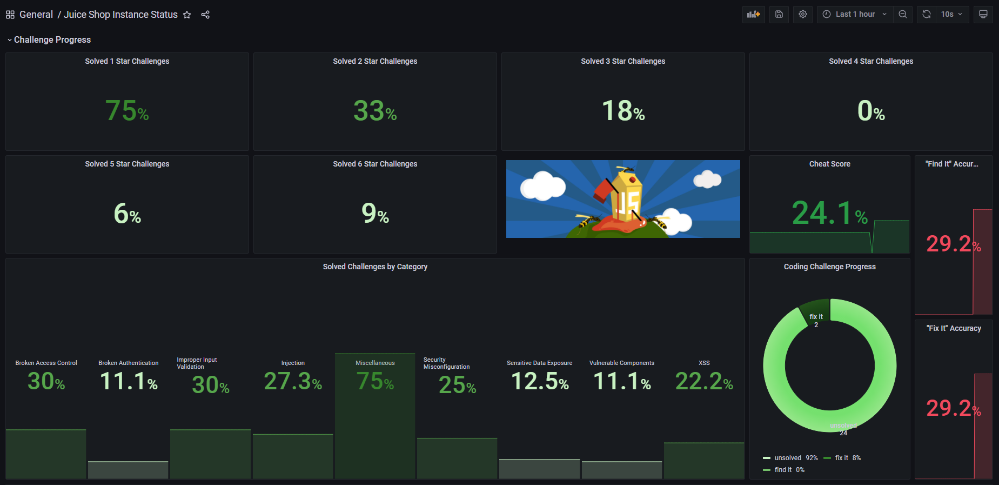
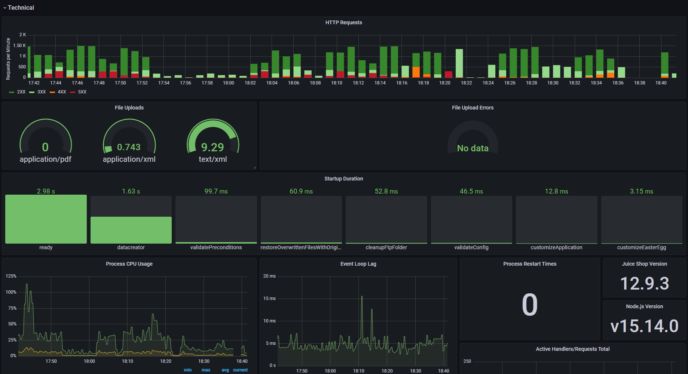

# Monitoring

You can monitor your local or cloud-hosted OWASP Juice Shop instance
using internally gathered metrics and visualize those on dashboards.





## Prometheus Metrics

Juice Shop collects functional and technical metrics using a
[Prometheus](https://prometheus.io) client module. Its endpoint is
publicly accessible and there is even a challenge asking you to
"[Find the endpoint that serves usage data to be scraped by a popular monitoring system](../part2/sensitive-data-exposure.md#find-the-endpoint-that-serves-usage-data-to-be-scraped-by-a-popular-monitoring-system)".

To consume these metrics you need to set up a Prometheus server which is
very straightforward:

1. [Install Prometheus](https://prometheus.io/download/) on the machine
   that will monitor your Juice Shop instance
2. Configure your Juice Shop instance as a scraping target in the
   `prometheus.yml`. A simple config example you can find below.
3. Start your Prometheus server which by default runs on
   <http://localhost:9090>
4. Check if your scraping endpoint shows "UP" as its state at
   <http://localhost:9090/targets>

```
scrape_configs:
  - job_name: 'juiceshop_local'
    scrape_interval: 60s
    scrape_timeout: 10s
    static_configs:
    - targets: ['localhost:3000']
```

You can create dashboards and alert rules in Prometheus itself, but if
you want to have a fancy dashboard like the one in the screenshots
above, you need a bit more visualization firepower.

## Grafana Dashboard

This is where [Grafana](https://grafana.com/) comes in. Juice Shop comes
with a full-fledged `JSON` template that you can import as a new
dashboard into your own Grafana installation. It consumes and displays
all metrics gathered via Prometheus as seen in the screenshots above.

1. [Install Grafana](https://grafana.com/get) (for ease-of-use, best use
   the machine you also have Prometheus running on)
2. Start Grafana and visit it at <http://localhost:3000> (ℹ️ _Its
   default port is the same as Juice Shop's, so if you run both on the
   same machine, one needs to be moved to a different port._)
3. Log in with `admin`/`admin`.
4. Go to _Configuration_ > _Data Sources_ at
   <http://localhost:3000/datasources>and click _Add data source_
5. Select _Prometheus_ and in its configuration screen set
   <http://localhost:9090> as the _HTTP_ > _URL_. Clicking _Save & Test_
   will confirm if Grafana could find your Prometheus server.
6. Now go to _Dashboards_ > _Manage_ at
   <http://localhost:3000/dashboards>
7. Click _Import_ and either upload or paste the contents of the
   [`monitoring/grafana-dashboard.json`](https://github.com/bkimminich/juice-shop/blob/master/monitoring/grafana-dashboard.json)
   found in the Juice Shop's GitHub repository.
8. Now visit the imported _Juice Shop Instance Dashboard_ by clicking on
   its name to view it! Voilá!

ℹ️ _The "Juice Shop Instance Dashboard" template was forked from the
multi-instance dashboard of
[MultiJuicer](trainers.md#hosting-individual-instances-for-multiple-users),
so if you need to run and subsequently monitor multiple Juice Shop
instances, best take a look at
[MultiJuicer](https://github.com/iteratec/multi-juicer) and our
[Trainer's guide](trainers.md)._
