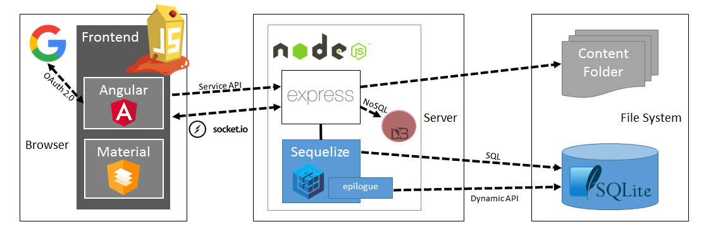

# Architecture overview

The OWASP Juice Shop is a pure web application implemented in JavaScript
and TypeScript (which is compiled into regular JavaScript). In the
frontend the popular [Angular](https://angular.io/) framework is used to
create a so-called _Single Page Application_. The user interface layout
is implementing Google's [Material Design](https://material.io/) using
[Angular Material](https://material.angular.io/) components. All icons
found in the UI are originating from the
[Font Awesome](https://fontawesome.com) library.

JavaScript is also used in the backend as the exclusive programming
language: An [Express](http://expressjs.com) application hosted in a
[Node.js](https://nodejs.org) server delivers the client-side code to
the browser. It also provides the necessary backend functionality to the
client via a RESTful API. As an underlying database a light-weight
[SQLite](https://www.sqlite.org) was chosen, because of its file-based
nature. This makes the database easy to create from scratch
programmatically without the need for a dedicated server.
[Sequelize](http://docs.sequelizejs.com) and
[epilogue](https://github.com/dchester/epilogue) are used as an
abstraction layer from the database. This allows to use dynamically
created API endpoints for simple interactions (i.e. CRUD operations)
with database resources while still allowing to execute custom SQL for
more complex queries.

As an additional data store a [MarsDB](https://github.com/c58/marsdb) is
part of the OWASP Juice Shop. It is a JavaScript derivate of the widely
used [MongoDB](https://www.mongodb.com) NoSQL database and compatible
with most of its query/modify operations.

The push notifications that are shown when a challenge was successfully
hacked, are implemented via
[WebSocket Protocol](https://tools.ietf.org/html/rfc6455). The
application also offers convenient user registration via
[OAuth 2.0](https://oauth.net/2/) so users can sign in with their Google
accounts.

The following diagram shows the high-level communication paths between
the client, server and data layers:

