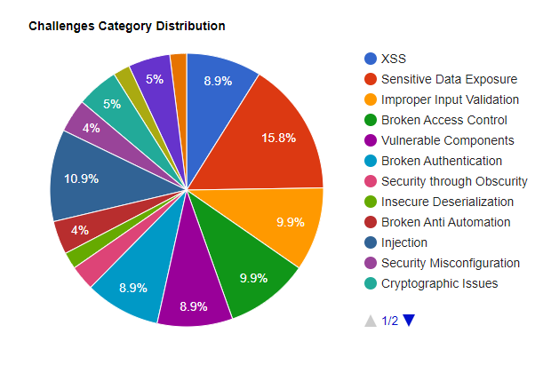

# Vulnerability Categories

The vulnerabilities found in the OWASP Juice Shop are categorized into
several different classes. Most of them cover different risk or
vulnerability types from well-known lists or documents, such as
[OWASP Top 10](https://owasp.org/www-project-top-ten/),
[OWASP ASVS](https://owasp.org/www-project-application-security-verification-standard/),
[OWASP Automated Threat Handbook](https://owasp.org/www-project-automated-threats-to-web-applications/),
[OWASP API Security Top 10](https://owasp.org/www-project-api-security/)
and
[OWASP Top 10 Privacy Risks](https://owasp.org/www-project-top-10-privacy-risks)
or MITRE's [Common Weakness Enumeration](https://cwe.mitre.org/). The
following table presents a mapping of the Juice Shop's categories to
OWASP, CWE and WASC threats, risks and attacks (without claiming to be
complete).

### Category Mappings

| Category                    | OWASP                                                                                                                                                                                                                                                                                                                                                                                                                                                                                                                                                                                                                                          | CWE                                                                                                                                                                                                                                            | WASC                                                                                                                                                                                                                                                            |
|:----------------------------|:-----------------------------------------------------------------------------------------------------------------------------------------------------------------------------------------------------------------------------------------------------------------------------------------------------------------------------------------------------------------------------------------------------------------------------------------------------------------------------------------------------------------------------------------------------------------------------------------------------------------------------------------------|:-----------------------------------------------------------------------------------------------------------------------------------------------------------------------------------------------------------------------------------------------|:----------------------------------------------------------------------------------------------------------------------------------------------------------------------------------------------------------------------------------------------------------------|
| Broken Access Control       | [A1:2021](https://owasp.org/Top10/A01_2021-Broken_Access_Control/), [API1:2019](https://owasp.org/www-project-api-security), [API5:2019](https://owasp.org/www-project-api-security)                                                                                                                                                                                                                                                                                                                                                                                                                     | [CWE-22](https://cwe.mitre.org/data/definitions/22.html), [CWE-285](https://cwe.mitre.org/data/definitions/285.html), [CWE-639](https://cwe.mitre.org/data/definitions/639.html)                                                               | [WASC-02](http://projects.webappsec.org/w/page/13246940/Insufficient%20Authorization), [WASC-09](http://projects.webappsec.org/w/page/13246919/Cross%20Site%20Request%20Forgery), [WASC-16](http://projects.webappsec.org/w/page/13246922/Directory%20Indexing) |
| Broken Anti-Automation      | [OWASP-AT-004](https://wiki.owasp.org/index.php/Testing_for_Brute_Force_%28OWASP-AT-004%29), [API4:2019](https://owasp.org/www-project-api-security), [OWASP-AT-010](https://wiki.owasp.org/index.php/Testing_for_Race_Conditions_%28OWASP-AT-010%29), [OAT-009](https://owasp.org/www-project-automated-threats-to-web-applications/assets/oats/EN/OAT-009_CAPTCHA_Defeat.html), [OAT-015](https://owasp.org/www-project-automated-threats-to-web-applications/assets/oats/EN/OAT-015_Denial_of_Service.html), [OAT-008](https://owasp.org/www-project-automated-threats-to-web-applications/assets/oats/EN/OAT-008_Credential_Stuffing.html) | [CWE-362](http://cwe.mitre.org/data/definitions/362.html)                                                                                                                                                                                      | [WASC-11](http://projects.webappsec.org/w/page/13246915/Brute%20Force), [WASC-21](http://projects.webappsec.org/w/page/13246938/Insufficient%20Anti-automation)                                                                                                 |
| Broken Authentication       | [A7:2021](https://owasp.org/Top10/A07_2021-Identification_and_Authentication_Failures/), [API2:2019](https://owasp.org/www-project-api-security), [P6:2021](https://owasp.org/www-project-top-10-privacy-risks)                                                                                                                                                                                                                                                                                                                                                                                                               | [CWE-287](https://cwe.mitre.org/data/definitions/287.html), [CWE-352](https://cwe.mitre.org/data/definitions/352.html)                                                                                                                         | [WASC-01](http://projects.webappsec.org/w/page/13246939/Insufficient%20Authentication), [WASC-49](http://projects.webappsec.org/w/page/13246942/Insufficient%20Password%20Recovery)                                                                             |
| Cross Site Scripting (XSS)  | [A1:2021](https://owasp.org/Top10/A03_2021-Injection/), [A7:2017](https://owasp.org/www-project-top-ten/OWASP_Top_Ten_2017/Top_10-2017_A7-Cross-Site_Scripting_%28XSS%29)                                                                                                                                                                                                                                                                                                                                                                                                                                                                                                                              | [CWE-79](https://cwe.mitre.org/data/definitions/79.html)                                                                                                                                                                                       | [WASC-8](http://projects.webappsec.org/w/page/13246920/Cross%20Site%20Scripting)                                                                                                                                                                                |
| Cryptographic Issues        | [A2:2021](https://owasp.org/Top10/A02_2021-Cryptographic_Failures/)                                                                                                                                                                                                                                                                                                                                                                                                                                                                                                                                     | [CWE-326](https://cwe.mitre.org/data/definitions/326.html), [CWE-327](https://cwe.mitre.org/data/definitions/327.html), [CWE-328](https://cwe.mitre.org/data/definitions/328.html), [CWE-950](https://cwe.mitre.org/data/definitions/950.html) | -                                                                                                                                                                                                                                                               |
| Improper Input Validation   | [ASVS V5](https://wiki.owasp.org/index.php/ASVS_V5_Input_validation_and_output_encoding), [API6:2019](https://owasp.org/www-project-api-security)                                                                                                                                                                                                                                                                                                                                                                                                                                                                                              | [CWE-20](https://cwe.mitre.org/data/definitions/20.html)                                                                                                                                                                                       | [WASC-20](http://projects.webappsec.org/w/page/13246933/Improper%20Input%20Handling)                                                                                                                                                                            |
| Injection                   | [A1:2021](https://owasp.org/Top10/A03_2021-Injection/), [API8:2019](https://owasp.org/www-project-api-security), [P1:2021](https://owasp.org/www-project-top-10-privacy-risks)                                                                                                                                                                                                                                                                                                                                                                                                                           | [CWE-74](https://cwe.mitre.org/data/definitions/74.html), [CWE-89](https://cwe.mitre.org/data/definitions/89.html)                                                                                                                             | [WASC-19](http://projects.webappsec.org/w/page/13246963/SQL%20Injection), [WASC-28](http://projects.webappsec.org/w/page/13246949/Null%20Byte%20Injection), [WASC-31](http://projects.webappsec.org/w/page/13246950/OS%20Commanding)                            |
| Insecure Deserialization    | [A8:2021](https://owasp.org/Top10/A08_2021-Software_and_Data_Integrity_Failures/), [A8:2017](https://owasp.org/www-project-top-ten/OWASP_Top_Ten_2017/Top_10-2017_A8-Insecure_Deserialization)                                                                                                                                                                                                                                                                                                                                                                                                                                                                                                                                    | [CWE-502](https://cwe.mitre.org/data/definitions/502.html)                                                                                                                                                                                     | -                                                                                                                                                                                                                                                               |
| Miscellaneous               | [P5:2021](https://owasp.org/www-project-top-10-privacy-risks)                                                                                                                                                                                                                                                                                                                                                                                                                                                                                                                                                                                  | -                                                                                                                                                                                                                                              | -                                                                                                                                                                                                                                                               |
| Security Misconfiguration   | [A5:2021](https://owasp.org/Top10/A05_2021-Security_Misconfiguration/), [A9:2021](https://owasp.org/Top10/A09_2021-Security_Logging_and_Monitoring_Failures/), [API7:2019](https://owasp.org/www-project-api-security), [API9:2019](https://owasp.org/www-project-api-security), [API10:2019](https://owasp.org/www-project-api-security)                                                                                                                                                                                                                               | [CWE-209](https://cwe.mitre.org/data/definitions/209.html)                                                                                                                                                                                     | [WASC-14](http://projects.webappsec.org/w/page/13246959/Server%20Misconfiguration), [WASC-15](http://projects.webappsec.org/w/page/13246914/Application%20Misconfiguration)                                                                                     |
| Security through Obscurity  | [P5:2021](https://owasp.org/www-project-top-10-privacy-risks)                                                                                                                                                                                                                                                                                                                                                                                                                                                                                                                                                                                  | [CWE-656](https://cwe.mitre.org/data/definitions/656.html)                                                                                                                                                                                     | -                                                                                                                                                                                                                                                               |
| Sensitive Data Exposure     | [A3:2017](https://owasp.org/www-project-top-ten/OWASP_Top_Ten_2017/Top_10-2017_A3-Sensitive_Data_Exposure), [API3:2019](https://owasp.org/www-project-api-security), [OTG-CONFIG-004](https://wiki.owasp.org/index.php/Review_Old,_Backup_and_Unreferenced_Files_for_Sensitive_Information_%28OTG-CONFIG-004%29), [P2:2021](https://owasp.org/www-project-top-10-privacy-risks)                                                                                                                                                                                                                                                                | [CWE-200](https://cwe.mitre.org/data/definitions/200.html), [CWE-530](https://cwe.mitre.org/data/definitions/530.html), [CWE-548](https://cwe.mitre.org/data/definitions/548.html)                                                             | [WASC-13](http://projects.webappsec.org/w/page/13246936/Information%20Leakage)                                                                                                                                                                                  |
| Unvalidated Redirects       | [A10:2013](https://owasp.org/www-project-top-ten/OWASP_Top_Ten_2017/Top_10_2013-A10-Unvalidated_Redirects_and_Forwards)                                                                                                                                                                                                                                                                                                                                                                                                                                                                                                                        | [CWE-601](https://cwe.mitre.org/data/definitions/601.html)                                                                                                                                                                                     | [WASC-38](http://projects.webappsec.org/w/page/13246981/URL%20Redirector%20Abuse)                                                                                                                                                                               |
| Vulnerable Components       | [A6:2021](https://owasp.org/Top10/A06_2021-Vulnerable_and_Outdated_Components/)                                                                                                                                                                                                                                                                                                                                                                                                                                                                                                                 | [CWE-829](https://cwe.mitre.org/data/definitions/829.html), [CWE-506](https://cwe.mitre.org/data/definitions/506.html), [CWE-1104](https://cwe.mitre.org/data/definitions/1104.html)                                                           | -                                                                                                                                                                                                                                                               |
| XML External Entities (XXE) | [A5:2021](https://owasp.org/Top10/A05_2021-Security_Misconfiguration/), [A4:2017](https://owasp.org/www-project-top-ten/OWASP_Top_Ten_2017/Top_10-2017_A4-XML_External_Entities_%28XXE%29)                                                                                                                                                                                                                                                                                                                                                                                                                                                                                                                             | [CWE-611](https://cwe.mitre.org/data/definitions/611.html)                                                                                                                                                                                     | [WASC-43](http://projects.webappsec.org/w/page/13247003/XML%20External%20Entities)                                                                                                                                                                              |
