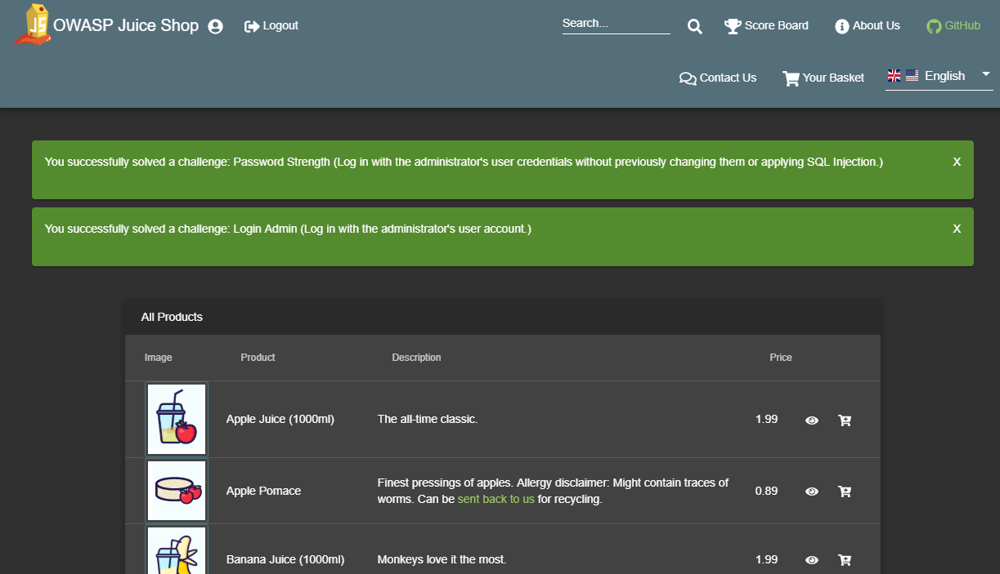
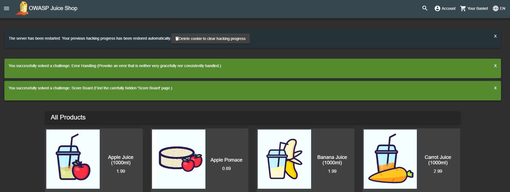

# Challenge tracking

## The Score Board

In order to motivate you to hunt for vulnerabilities, it makes sense to
give you at least an idea what challenges are available in the
application. Also you should know when you actually solved a challenge
successfully, so you can move on to another task. Both these cases are
covered by the application's score board.

On the score board you can view a list of all available challenges with
a brief description. Some descriptions are _very explicit_ hacking
instructions. Others are just _vague hints_ that leave it up to you to
find out what needs to be done.

The challenges are rated with a difficulty level between :star: and
:star::star::star::star::star::star:, with more stars representing a
higher difficulty. To make the list of challenges less daunting, they
are clustered by difficulty. By default only the 1-star challenges are
unfolded. You can open or collapse all challenge blocks as you like.
Collapsing a block has _no impact_ on whether you can _solve_ any of its
challenges.

The difficulty ratings have been continually adjusted over time based on
user feedback. The ratings allow you to manage your own hacking pace and
learning curve significantly. When you pick a 5- or 6-star challenge you
should _expect_ a real challenge and should be less frustrated if you
fail on it several times. On the other hand if hacking a 1- or 2-star
challenge takes very long, you might realize quickly that you are on a
wrong track with your chosen hacking approach.

Finally, each challenge states if it is currently _unsolved_ or
_solved_. The current overall progress is represented in a progress bar
on top of the score board. Especially in group hacking sessions this
allows for a bit of competition between the participants.

If not deliberately turned off (see [Customization](customization.md))
you can hover over each _unsolved_ label to see a hint for that
challenge. If a "book" icon is also displayed within the label, you can
click on it to be redirected to the corresponding hints section in
[Part 2](../part2/README.md) of this book.

### Challenge Filters

Additional to the folding and unfolding of entire difficulty blocks, you
can filter the Score Board by [challenge categories](categories.md), e.g. to focus on specific vulnerabilities.
You can also hide all solved challenges to reduce the level of distraction on the Score Board.

## Success notifications

The OWASP Juice Shop employs a simple yet powerful gamification
mechanism: Instant success feedback! Whenever you solve a hacking
challenge, a notification is _immediately_ shown on the user interface.

This feature makes it unnecessary to switch back and forth between the
screen you are attacking and the score board to verify if you succeeded.
Some challenges will force you to perform an attack outside of the Juice
Shop web interface, e.g. by interacting with the REST API directly. In
these cases the success notification will light up when you come back to
the regular web UI the next time.

To make sure you do not miss any notifications they do not disappear
automatically after a timeout. You have to dismiss them explicitly. In
case a number of notifications "piled up" it is not necessary to dismiss
each one individually, as a simple reload of the UI in the browser (`F5`
key) will dismiss all at the same time.

Depending on your application configuration, each challenge notification
might also show a :checkered_flag: symbol with a character sequence next
to it. If you are doing a hacking session just on your own, you can
completely ignore this flag. The code is only relevant if you are
participating in a CTF event. Please refer to chapter
[Hosting a CTF event](ctf.md) for more information this topic.

## Automatic saving and restoring hacking progress

The [_self-healing_ feature](running.md#self-healing-feature) - by
wiping the entire database on server start - of Juice Shop was
advertised as a benefit just a few pages before. This feature comes at a
cost, though: As the challenges are also part of the database schema,
they will be wiped along with all the other data. This means, that after
every restart you start with a clean 0% score board and all challenges
in _unsolved_ state.

To keep the resilience against data corruption but allow users to _pick
up where they left off_ after a server restart, your hacking progress is
automatically saved whenever you solve a challenge - as long as you
allow Browser cookies!

After restarting the server, once you visit the application your hacking
progress is automatically restored:

The auto-save mechanism keeps your progress for up to 30 days after your
previous hacking session. When the score board is restored to its prior
state, a torrent of success notifications will light up - depending on
how many challenges you solved up to that point. As mentioned earlier
these can be bulk-dismissed by reloading the page with the `F5` key.

If you want to start over with a fresh hacking session, simply click the
_Delete cookie to clear hacking progress_ button. After the next server
restart, your score board will be blank.
