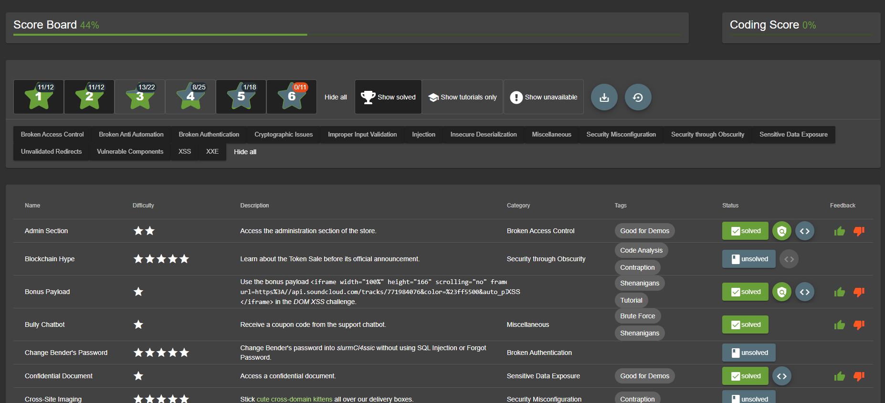
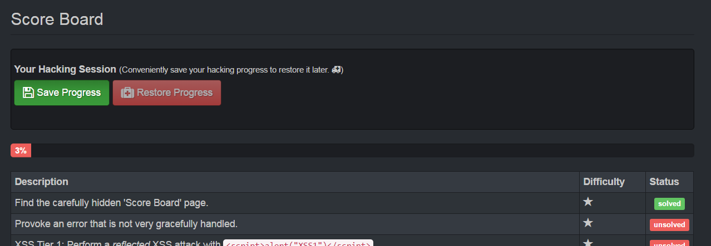

# Challenge tracking

## The Score Board

In order to motivate you to hunt for vulnerabilities, it makes sense to
give you at least an idea what challenges are available in the
application. Also you should know when you actually solved a challenge
successfully, so you can move on to another task. Both these cases are
covered by the application's score board.

On the score board you can view a list of all available challenges with
a brief description. Some descriptions are _very explicit_ hacking
instructions. Others are just _vague hints_ that leave it up to you to
find out what needs to be done.

The challenges are rated with a difficulty level between 1 and 5 stars,
with more stars representing a higher difficulty. These ratings have
been continually adjusted over time based on user feedback. Visible
difficulty ratings allow you to influence your own hacking pace and
learning curve significantly. When you pick a 4- or 5-star challenge you
_expect_ a real challenge and should be less frustrated if you fail on
it several times. On the other hand if hacking a 1- oder 2-star
challenge takes very long, you might realize quickly that you are on a
wrong track with your chosen hacking approach.

Finally, each challenge states if it is currently _unsolved_ or
_solved_. The current overall progress is represented in a progress bar
on top of the score board. Especially in group hacking sessions this
allows for a bit of competition between the participants.

## Success notifications

The OWASP Juice Shop employs a simple yet powerful gamification
mechanism: Instant success feedback! Whenever you solve a hacking
challenge, a notification is _immediately_ shown on the user interface.

This feature makes it unnecessary to switch back and forth between the
screen you are attacking and the score board to verify if you succeeded.
Some challenges will force you to perform an attack outside of the Juice
Shop web interface, e.g. by interacting with the REST API directly. In
these cases the success notification will light up when you come back to
the regular web UI the next time.

To make sure you do not miss any notifications they do not disappear
automatically after a timeout. You have to dismiss them explicitly. In
case a number of notifications "piled up" it is not necessary to dismiss
each one individually, as a simple reload of the UI in the browser (`F5`
key) will dismiss all at the same time.

Each challenge notification will also show a :checkered_flag: symbol
with a character sequence next to it. If you are doing a hacking session
just on your own, you can completely ignore this flag. The code is only
relevant if you are participating in a CTF event. Please refer to
[Appendix B](ctf.md) for more information on hosting CTF
events.

## Saving and restoring hacking progress

The ["self-healing" feature](running.md#self-healing-feature) - by
wiping the entire database on server start - of Juice Shop was
advertised as a benefit just a few pages before. This feature comes at a
cost, though: As the challenges are also part of the database schema,
they will be wiped along with all the other data. This means, that after
every restart you start with a "clean" 0% score board and all challenges
in _unsolved_ state.

To keep the resilience against data corruption but allow users to "pick
up where they left off" after a server restart, you can manually save
your hacking progress using a button on the top of the Score Board:

If you previously saved your hacking progress, you can restore it with
the corresponding button up to 30 days after your previous hacking
session.

Please be aware that __your progress is never automatically saved__, so
it is highly recommended to __save your progress regularly__ if you want
to avoid re-doing challenges a lot. After a server crash, you can then
simply restore the previous hacking progress:

1. Restart the application (e.g. via `npm start` or by restarting the
   Docker container).
2. Navigate to the (now wiped) score board.
3. Click the _Restore Progress_ button.

The score board will now be restored to its prior state and - depending
on how many challenges you solved up to that point - a torrent of
success notifications will light up. As mentioned earlier these can be
bulk-dismissed by reloading the page with the `F5` key.
