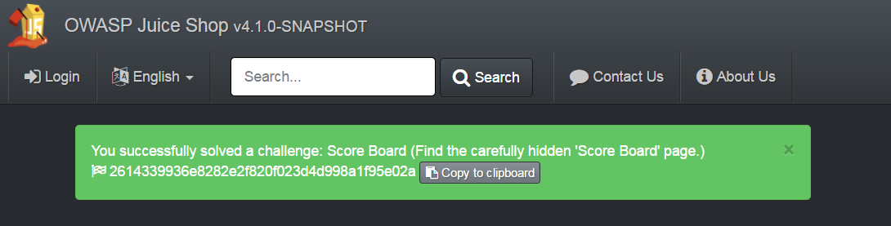
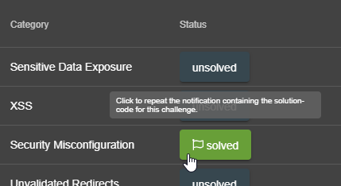
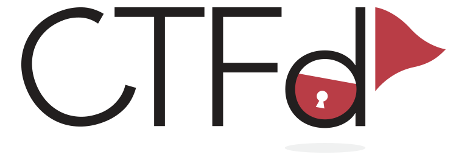
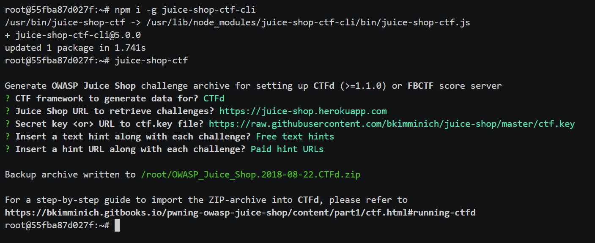
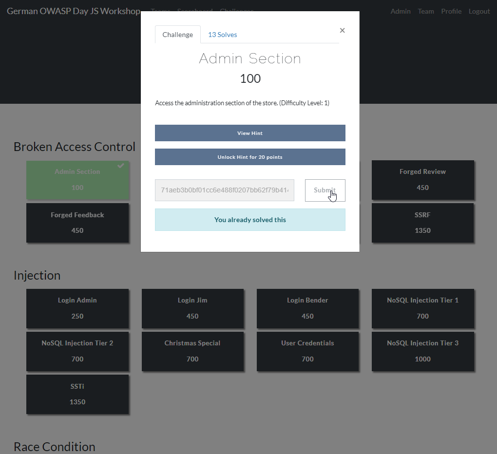
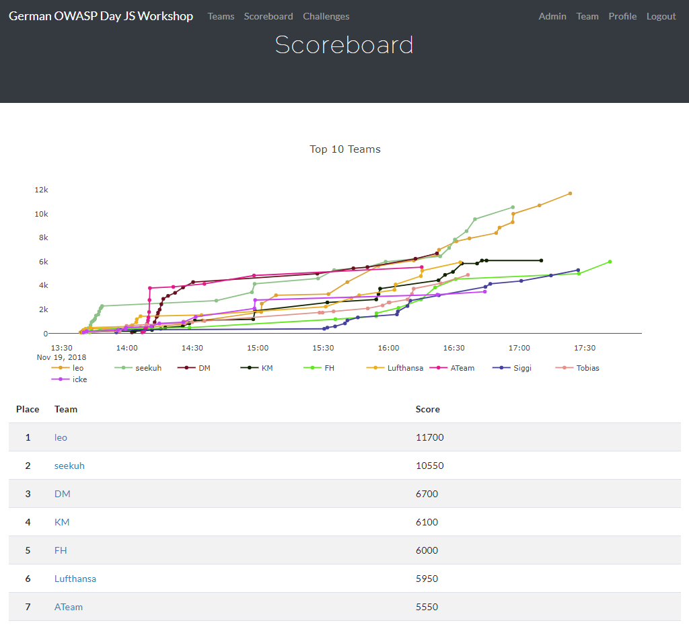
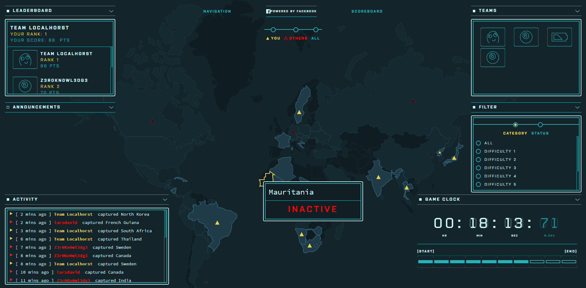
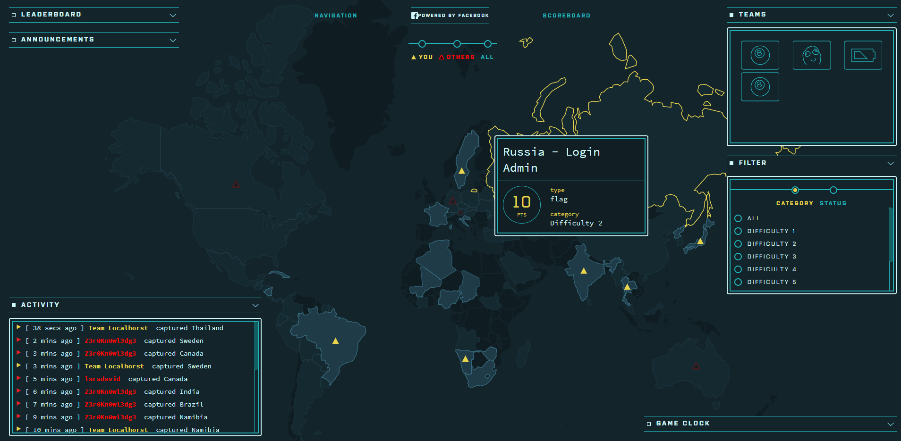
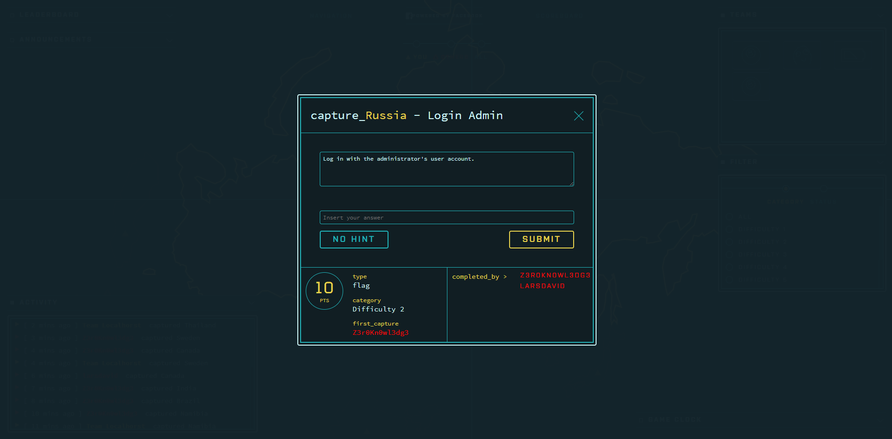
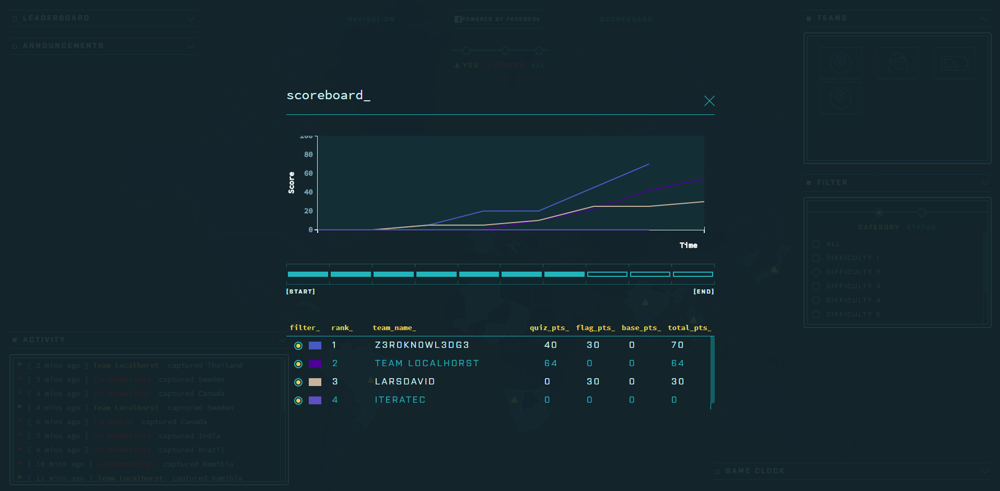

# Hosting a CTF event

> In computer security, Capture the Flag (CTF) is a computer security
> competition. CTF contests are usually designed to serve as an
> educational exercise to give participants experience in securing a
> machine, as well as conducting and reacting to the sort of attacks
> found in the real world. Reverse-engineering, network sniffing,
> protocol analysis, system administration, programming, and
> cryptanalysis are all skills which have been required by prior CTF
> contests at DEF CON. There are two main styles of capture the flag
> competitions: attack/defense and jeopardy.
>
> In an attack/defense style competition, each team is given a machine
> (or a small network) to defend on an isolated network. Teams are
> scored on both their success in defending their assigned machine and
> on their success in attacking the other team's machines. Depending on
> the nature of the particular CTF game, teams may either be attempting
> to take an opponent's flag from their machine or teams may be
> attempting to plant their own flag on their opponent's machine. Two of
> the more prominent attack/defense CTF's are held every year at DEF
> CON, the largest hacker conference, and the NYU-CSAW (Cyber Security
> Awareness Week), the largest student cyber-security contest.
>
> Jeopardy-style competitions usually involve multiple categories of
> problems, each of which contains a variety of questions of different
> point values and difficulties. Teams attempt to earn the most points
> in the competition's time frame (for example 24 hours), but do not
> directly attack each other. Rather than a race, this style of game
> play encourages taking time to approach challenges and prioritizes
> quantity of correct submissions over the timing.[^1]


OWASP Juice Shop can be run in a special configuration that allows to
use it in Capture-the-flag (CTF) events. This can add some extra
motivation and fun competition for the participants of a security
training or workshop.

## Running Juice Shop in CTF-mode

Juice Shop supports _Jeopardy-style CTFs_ by generating a unique _CTF
flag code_ for each solved challenge.



These codes are not displayed by default, but can be made visible by
running the application with the `config/ctf.yml` configuration:

```
set NODE_ENV=ctf     # on Windows
export NODE_ENV=ctf  # on Linux

npm start
```

On Linux you can also pass the `NODE_ENV` in directly in a single
command

```
NODE_ENV=ctf npm start
```

When running the application as a Docker container instead execute

```
docker run -d -e "NODE_ENV=ctf" -p 3000:3000 bkimminich/juice-shop
```

The `ctf.yml` configuration furthermore hides the GitHub ribbon in the
top right corner of the screen. It also hides all hints from the score
board. Instead it will make the _solved_-labels on the score board
clickable which results in the corresponding _"challenge
solved!"_-notification being repeated. This can be useful in case you
forgot to copy a flag code before closing the corresponding
notification.



### Overriding the `ctf.key`

Juice Shop uses the content of the provided `ctf.key` file as the secret
component of the generated CTF flag codes. If you want to make sure that
your flag codes are not the same for every hosted CTF event, you need to
override that secret key.

The simplest way to do so, is by providing an alternative secret key via
the `CTF_KEY` environment variable:

```
set CTF_KEY=xxxxxxxxxxxxxxx     # on Windows
export CTF_KEY=xxxxxxxxxxxxxxx  # on Linux
```

or when using Docker

```
docker run -d -e "CTF_KEY=xxxxxxxxxxxxxxx" -e "NODE_ENV=ctf" -p 3000:3000 bkimminich/juice-shop
```

## CTF event infrastructure

The pivotal point of any Jeopardy-style CTF event is a central
score-tracking server. It manages the status of the CTF, typically
including

* registration dialogs for teams and users
* leader board of users/teams participating in the event
* challenge board with the open/solved hacking tasks and their score
  value
* which challenges have been solved already and by whom

Apart from the score-tracking server, each participant must have their
own instance of OWASP Juice Shop. As explained in the
[Single-user restriction](running.md#single-user-restriction) section,
having a shared instance for each team is strongly discouraged, because
Juice Shop is programmed as a single-user application. It is absolutely
important that all Juice Shop instances participating in a CTF use the
same [secret key to generate their CTF
flag codes](#overriding-the-ctfkey). The score server must be set up
accordingly to accept exactly those flag codes for solving the hacking
challenges and allocating their score to the first team/user that solved
it.

As long as the flag code key is identical for all of them, it does not
matter which run option for the Juice Shop each participant uses: Local
Node.js, Docker container or Heroku/Amazon EC2 instances all work fine
as they are independently running anyway! _There is no runtime
dependency to the score server_ either, as participants simply enter the
flag code they see upon solving a challenge manually somewhere on the
score server's user interface, typically via their browser:


## Setting up CTFd for Juice Shop

Juice Shop comes with
[the convenient `juice-shop-ctf-cli` tool](https://github.com/bkimminich/juice-shop-ctf)
to to simplify the hosting of CTFs using the open source
[CTFd](https://ctfd.io) framework. This can significantly speed up your
setup time for an event, because things like using the same secret key
for the flag codes are taken care of mostly automatic.

CTFd is a very well-written and stable piece of Open Source Software,
which is why OWASP Juice Shop recommends it as its preferred CTF score
server!



This setup guide assumes that you use CTFd {{book.ctfdVersion}} or
higher.

### Generating CTFd challenges with `juice-shop-ctf-cli`

The
[`juice-shop-ctf-cli`](https://www.npmjs.com/package/juice-shop-ctf-cli)
is a simple command line tool, which will generate a ZIP-archive
compatible with CTFd's data backup format. This can be imported to
populate the database underneath CTFd and generate mirror images of all
current Juice Shop challenges on the score server. The following
instructions were written for {{book.juiceShopCtfVersion}} of
`juice-shop-ctf-cli`.

To install `juice-shop-ctf-cli` you need to have Node.js 6.x or higher
installed. Simply execute

```
npm install -g juice-shop-ctf-cli
```

and then run the tool with

```
juice-shop-ctf
```

The tool will now ask a series of questions. All questions have default
answers available which you can choose by simply hitting `ENTER`.



1. **Juice Shop URL to retrieve challenges?** URL of a _running_ Juice
   Shop server where the tool will retrieve the existing challenges from
   via the `/api/Challenges` API. Defaults to
   `https://juice-shop.herokuapp.com` which always hosts the latest
   official released version of OWASP Juice Shop.
2. **Secret key <or> URL to ctf.key file?** Either a secret key to use
   for the CTF flag codes _or_ a URL to a file containing such a key.
   Defaults to
   `https://raw.githubusercontent.com/bkimminich/juice-shop/master/ctf.key`
   which is the key file provided with the latest official OWASP Juice
   Shop release. See [Overriding the `ctf.key`](#overriding-the-ctfkey)
   for more information.
3. **Insert a text hint along with each CTFd Challenge?** Offers a
   selectable choice between
   * `No text hints` will not add any hint texts to the CTFd challenges.
     This is the default choice.
   * `Free text hints` will add the `Challenge.hint` property from the
     Juice Shop database as hint to the corresponding challenge on the
     CTFd server. Viewing this hint is free.
   * `Paid text hints` adds a hint per challenge like described above.
     Viewing this hint costs the team 10% of that challenge's score
     value.
4. **Insert a hint URL along with each CTFd Challenge?** Offers a
   selectable choice between
   * `No hint URLs` will not add any hint URLs to the CTFd challenges.
     This is the default choice.
   * `Free hint URLs` will add the `Challenge.hintUrl` property from the
     Juice Shop database as a hint to the corresponding challenge on the
     CTFd server. Viewing this hint is free.
   * `Paid hint URLs` adds a hint per challenge like described above.
     Viewing this hint costs the team 20% of that challenge's score
     value.

The category of each challenge is identical to its category in the Juice
Shop database. The score value of each challenge is calculated by the
`juice-shop-ctf-cli` program:

* 1-star challenge = 100 points
* 2-star challenge = 250 points
* 3-star challenge = 450 points
* 4-star challenge = 700 points
* 5-star challenge = 1000 points

The entire output of the tool will finally be written into
`OWASP_Juice_Shop.YYYY-MM-DD.zip` in the folder the program was started
in.

### Running CTFd

To apply the generated `.zip`, follow the steps describing your
preferred CTFd run-mode below.

#### Local server setup

1. Get CTFd with `git clone https://github.com/CTFd/CTFd.git`.
2. Perform steps 1 and 3 from
   [the CTFd installation instructions](https://github.com/CTFd/CTFd#install).
3. Browse to your CTFd instance UI (by default <http://127.0.0.1:4000>)
   and create an admin user and CTF name
4. Go to the section _Admin_ > _Config_ > _Backup_ and choose _Import_
5. Select the generated `.zip` file and make sure only the _Challenges_
   box is ticket. Press _Import_.

#### Docker container setup

1. Setup
   [Docker host and Docker compose](https://docs.docker.com/compose/install/).
2. Follow steps 2-4 from
   [the CTFd Docker setup](https://github.com/isislab/CTFd/wiki/Deployment#docker)
   to download the source code, create containers and start them.
3. After running `docker-compose up` from previous step, you should be
   able to browse to your CTFd instance UI (`<<docker host IP>>:8000` by
   default) and create an admin user and CTF name.
4. Follow the steps 4-5 from the [Default setup](#local-server-setup)
   described above

Once you have CTFd up and running, you should see all the created data
in the _Challenges_ tab:





## Using other CTF frameworks

As mentioned above, [CTFd](https://ctfd.io) is not the only possible
score server you can use. Open Source alternatives are for example
[FBCTF](https://github.com/facebook/fbctf) from Facebook,
[Mellivora](https://github.com/Nakiami/mellivora) or
[NightShade](https://github.com/UnrealAkama/NightShade). You can find a
nicely curated list of CTF platforms and related tools & resources in
[Awesome CTF](https://github.com/apsdehal/awesome-ctf) on GitHub.

All these platforms have one thing in common: You have to set up the
challenges inside them on your own. Of course you can choose aspects
like score per challenge, description etc. like you want. For the CTF to
_actually work_ there is only one mandatory prerequisite:

The flag code for each challenge must be declared as the result of

```
HMAC_SHA1(ctfKey, challenge.name)
```

with `challenge.name` being the `name` column of the `Challenges` table
in the Juice Shop's underlying database. The `ctfKey` has been described
in the [Overriding the `ctf.key`](#overriding-the-ctfkey) section above.

Feel free to use
[the implementation within `juice-shop-ctf-cli`](https://github.com/bkimminich/juice-shop-ctf/blob/master/lib/generateSql.js#L25)
as an example:

```
var jsSHA = require('jssha')

function hmacSha1 (secretKey, text) {
  var shaObj = new jsSHA('SHA-1', 'TEXT')
  shaObj.setHMACKey(secretKey, 'TEXT')
  shaObj.update(text)
  return shaObj.getHMAC('HEX')
}
```

> In cryptography, a keyed-hash message authentication code (HMAC) is a
> specific type of message authentication code (MAC) involving a
> cryptographic hash function and a secret cryptographic key. It may be
> used to simultaneously verify both the data integrity and the
> authentication of a message, as with any MAC. Any cryptographic hash
> function, such as MD5 or SHA-1, may be used in the calculation of an
> HMAC; the resulting MAC algorithm is termed HMAC-MD5 or HMAC-SHA1
> accordingly. The cryptographic strength of the HMAC depends upon the
> cryptographic strength of the underlying hash function, the size of
> its hash output, and on the size and quality of the key.
>
> An iterative hash function breaks up a message into blocks of a fixed
> size and iterates over them with a compression function. For example,
> MD5 and SHA-1 operate on 512-bit blocks. The size of the output of
> HMAC is the same as that of the underlying hash function (128 or 160
> bits in the case of MD5 or SHA-1, respectively), although it can be
> truncated if desired.
>
> HMAC does not encrypt the message. Instead, the message (encrypted or
> not) must be sent alongside the HMAC hash. Parties with the secret key
> will hash the message again themselves, and if it is authentic, the
> received and computed hashes will match.[^2]

The following screenshots were taken during a CTF event where Facebook's
popular [FBCTF](https://github.com/facebook/fbctf) game server was used.
Juice Shop instances were running in a Docker cluster and individually
assigned to a participant via a load balancer.









## Commercial use disclaimer

:warning: Bear in mind: With the increasing number of challenge
solutions (this book included) available on the Internet _it might
**not** be wise to host a professional CTF for prize money_ with OWASP
Juice Shop!

[^1]: https://en.wikipedia.org/wiki/Capture_the_flag#Computer_security

[^2]: https://en.wikipedia.org/wiki/Hash-based_message_authentication_code

