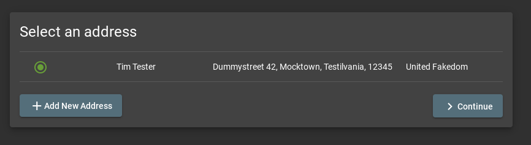
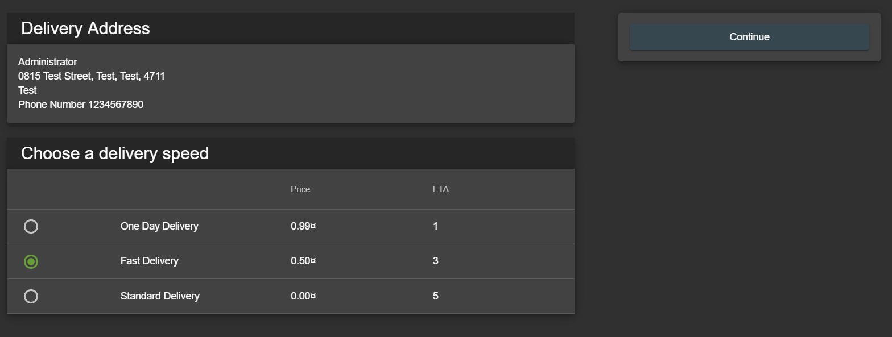
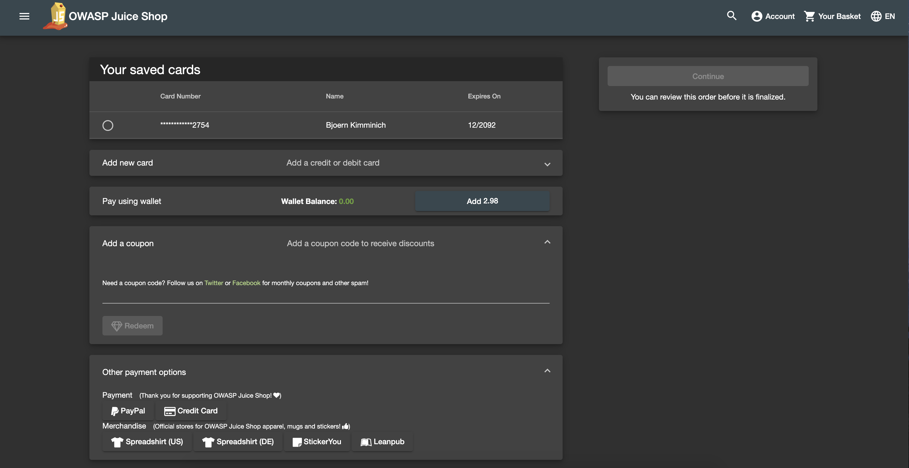
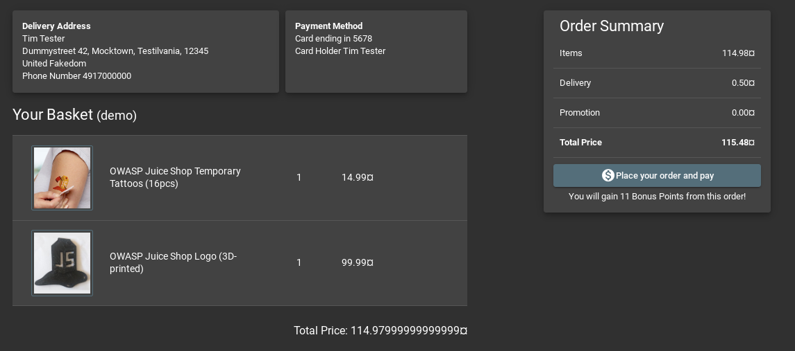

# Walking the "happy path"

When investigating an application for security vulnerabilities, you
should _never_ blindly start throwing attack payloads at it. Instead,
__make sure that you understand how it works__ before attempting any
exploits.

> Before commencing security testing, understanding the structure of the
> application is paramount. Without a thorough understanding of the
> layout of the application, it is unlikely that it will be tested
> thoroughly. Map the target application and understand the principal
> workflows.[^1]

A good way to gain an understanding for the application, is to _actually
use it_ in the way it was meant to be used by a normal user. In regular
software testing this is often called "happy path" testing.

> Also known as the "sunny day" scenario, the happy path is the "normal"
> path of execution through a use case or through the software that
> implements it. Nothing goes wrong, nothing out of the normal happens,
> and we swiftly and directly achieve the user's or caller's goal.[^2]

The OWASP Juice Shop is a rather simple e-commerce application that
covers the typical workflows of a web shop. The following sections
briefly walk you through these "happy path" use cases.

### Browse products

When visiting the OWASP Juice Shop you will begin on the landing page
`#/` which initially displays all products offered in the shop. Clicking
on the logo in the top left corner of the screen will always bring you
back to this screen (or more precisely, to its alias `#/search`).

This is of course the "bread & butter" screen for any e-commerce site.
When you click on the small "eye"-button next to the price of a product,
an overlay screen will open showing you that product details including a
list of customer reviews for that product (if available). You can also
enter a new (or edit an existing) product review in this dialog.
Authenticated users can upvote reviews they like.

You can use the _Search..._ box in the navigation bar on the top of the
screen to filter the table for specific products by their name and
description. Using the controls at the bottom of the table, you can
navigate through a the result list that exceeds the _Items per page_
limit.

### User login

You might notice that there seems to be no way to actually purchase any
of the products. This functionality exists, but is not available to
anonymous users. You first have to log in to the shop with your user
credentials on the `#/login` page. There you can either log in with your
existing credentials (if you are a returning customer) or with your
Google account.

### User registration

In case you are a new customer, you must first register by following the
corresponding link on the login screen to `#/register`. There you must
enter your email address and a password to create a new user account.
With these credentials you can then log in... and finally start
shopping! During registration you also choose and answer a security
question that will let you recover the account if you ever forget your
password.

### Forgot Password

By providing your email address, the answer to your security question
and a new password, you can recover an otherwise inaccessible account.

### Choosing products to purchase

After logging in to the application you will notice a "shopping
cart"-icon in every row of the products table. Unsurprisingly this will
let you add one or more products into your shopping basket. The _Your
Basket_ button in the navigation bar will bring you to the `#/basket`
page, where you can do several things before actually confirming your
purchase:

* increase ("+") or decrease ("-") the quantity of individual products
  in the shopping basket
* remove products from the shopping basket with the "trashcan"-button

### Checkout

During checkout you will be guided through a series of steps to set your
delivery address, desired delivery method and credit card.

_Do not put any real credit card or delivery address options anywhere in
the Juice Shop as it is not a "real" shop, after all._

In the _Add a coupon_ section you can redeem a code for a discount.
Unfold the _Other payment options_ section to see links with donation
and merchandise links of the Juice Shop open source project.

Finally you can click the _Checkout_ button to issue an order. You will
be forwarded to a confirmation of your order right away. It also
includes a link to a printable PDF confirmation for your order and as
well as a tracking link.

### User Menu

Clicking the user icon right next to the application logo & title, you
will give you access to several secondary use cases of the Juice Shop.
This menu is obviously only available when you are logged in with your
user account.

ℹ️ We will cover only a fraction of the available functionality from
the user menu in the following sub-sections. It is recommended to
explore the rest on your own before diving into any hacking exercises.

#### User Profile

Clicking you your email address in the user menu, you will get to the
_User Profile_ screen on `/profile`. Visiting it might break your user
experience a bit, as it looks slightly less sophisticated than the rest
of the shop's UI. It is fully functional nonetheless, as it allows you
to upload a `JPG`-format picture of yourself (or link an existing
Gravatar) and choose a username for your account.

#### Request Recycling Box

When logged in you will furthermore see a _Recycle_ button that brings
you to the `#/recycle` page. This is a very innovative feature that
allows eco-friendly customers to order pre-stamped boxes for returning
fruit pressing leftovers to the Juice Shop.

For greater amounts of pomace the customer can alternatively order a
truck to come by and pick it up at a chosen future date.

#### Order Tracking

Equipped with an order number from your confirmation PDF, you can invoke
the `#/track-order` functionality by clicking _Track Orders_.

After entering a valid order number, you will be shown the products from
your order along with a delivery status and expected delivery date.

_Just as there was no "real" payment was happening, you will hopefully
understand that there is no "real" order delivery happening - no matter
what the order tracking dialog suggested._

#### Change user password

If you are currently logged in you will find the obligatory _Change
Password_ button in the navigation bar. On the
`#/privacy-security/change-password` page you can then choose a new
password. To prevent abuse you have of course to supply your current
password to legitimate this change.

### Side Menu

The sidebar menu button left of the application logo reveals some more
options to choose from.

#### Customer Feedback

Customers are invited to leave feedback about their shopping experience
with the Juice Shop. Simply visit the `#/contact` page by clicking the
_Customer Feedback_ menu item. You might recognize that it is also
possible to leave feedback as an anonymous user. The contact form is
very straightforward with a free text _Comment_ field and a _Rating_ on
a 1-5 stars scale. To prevent abuse, you have to solve a simple
mathematical problem before being allowed to submit your feedback.

#### Complain

The _Complain?_ menu item is shown only to logged in users. It brings
you to the `#/complain` page where you can leave a free text _Message_
and also attach an _Invoice_ file in case you had some issues with a
recent order at the Juice Shop.

#### About Us

Like every proper enterprise, the OWASP Juice Shop has of course an
`#/about` page titled _About Us_. There you find a summary of the
interesting history of the shop along with a link to its official Terms
of Use document. Additionally the page displays a fancy illustrated
slideshow of all [customer feedback](#customer-feedback). Beneath that
you can find all important social media contact information of the shop.

### Language selection

From a dropdown menu in the navigation bar you can select a multitude of
languages you want the user interface to be displayed in. Languages
marked with a "flask"-icon next to them offer only rudimentary or
partial translation.

_If you want to know more about (or even help with) the localization of
OWASP Juice Shop, please refer to the
[Help with translation](/part3/translation.md) chapter in part III of
this book._

[^1]: https://www.owasp.org/index.php/Map_execution_paths_through_application_(OTG-INFO-007)

[^2]: http://xunitpatterns.com/happy%20path.html
