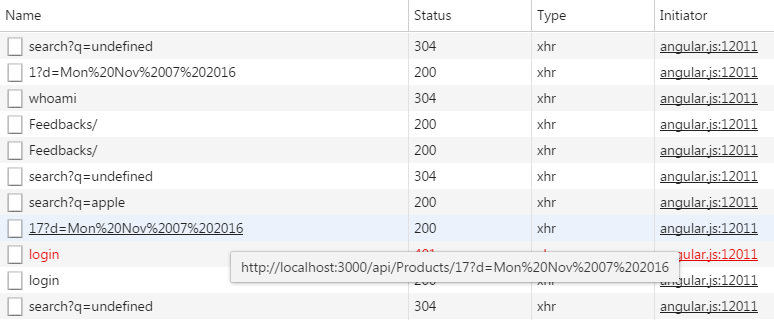

# Cross Site Scripting (XSS)

> Cross-Site Scripting (XSS) attacks are a type of injection, in which malicious scripts are injected into otherwise benign and trusted web sites. XSS attacks occur when an attacker uses a web application to send malicious code, generally in the form of a browser side script, to a different end user. Flaws that allow these attacks to succeed are quite widespread and occur anywhere a web application uses input from a user within the output it generates without validating or encoding it.
>
> An attacker can use XSS to send a malicious script to an unsuspecting user. The end user’s browser has no way to know that the script should not be trusted, and will execute the script. Because it thinks the script came from a trusted source, the malicious script can access any cookies, session tokens, or other sensitive information retained by the browser and used with that site. These scripts can even rewrite the content of the HTML page.[^1]

## Challenges covered in this chapter

| Challenge | Difficulty |
| --------- | ---------- |
| XSS Tier 1: Perform a reflected XSS attack with ``. | 1 of 5 |
| XSS Tier 2: Perform a persisted XSS attack with `` bypassing a client-side security mechanism. | 3 of 5 |
| XSS Tier 3: Perform a persisted XSS attack with `` without using the frontend application at all. | 3 of 5 |
| XSS Tier 4: Perform a persisted XSS attack with `` bypassing a server-side security mechanism. | 4 of 5 |

### XSS Tier 1: Perform a reflected XSS attack

> Reflected Cross-site Scripting (XSS) occur when an attacker injects browser executable code within a single HTTP response. The injected attack is not stored within the application itself; it is non-persistent and only impacts users who open a maliciously crafted link or third-party web page. The attack string is included as part of the crafted URI or HTTP parameters, improperly processed by the application, and returned to the victim.[^2]

#### Hints

* Look for an input field where its content appears in the response HTML when its form is submitted.
* Try probing for XSS vulberabilities by submitting text wrapped in an HTML tag which is easy to spot on screen, e.g. `<h1>` or `<strike>`.

### XSS Tier 2: Perform a persisted XSS attack bypassing a client-side security mechanism

This challenge is founded on a very common security flaw of web applications, where the developers ignored the following golden rule of input validation:

> Be aware that any JavaScript input validation performed on the client can be bypassed by an attacker that disables JavaScript or uses a Web Proxy. Ensure that any input validation performed on the client is also performed on the server.[^3]

#### Hints

* There are only some input fields in the Juice Shop forms that validate their input.
* Even less of these fields are persisted in a way where their content is shown on another screen.
* Bypassing client-side security can typically be done by
  * either disabling it on the client (i.e. in the browser by manipulating the DOM tree)
  * or by ignoring it completely and interacting with the backend instead.

### XSS Tier 3: Perform a persisted XSS attack without using the frontend application at all

As presented in the [Architecture Overview](/introduction/architecture.md), the OWASP Juice Shop uses a Javascript client on top of a RESTful API on the server side. Even without giving this fact away in the introduction chapter, you would have quickly figured this out looking at their interaction happening on the network. Most actions on the UI result in `XMLHttpRequest` (`XHR`) objects being sent and responded to by the server.

For the XSS Tier 3 challenge it is necessary to work with the server-side API directly. You will need a command line tool like `curl` or an [API testing plugin for your browser](/part1/rules.md#apiTestingPlugin) to master this challenge.

#### Hints

* As a preparation you could create a matrix of known data entities and supported HTTP verbs through the API
* Careless developers might have exposed API methods that the client does not even need

### XSS Tier 4: Perform a persisted XSS attack bypassing a server-side security mechanism

This is the hardest XSS challenge, as it cannot by solved by fiddling with the client-side Javascript or bypassing the client entirely.
Whenever there is a server-side validation or input processing involved, you should investigate how it works. Finding out implementation
details - e.g. used libraries, modules or algorithms - should be your priority. If the application does not leak this kind of details,
you can still go for a _blind approach_ by testing lots and lots of different attack payloads and check the reaction of the application.

_When you actually understand a security mechanism you have a lot higher chance to beat or trick it somehow, than by using a trial and error approach._

#### Hints

* The _Comment_ field if the _Contact Us_ is where you want to put your focus on
* The attack payload `` will _not be rejected_ by any validator but _stripped from the comment_ before persisting it
* Look for possible dependencies related to input processing in the `package.json.bak` you harvested earlier

----

[^1]: https://www.owasp.org/index.php/Cross-site_Scripting_(XSS)
[^2]: https://www.owasp.org/index.php/Testing_for_Reflected_Cross_site_scripting_(OWASP-DV-001)
[^3]: https://www.owasp.org/index.php/Input_Validation_Cheat_Sheet#Client_Side_vs_Server_Side_Validation