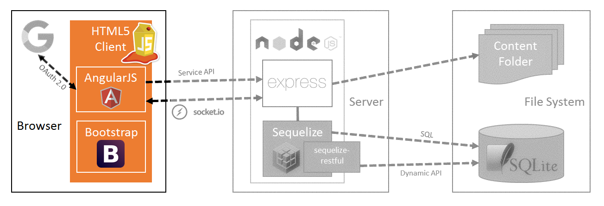
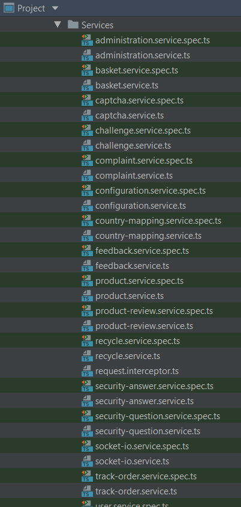
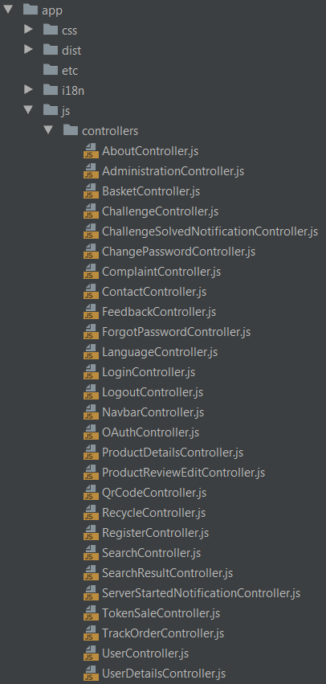
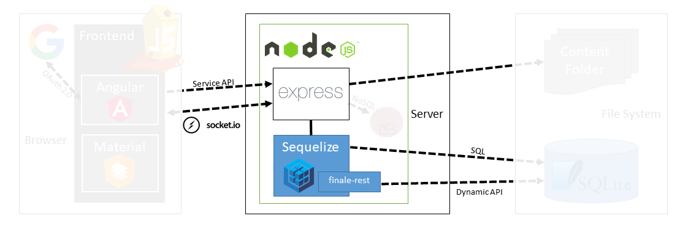

# Codebase 101

Jumping head first into any foreign codebase can cause a little
headache. This section is there to help you find your way through the
code of OWASP Juice Shop. On its top level the Juice Shop codebase is
mainly separated into a client and a server tier, the latter with an
underlying lightweight database and file system as storage.

## Client Tier

OWASP Juice Shop uses v1.5 of the popular
[AngularJS](https://angularjs.org/) framework as the core of its
client-side. Thanks to the [Bootstrap](http://getbootstrap.com/) CSS
framework, the UI is responsive letting it adapt nicely to different
screen sizes. Both frameworks work very well together thanks to the
[UI Bootstrap](https://angular-ui.github.io/bootstrap/) library that
provides components for Bootstrap that are explicitly written for
AngularJS. The various icons used throughout the frontend are from the
vast [Font Awesome 5](https://fontawesome.com/) collection.



### Services

> AngularJS services are substitutable objects that are wired together
> using dependency injection (DI). You can use services to organize and
> share code across your app.[^1]

The client-side AngularJS services reside in the `app/js/services`
folder. Each service file handles all RESTful HTTP calls to the Node.js
backend for a specific domain entity or functional aspect of the
application.



Service functions must **always** use `$q.defer()` to wrap the return
value of the `$http` backend call into a `promise`. If the backend call
was successful, the promise will be resolved. In case of an error, the
promise will be rejected.

The following code snippet shows how all services in the OWASP Juice
Shop client are structured using the example of `FeedbackService`. It
wraps the `/api/Feedback` API which offers a `GET`, `POST` and `DELETE`
endpoint to find, create and delete `Feedback` of users:

```javascript
angular.module('juiceShop').factory('FeedbackService', ['$http', '$q', function ($http, $q) {
  'use strict'

  var host = '/api/Feedbacks'

  function find (params) {
    var feedbacks = $q.defer()
    $http.get(host + '/', {params: params}).success(function (data) {
      feedbacks.resolve(data.data)
    }).error(function (err) {
      feedbacks.reject(err)
    })
    return feedbacks.promise
  }

  function save (params) {
    var createdFeedback = $q.defer()
    $http.post(host + '/', params).success(function (data) {
      createdFeedback.resolve(data.data)
    }).error(function (err) {
      createdFeedback.reject(err)
    })
    return createdFeedback.promise
  }

  function del (id) {
    var deletedFeedback = $q.defer()
    $http.delete(host + '/' + id).success(function (data) {
      deletedFeedback.resolve(data.data)
    }).error(function (err) {
      deletedFeedback.reject(err)
    })
    return deletedFeedback.promise
  }

  return {
    find: find,
    save: save,
    del: del
  }
}])
```

:rotating_light: Unit tests for all services can be found in the
`test/client/services` folder. They are
[Jasmine 3](https://jasmine.github.io) specifications which are executed
by the [Karma](https://karma-runner.github.io) test runner.

### Controllers

> In AngularJS, a Controller is defined by a JavaScript constructor
> function that is used to augment the AngularJS Scope.[^2]

The AngularJS controllers reside in the `app/js/controllers` folder.
Each controller file handles is responsible for one screen or functional
aspect of the application.



Controllers must **always** go through one or more [Services](#services)
when communicating with the application backend. Furthermore, they will
rely on their own `$scope` and are forbidden to pollute the `$rootScope`
unnecessarily.

The code snippet below shows the `ContactController` which handles the
_Contact Us_ screen and uses three different services to fulfill its
tasks:
* `UserService` to retrieve data about the currently logged in user (if
  applicable) via the `whoAmi()` function
* `CaptchaService` to retrieve a new CAPTCHA for the user to solve via
  the `getCaptcha()` function
* `FeedbackService` to eventually `save()` the user feedback

:point_up: As a universal rule for the entire Juice Shop codebase,
unnecessary code duplication should be avoided by using well-named
helper functions. This is demonstrated by the very simple
`getNewCaptcha()` function in the code snippet below. Helper functions
should always be located as close to the calling code as possible and
**never** be put into the _global scope_ unnecessarily as this can cause
unexpected side effects.

```javascript
angular.module('juiceShop').controller('ContactController', [
  '$scope',
  'FeedbackService',
  'UserService',
  'CaptchaService',
  function ($scope, feedbackService, userService, captchaService) {
    'use strict'

    userService.whoAmI().then(function (data) {
      $scope.feedback = {}
      $scope.feedback.UserId = data.id
      $scope.userEmail = data.email || 'anonymous'
    })

    function getNewCaptcha () {
      captchaService.getCaptcha().then(function (data) {
        $scope.captcha = data.captcha
        $scope.captchaId = data.captchaId
      })
    }
    getNewCaptcha()

    $scope.save = function () {
      $scope.feedback.captchaId = $scope.captchaId
      feedbackService.save($scope.feedback).then(function (savedFeedback) {
        $scope.error = null
        $scope.confirmation = 'Thank you for your feedback' + (savedFeedback.rating === 5 ? ' and your 5-star rating!' : '.')
        $scope.feedback = {}
        getNewCaptcha()
        $scope.form.$setPristine()
      }).catch(function (error) {
        $scope.error = error
        $scope.confirmation = null
        $scope.feedback = {}
        $scope.form.$setPristine()
      })
    }
  }])
```

:rotating_light: Unit tests for all controllers can be found in the
`test/client/controllers` folder. Like the
[service unit tests](#services) they are written in
[Jasmine 3](https://jasmine.github.io) and run on
[Karma](https://karma-runner.github.io).

### Views

> In AngularJS, templates are written with HTML that contains
> AngularJS-specific elements and attributes. AngularJS combines the
> template with information from the model and controller to render the
> dynamic view that a user sees in the browser.[^3]

:wrench: **TODO**

### Index page template

:wrench: **TODO**

### Client-side code minification

All client side code (except the `index.html`) is first _uglified_ (for
[security by obscurity](https://en.wikipedia.org/wiki/Security_through_obscurity))
and then _minified_ (for initial load time reduction) during the build
process (launched with `npm install`) of the application. This creates
an `app/dist/juice-shop.min.js` file, which is included by the
`index.html` to load all application-specific client-side code.

If you want to quickly test client-side code changes, it can be
cumbersome to launch `npm install` over and over again. Instead you can
simply trigger the minification to generate the `juice-shop.min.js` file
with

```bash
grunt minify
```

and then refresh your browser with `F5` to test your changes. This will
require grunt being installed globally on your system, so if above
command fails for you, please run `npm install -g grunt-cli` once to
install this useful task runner. From then on, `grunt minify` should
work.

## Server Tier

:wrench: **TODO**



### Routes

> Routing refers to determining how an application responds to a client
> request to a particular endpoint, which is a URI (or path) and a
> specific HTTP request method (GET, POST, and so on).
>
> Each route can have one or more handler functions, which are executed
> when the route is matched.[^4]

:wrench: **TODO**

:rotating_light: Unit tests for all routes can be found in the
`test/server` folder. These tests are written using the
[Chai](http://chaijs.com/) assertion library in conjunction with the
[Mocha](https://mochajs.org/) test framework.

#### Generated API endpoints

:rotating_light: Integration tests for all API endpoints can be found in
the `test/api` folder. These tests are specified using
[Frisby.js](https://www.frisbyjs.com/) and are executed by Facebook's
[Jest](https://facebook.github.io/jest/).

:wrench: **TODO**

#### Hand-written routes

:wrench: **TODO**

:rotating_light: Integration tests for hand-written routes can be found
in the `test/api` folder alongside all other API endpoint tests, from
where
[Frisby.js](https://www.frisbyjs.com/)/[Jest](https://facebook.github.io/jest/)
assert the functionality of the entire backend on HTTP-request/response
level.

### Custom libraries

:wrench: **TODO**

#### Useful utilities

:wrench: **TODO**

#### Insecurity features

:wrench: **TODO**

## Storage Tier

:wrench: **TODO**


### Database

:wrench: **TODO**

#### Populating the DB

:wrench: **TODO**

### Non-relational database

:wrench: **TODO**

### File system

:wrench: **TODO**

## End-to-end tests

> As applications grow in size and complexity, it becomes unrealistic to
> rely on manual testing to verify the correctness of new features,
> catch bugs and notice regressions. Unit tests are the first line of
> defense for catching bugs, but sometimes issues come up with
> integration between components which can't be captured in a unit test.
> End-to-end tests are made to find these problems.[^5]

:wrench: **TODO**

[^1]: https://docs.angularjs.org/guide/services

[^2]: https://docs.angularjs.org/guide/controller

[^3]: https://docs.angularjs.org/guide/templates

[^4]: http://expressjs.com/en/starter/basic-routing.html

[^5]: https://docs.angularjs.org/guide/e2e-testing

