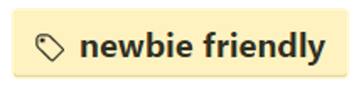

# Contribute to development

## Development infrastructure

### Version control

The project uses `git` as its version control system and GitHub as the
central server and collaboration platform. OWASP Juice Shop resides in
the following repository:

<https://github.com/bkimminich/juice-shop>

> There is an additional repository <https://github.com/bkimminich/juice-shop-ctf>
which is prepared for a future addon-project: A _Capture The Flag_ (CTF)
environment conjunction with Facebook CTF as an easy-to-deploy Docker cluster.

### Branching model

OWASP Juice Shop is maintained in a simplified [Gitflow](https://www.atlassian.com/git/tutorials/comparing-workflows/gitflow-workflow)
fashion, where all active development happens on the `develop` branch
while `master` is used hold the currently released stable version.

Feature branches are only used for long-term tasks that could jeopardize
regular releases from `develop` in the meantime. Likewise prototypes and
experiments must developed on an individual branch or a distinct fork of
the entire project.

Any release from `master` is tagged with a unique version in the format
`vMAJOR.MINOR.PATCH`, for example `v2.19.0`.

### Versioning

> Given a version number `MAJOR.MINOR.PATCH`, increment the:
>
> 1. `MAJOR` version when you make incompatible API changes,
> 2. `MINOR` version when you add functionality in a backwards-compatible manner, and
> 3. `PATCH` version when you make backwards-compatible bug fixes.[^1]

The current version of the project must be manually maintained in the
following two places:

* `/package.json` in property `"version"`
* `/bower.json` in property `"version"`

All other occurrences of the version (i.e. Docker images, packaged releases &
the menu bar of the application itself) are resolved through
the `"version"` property of `/package.json` automatically.

### Continuous integration & deployment

#### Travis-CI

The main build and CI server for OWASP Juice Shop is set up on Travis-CI:

<https://travis-ci.org/bkimminich/juice-shop>

On every push to any branch on GitHub, a build is triggered on Travis-CI.
A build consists of several jobs: One for each version of Node.js that is
officially supported by the application. Each job performs the following
actions:

1. Clone the repository and checkout the branch to build
2. Build the application
3. Execute the quality checks consisting of
  * Compliance check against the [JS Standard Code Style rules](http://standardjs.com)
  * Unit tests for the Angular client
  * Integration tests for the server-side API
  * End-to-end tests verifying that all challenges can be solved
4. Upload of the quality metrics to [Code Climate](https://codeclimate.com/github/bkimminich/juice-shop)
5. Deployment to a Heroku instance
  * <https://juice-shop-staging.herokuapp.com> for `develop` branch builds
  * <https://juice-shop.herokuapp.com> for `master` branch builds
6. Trigger some monitoring endpoints about the build result

> Pull Requests are built in the same manner (steps 1-3) to assess if they can safely
be merged into the codebase. For tag-builds (i.e. versions to be released)
an additional step is to package release-artifacts for Linux for each Node.js
version and attach these to the release page on GitHub.

#### AppVeyor

AppVeyor is used as a secondary CI server to check if the application can
be built on Windows. It also packages and attaches release-artifacts for
Windows in case a tag-build is executed:

<https://ci.appveyor.com/project/bkimminich/juice-shop>

## Contribution Guidelines

You can find the latest guidelines for our contributors here:

<https://github.com/bkimminich/juice-shop/blob/master/CONTRIBUTING.md>

The following sections sum up the most important rules and processes.

### Minimum requirements for code contributions

1. The code must be compliant with the [JS Standard Code Style rules](http://standardjs.com)
2. All new and changed code has a corresponding unit and/or integration test
3. New and changed challenges have a corresponding e2e test
4. All unit, integration and e2e tests must pass locally

### Executing the tests

```
npm test
npm run protractor
```

`npm test` will first check for code style violations and then run all unit/integration tests.
`npm run protractor` will run all e2e tests. These require a locally installed Google Chrome browser and and internet access.

#### Run the mutation tests

```
npm run stryker
```

If you want to be sure that your tests are actually meaningful, you can use `npm run stryker` to execute
the Angular unit tests within a mutation testing engine that will complain lines of code that cause no
test to fail when altered in behavior or logic.

> Currently only the client-side unit tests are covered by mutation tests. The server-side and end-to-end tests are not suitable for mutation testing because they run against a real server instance with dependencies to the database and an internet connection.

### GitHub issue labels

If you would like to contribute to OWASP Juice Shop but need some idea what
task to address, the best place to look is in the GitHub issue list:

<https://github.com/bkimminich/juice-shop/issues>

* Issues labeled with "help wanted" indicate tasks where the project team would very much appreciate help from the community
* Issues labeled with "newbie friendly" indicate tasks that are isolated and not too hard to implement, so they are well-suited for new contributors

 

----

[^1]: <http://semver.org>