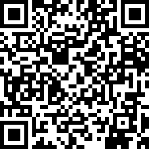
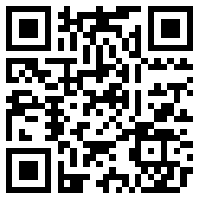
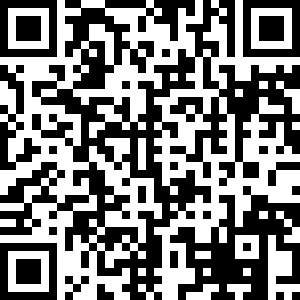

# Donations

As a project of the OWASP Foundation the Juice Shop is and always will
be

* open source
* free software

The entire project is licensed under the liberal
[MIT license](https://opensource.org/licenses/MIT) which allows even
commercial use and modifications. There will never be an "enterprise" or
"premium" version of OWASP Juice Shop either.

This does not mean that a project like it can thrive without any
funding. Some examples on what the OWASP Juice Shop spent (or might
spend) money on:

* Giveaways for conferences and meetups (e.g.
  [stickers](https://www.stickermule.com/user/1070702817/stickers))
* Merchandise to reward awesome project contributions or marketing for
  the project (e.g.
  [apparel or mugs](http://shop.spreadshirt.com/juiceshop))
* Bounties on features or fixes (via
  [Bountysource](https://www.bountysource.com/teams/juice-shop))
* Software license costs (e.g. an extended icon library)
* Commercial support where the team lacks expertise (e.g. graphics
  design for this book's cover)

## How can I donate?

The project gratefully accepts donations via PayPal as well as BitCoin
and other payment options:

| Provider               | Link                                                                                                                                                                                                                                                     |
|:-----------------------|:---------------------------------------------------------------------------------------------------------------------------------------------------------------------------------------------------------------------------------------------------------|
| **PayPal** (preferred) |  |
| Gratipay               | <https://gratipay.com/juice-shop>                                                                                                                                                                                                                        |
| Flattr                 | <https://flattr.com/thing/3856930/bkimminichjuice-shop-on-GitHub>                                                                                                                                                                                        |
| BitCoin                |  [1AbKfgvw9psQ41NbLi8kufDQTezwG8DRZm](https://blockchain.info/address/1AbKfgvw9psQ41NbLi8kufDQTezwG8DRZm)                                                    |
| Dash                   |  [Xr556RzuwX6hg5EGpkybbv5RanJoZN17kW](https://explorer.dash.org/address/Xr556RzuwX6hg5EGpkybbv5RanJoZN17kW)                                                     |
| Ethereum               |  [0x0f933ab9fCAAA782D0279C300D73750e1311EAE6](https://etherscan.io/address/0x0f933ab9fcaaa782d0279c300d73750e1311eae6)                                                     |

Donations via PayPal are received and managed by the OWASP Foundation.
This is the only option where an official donation receipt can be handed
out.

> Please refer to the
> [Donations](https://github.com/bkimminich/juice-shop#donations)
> section at the bottom of the project's `README.md` file on GitHub for
> possible additional options.

## Sponsorship Rules

OWASP Juice Shop adheres to the
[Project Sponsorship Operational Guidelines](https://www.owasp.org/index.php/Project_Sponsorship_Operational_Guidelines)
of the OWASP Foundation. In one sentence, these allow named
acknowledgements (with link) for all monetary donations. For amounts of
least 1000 US$ a logo image (with link) can be added instead. You can
find a list of all sponsors of the OWASP Juice Shop to date in the
[Acknowledgements](https://www.owasp.org/index.php/OWASP_Juice_Shop_Project#tab=Acknowledgements)
tab of the project homepage.
