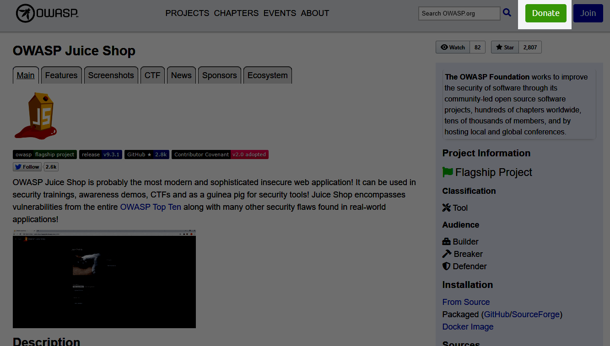
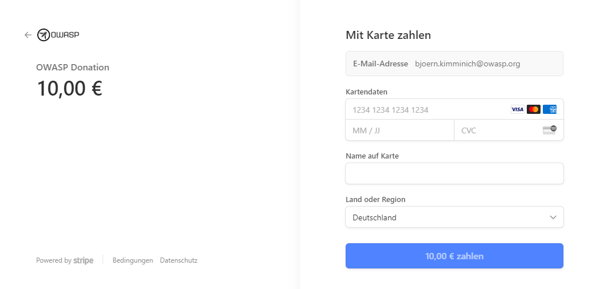
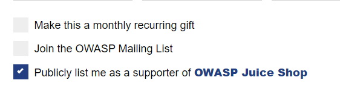

# Donations

As a project of the OWASP Foundation the Juice Shop is and always will
be

* open source
* free software

The entire project is licensed under the liberal
[MIT license](https://opensource.org/licenses/MIT) which allows even
commercial use and modifications. There will never be an "enterprise" or
"premium" version of OWASP Juice Shop either.

This does not mean that a project like it can thrive without any
funding. Some examples on what the OWASP Juice Shop spent (or might
spend) money on:

* Giveaways for conferences and meetups (e.g.
  [stickers, magnets, iron-ons or temporary tattoos](https://www.stickeryou.com/products/owasp-juice-shop/794))
* Merchandise to reward awesome project contributions or marketing for
  the project (e.g.
  [apparel or mugs](http://shop.spreadshirt.com/juiceshop))
* Bounties on features or fixes (via
  [Bountysource](https://www.bountysource.com/teams/juice-shop))
* Software license costs (e.g. an extended icon library)
* Commercial support where the team lacks expertise (e.g. graphics
  design for this book's cover was paid from donations)

## Supporting Juice Shop

The OWASP Foundation gratefully accepts donations via Stripe. Projects
such as Juice Shop can then request reimbursement for expenses (like
those listed above) from the Foundation.

If you'd like to express your support of the Juice Shop project, please
make sure to use the green "Donate"-button _while on the Juice Shop
website_ or simply use the following link for your donation:

<https://owasp.org/donate/?reponame=www-project-juice-shop&title=OWASP+Juice+Shop>

Filling out the form is pretty straightforward. It will send you then
redirect you to a Stripe payment page where you can at least choose to
pay between the usual credit cards and depending on your decive also
Google Pay or Apple Pay:

## Restricted gifts

All donations >1000 US$ to the OWASP Foundation can be restricted
explicitly to be only used by the Juice Shop project in the current
calendar year. To learn more about such earmarked donations please check
OWASP's
[Rules of Procedure on Donations](https://owasp.org/www-policy/operational/donations.html).

ℹ️ _While the Juice Shop appreciates such dedicated donations, please
note that these add an organizational overhead for the OWASP Foundation.
To this day no expenses of the categories mentioned above have ever been
denied by OWASP for Juice Shop._

## Attribution

If you tick the "Publicly list me as a supporter of OWASP Juice Shop"
checkbox your name (but obviously **not** your email address) will be
added to the
[_Supporters tab of the project website](https://owasp.org/www-project-juice-shop/#div-supporters)
automatically.

For donation amounts of at least 1000 US$ your corporate logo (with
link) will be added to the _Top Supporters_ section as well. The logo
size can be at most 300x300 pixels. Logo and name placements are
guaranteed for 1 year after the donation but might stay there longer at
the discretion of the Project Leader.
