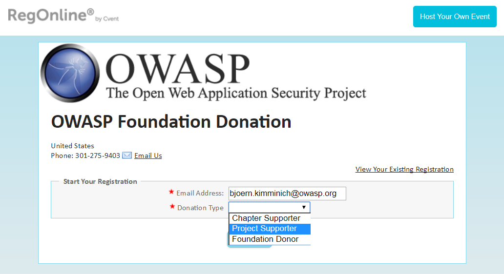
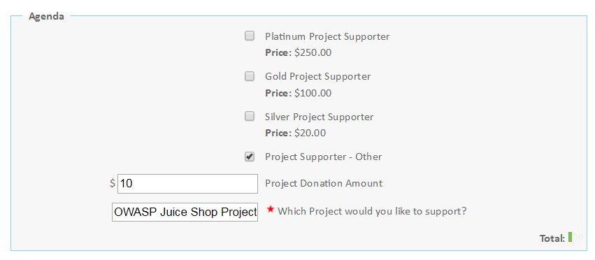
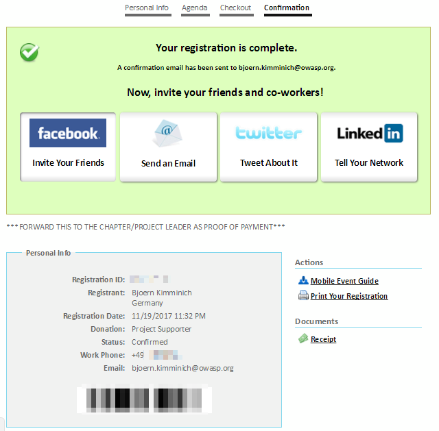

# Donations

As a project of the OWASP Foundation the Juice Shop is and always will
be

* open source
* free software

The entire project is licensed under the liberal
[MIT license](https://opensource.org/licenses/MIT) which allows even
commercial use and modifications. There will never be an "enterprise" or
"premium" version of OWASP Juice Shop either.

This does not mean that a project like it can thrive without any
funding. Some examples on what the OWASP Juice Shop spent (or might
spend) money on:

* Giveaways for conferences and meetups (e.g.
  [stickers, magnets, iron-ons or temporary tattoos](https://www.stickeryou.com/products/owasp-juice-shop/794))
* Merchandise to reward awesome project contributions or marketing for
  the project (e.g.
  [apparel or mugs](http://shop.spreadshirt.com/juiceshop))
* Bounties on features or fixes (via
  [Bountysource](https://www.bountysource.com/teams/juice-shop))
* Software license costs (e.g. an extended icon library)
* Commercial support where the team lacks expertise (e.g. graphics
  design for this book's cover was paid from donations)

## How can I donate?

The project gratefully accepts donations via PayPal or Credit Card:

| Provider             | Link                                                                                                                                                                                                                                                               |
|:---------------------|:-------------------------------------------------------------------------------------------------------------------------------------------------------------------------------------------------------------------------------------------------------------------|
| **PayPal**           |  |
| **Credit Card**      | <https://www.regonline.com/Register/Checkin.aspx?EventID=1044369>                                                                                                                                                                                                  |

All donations are received and managed by the
OWASP Foundation and must be earmarked properly to end up in the Juice Shop budget. You will receive an official donation receipt.

:information_source: _Independent of your selected method it is
recommended to forward your donation confirmation to
bjoern.kimminich@owasp.org to allow verifying if the earmarking worked
and the money is attributed to the Juice Shop budget. You should provide
your full name and (optional) URL for the mention in the
[Acknowledgements](https://www.owasp.org/index.php/OWASP_Juice_Shop_Project#tab=Acknowledgements)
on the official project page. If you donated at least 1000 US$ you can
choose to provide a logo to put on the page instead of your name. See
[Sponsorship Rules](#sponsorship-rules) below for details._

### Credit card donation step-by-step

1. Go to
   <https://www.regonline.com/Register/Checkin.aspx?EventID=1044369>.
2. Register with your email address and select `Project Supporter` from
   the _Donation Type_ dropdown list.

   
3. _Continue_ to the _Personal Info_ step and fill at least all
   mandatory fields. Click _Continue_.
4. In the _Agenda_ step select one of the available amounts or _Project
   Supporter - Other_ to put in an individual amount.
5. Enter `OWASP Juice Shop Project` into the mandatory field _Which
   Project would you like to support?_ and click _Continue_.

   
6. In the final _Checkout_ step choose a _Password_ for your account and
   fill in your _Billing Information.
7. Click _Finish_ to process your donation and be led to the
   _Confirmation_ screen.
8. Here you can download your _Receipt_ under the _Documents_ section on
   the right.

   

## Sponsorship Rules

OWASP Juice Shop adheres to the
[Project Sponsorship Operational Guidelines](https://www.owasp.org/index.php/Project_Sponsorship_Operational_Guidelines)
of the OWASP Foundation. In one sentence, these allow named
acknowledgements (with link) for all monetary donations. For amounts of
least 1000 US$ a logo image (with link) can be added instead. The logo
size can be at most 300x300 pixels. Logo and name placements are
guaranteed for 1 year after the donation but might stay there longer at
the discretion of the Project Leader.

You can find a list of all sponsors of the OWASP Juice Shop to date in
the
[Acknowledgements](https://www.owasp.org/index.php/OWASP_Juice_Shop_Project#tab=Acknowledgements)
tab of the project homepage.
